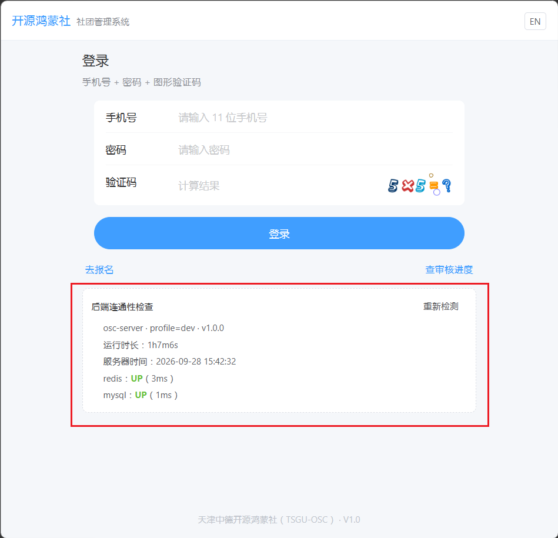
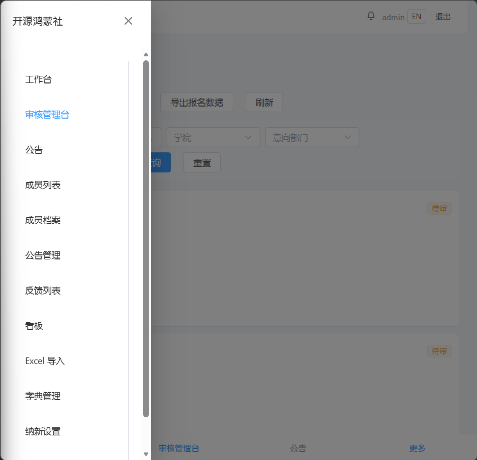
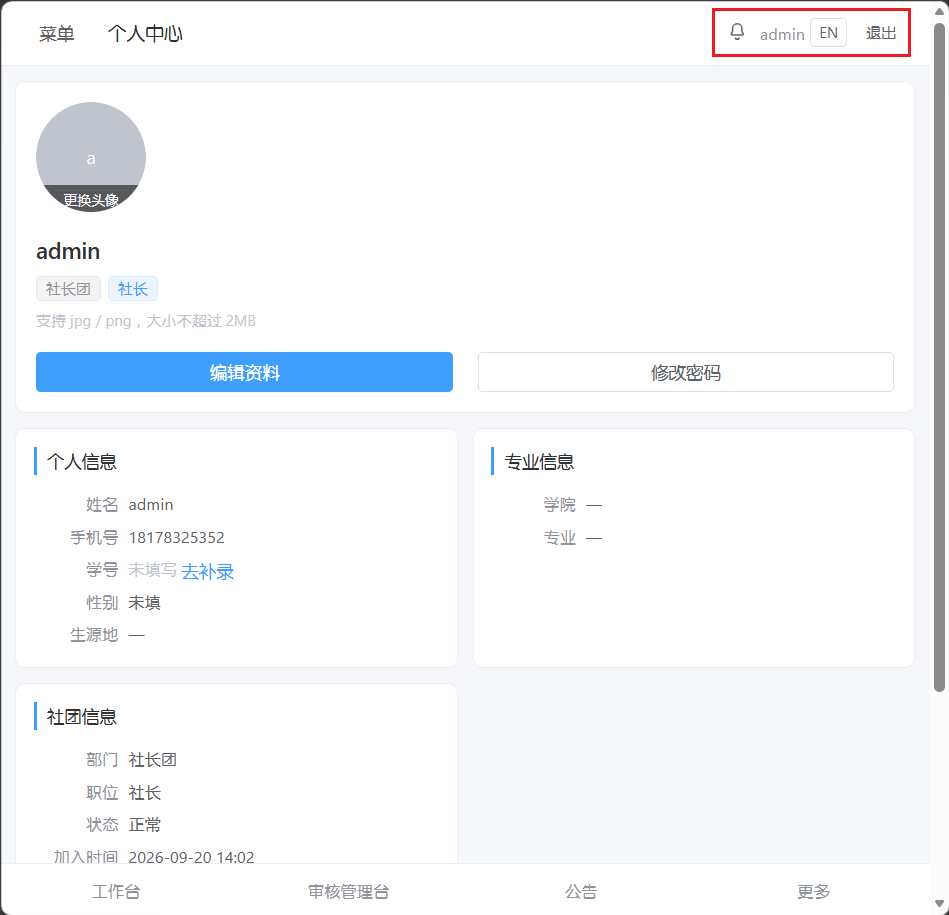
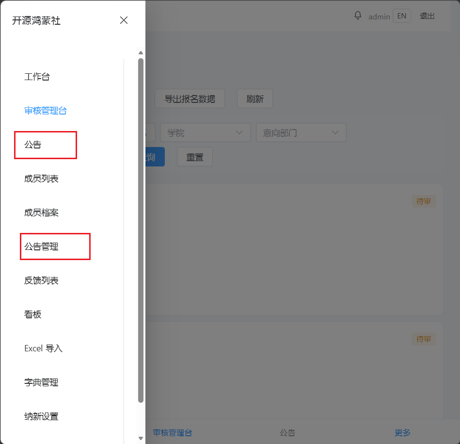
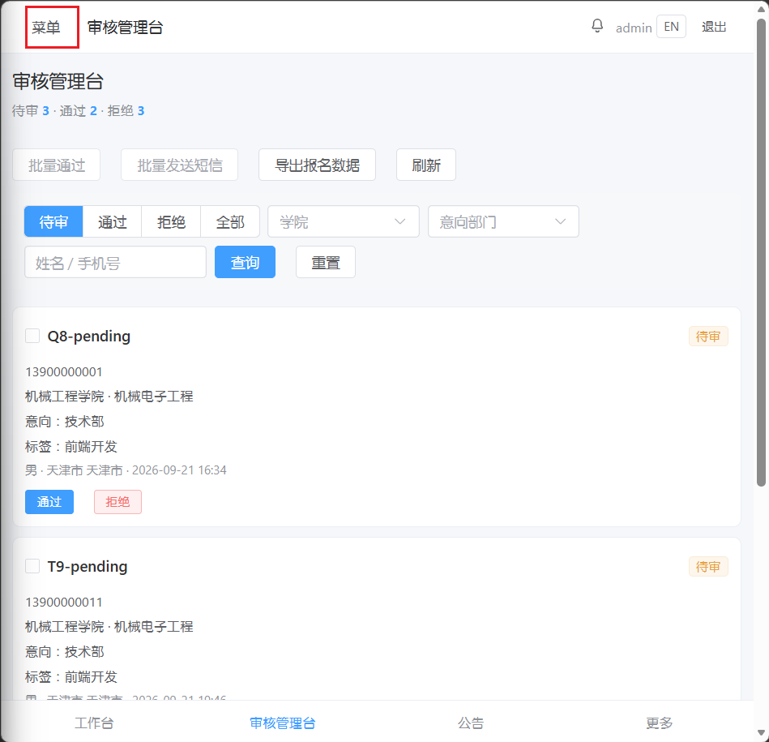

# OSC 社团管理系统 · V1.0 继续更新优化需求

> ⚠️ **文档定位（2026-09-28 Agent 加注）**：这是**社长的原始体感记录稿**（截图 + 一句吐槽的形式），
> 已由《**OSC 社团管理系统 · V1.0 收尾需求**》**正式化**（结构化、补技术方案落点、补验收标准）。
> **二者内容重叠 → 请以《V1.0 收尾需求》为单一出处**；本文保留作为"原始依据/截图出处"。
> 若后续不再需要，建议**并入收尾需求后删除本文**（避免同一事实两处维护，铁律第 3 条）。
>
> 另：本文第 33 行「应该是根据分辨率识别为了手机设备，应该是识别为设备种类」的成因已在收尾需求 §4.5 核清 ——
> 不是"误判设备种类"，而是**当前只有 `<768px` 单断点**，窄屏直接切成底部 tabbar + 抽屉，**没有中间档**。

## 通用

设计英文界面，但是需要以下内容开发完毕之后再全部更新，避免漏改

## 登录页

主要是前端样式的修改，后端逻辑再确定后进行优化

1. 添加Logo
2. 去除`后端联通性检查`信息
3. 将登录输入框居中，同时添加背景图片
   

## 主页

1. 菜单栏没有细分，没有类别，获取信息效率低下，无法快速聚焦所需内容：添加一二级菜单（必要时可以添加三级，但是三级菜单可以处理为弹窗）
   
2. 整体页面还比较朴素和传统，可以稍微有风格一点
3. 底部菜单和左侧菜单会重复，建议添加设备适配：手机显示底部菜单栏，PC显示左侧菜单
4. 个人中心和退出登录可以模仿将光标移动到右上角账号名称处，简化左侧菜单
   

## 公告&公告管理重复

有两个公告菜单，建议合并为一个

## 不同分辨率适配

目前缩小窗口后，无法唤出左侧菜单，应该是根据分辨率识别为了手机设备，应该是识别为设备种类

而且菜单也应该做成图标样式而不是文字，现在很容易和所在页面名重合在一块而无法被及时发现

## 导航栏

如上，需要进行处理