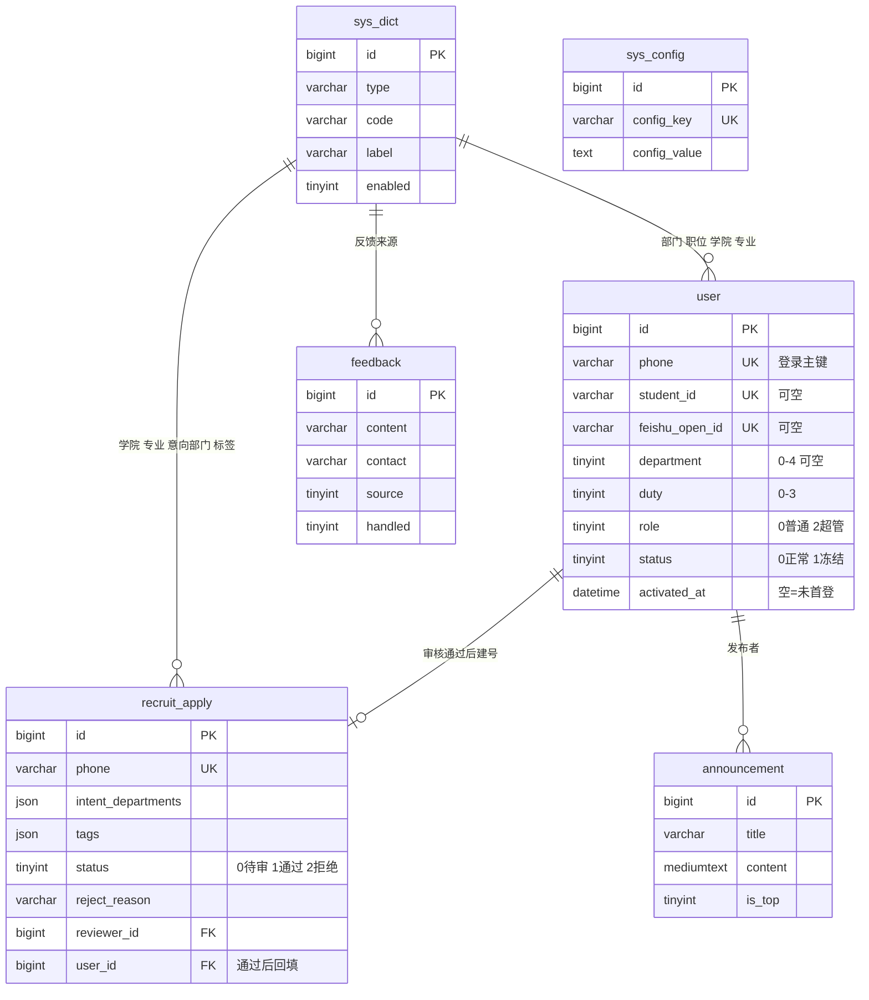

# OSC 社团管理系统 · 开发任务点清单（工作台账）

> **用途**：把 PRD 拆成**可逐个交付的任务点**，并记录每个任务点的方案、实现结果、验证方式与实现层决策。
>
> **职责边界（单一出处）**：本清单只管三件事 —— **§3 总表看进度**、**§4 任务点详情**、**§6 实现层决策**。
> 开会话要用的一切（开场提示词、当前阶段、关键词速查、环境坑、全局铁律）一律在
> `docs/OSC 社团管理系统 · 新对话交接提示词（通用版）.md`，**不在本文件重复抄写**（见该文档「五、全局铁律」第 3 条）。
>
> **配套文档**：
> - `docs/OSC 社团管理系统 · 产品需求文档（PRD）V1.0.md`（权威需求依据，代码以 PRD 为准）
> - `docs/OSC 社团管理系统 · 战略定位与价值延伸说明.md`（定位与价值规划）
> - `docs/OSC 社团管理系统 · 新对话交接提示词（通用版）.md`（开工与铁律，新对话第一份读物）
> - `.workbuddy/memory/`（项目记忆：`MEMORY.md` + 每日日志）
>
> **维护方式**：每完成一个任务点 → 更新 §3 状态列 + 在 §4 该条目补「实现结果」+ §6 追加决策；
> 交接文档由 AI 在收到「我要开启新对话」时统一刷新。

---

## 2. 技术栈（2026-09-20 定稿）

| 层 | 定稿选型 | 备注 |
|---|---|---|
| 工程布局 | monorepo 单仓：`server/`（后端）+ `web/`（前端，T3 建） | 独立 git 仓库，远端 GitHub（SSH） |
| 后端 | Java **17** + Spring Boot **3.3.13** + MyBatis-Plus **3.5.7** + Sa-Token **1.44.0** + Redis（Lettuce） | 分页用 MP 内置，弃 PageHelper |
| 数据库 | MySQL 8（`mysql-connector-j`）+ 一套建表脚本 + 种子数据 | 本地 `127.0.0.1:3306`，库名 `osc` |
| 缓存 | Redis（图形验证码 / 登录失败锁定 / token 存储） | 本地 `127.0.0.1:6379` 无密码（3.0.504，上线换新版） |
| 文件存储 | MinIO（头像） | **T11 已启用**（依赖、配置、建桶与公开读策略全部就位） |
| Excel | EasyExcel（导入/导出） | T13 启用 |
| 接口文档 | Knife4j **4.5.0**（jakarta，仅 dev） | prod 关闭 |
| 前端（管理端） | Vue 3 + Vite + Element Plus + Pinia + Vue Router + axios | T3 落地 |
| 前端（移动端页面） | 响应式适配或 Vant（报名页/查询页为移动第一体验） | T3 定稿 |
| 接口风格 | RESTful + 统一返回体 `{code,message,data}` + 全局异常；错误码 40000 参数 / 40100 未登录 / 40300 无权限 / 40400 不存在 / 50000 系统 / 50001 下游不可用 | Header 传 token（不用 Cookie，见 PRD F-002）；不带 `/api` 前缀；dev 8080 / prod 8081 |
| 配置 | 全环境变量化：`.env`（忽略）+ `.env.example`（入仓） | 明文绝不入仓 |

## 3. 任务点总表（状态跟踪）

| # | 任务点 | 覆盖 PRD | 依赖 | 状态 |
|---|---|---|---|---|
| T1 | 后端工程初始化 | NFR 可维护性 | — | ✅ 已完成 |
| T2 | 数据库设计与初始化脚本 | §6 全部 | T1 | ✅ 已完成 |
| T3 | 前端工程初始化 | §8.2 页面地图 | — | ✅ 已完成 |
| T4 | 超管初始化 + 登录认证（含首登强制改密） | F-012 / F-002 / 切片2、12 | T1、T2 | ✅ 已完成 |
| T5 | 字典管理 | F-011 / 切片11 | T4 | ✅ 已完成 |
| T6 | 公开报名页 | F-001 / 切片1 | T3、T5 | ✅ 已完成 |
| T7 | 审核管理台 | F-003 / 切片3 | T6 | ✅ 已完成 |
| T8 | 审核状态查询页 | F-005 / 切片5 | T6 | ✅ 已完成 |
| T9 | 短信通知提效工具 | F-004 / 切片4 | T7 | ✅ 已完成 |
| T10 | 成员档案管理 | F-006 / 切片6 | T4、T5 | ✅ 已完成 |
| T11 | 个人中心 | F-007 / 切片7 | T4 | ✅ 已完成 |
| T12 | 公告系统 | F-008 / 切片8 | T4 | ✅ 已完成 |
| T13 | Excel 批量导入 | F-009 / 切片9 | T4、T5 | ✅ 已完成 |
| T14 | 数据导出 | F-013 / 切片13 | T10、T7 | ✅ 已完成 |
| T15 | 基础看板 | F-010 / 切片10 | T4、T5 | ✅ 已完成 |
| T16 | 轻量反馈入口 | F-014 / 切片14 | T4 | ⏳ |
| T17 | 全链路联调与上线准备 | NFR / M2-M3 | 全部 | ⏳ |
| T18 | 公开端报名链路梳理 | F-001 / F-005、PRD v3.2 | T6、T8 | ⏳ 待做（**插在 T16 之前执行**） |
| T19 | 内部导航与首页工作台 | PRD §8.2 v3.2、§6 D106~D112 | T3~T15 | ⏳ 待做（**插在 T16 之前执行**） |

> **执行顺序（2026-09-26 调整）**：T1→T2→T3→T4→T5→T6→T7→T8（纳新主链）→ T9→T10→T11→T12→T13→T14→T15（支撑链）→ **T18 → T19 → T16 → T17**。
> T18/T19 是**新插入的信息架构调整**（编号向后排，不动 T16/T17 已有引用）：先做 T18（公开端，小且独立），再做 T19（内部导航与首页工作台），
> 然后才是 T16（反馈入口 —— 它同时要动工作台与报名结果态，放在这两者之后可避免返工），最后 T17 联调上线。

> **优先顺序**：T1→T2→T3 地基先行；随后**纳新主链**（T4→T5→T6→T7→T8→T9）优先冲刺；其余按序补齐；T17 收尾。

---

## 4. 任务点详情

### T1 后端工程初始化 ✅

> 状态：**已完成（2026-09-20）**。

- **覆盖**：PRD §7 NFR（可维护性）、§2 技术栈
- **交付物**：工作空间内新建后端工程 `server/`（artifactId `osc-server`）；统一返回体 + 全局异常处理；Sa-Token 接入（Header 模式）；Redis 连接；配置环境变量化（`.env.example`，杜绝明文入仓）；健康检查接口 `/health`。
- **关键点**：不写业务代码；不引 Actuator（保持轻量，避免多一套端点与权限面）。
- **自测要点**：`/health` 返回统一格式；配置项全部可从环境变量覆盖。

#### T1 技术方案（已确认 2026-09-20）

**① 目录规划**（T1 只建 `server/`，`web/` 留给 T3）

```text
New-Management-System\
├─ .gitignore                    ← T1 新增（根级，前后端通用）
├─ LICENSE / docs\ / .workbuddy\
└─ server\                       ← T1 新增
   ├─ pom.xml
   ├─ .env.example               ← 入仓（变量样例）
   ├─ .env                       ← 本地私有值（被 .gitignore 忽略）
   └─ src\main\
      ├─ java\com\tsguosc\
      │  ├─ OscServerApplication.java
      │  ├─ common\result\     Result.java · ResultCode.java
      │  ├─ common\exception\  BusinessException.java · GlobalExceptionHandler.java
      │  ├─ config\            RedisConfig.java · SaTokenConfig.java · OpenApiConfig.java
      │  └─ controller\        HealthController.java
      └─ resources\  application.yml · application-dev.yml · application-prod.yml
```

**② 依赖清单**（版本已于 2026-09-20 逐个联网核验存在）

| 依赖 | 版本 | 用途 |
|---|---|---|
| `spring-boot-starter-parent` | 3.3.13 | 父 POM，统一管版本 |
| `starter-web` / `starter-validation` / `starter-data-redis` / `starter-test` | 随父 POM | MVC · 参数校验 · Lettuce · 测试 |
| `mybatis-plus-spring-boot3-starter` | 3.5.7 | ORM + MP 内置分页（弃 PageHelper） |
| `mysql-connector-j` | 随父 POM | MySQL 驱动（旧坐标 `mysql-connector-java` 已废弃） |
| `sa-token-spring-boot3-starter` | 1.44.0 | 鉴权，Header 模式 |
| `sa-token-redis-jackson` | 1.44.0 | token 存 Redis，重启不掉线 |
| `lombok` | 随父 POM | 简化实体 |
| `knife4j-openapi3-jakarta-spring-boot-starter` | 4.5.0 | 接口文档，**仅 dev** |
| `minio` | 8.5.12 | **T11 已启用**（头像对象存储） |
| `easy-captcha`（+ `nashorn-core`） | — | T4 引入；JDK 17 已移除 Nashorn，必须补依赖 |

**③ 配置分层与环境变量**
- `application.yml`：应用名、端口占位、Jackson 时区、Sa-Token 基础项、MP 逻辑删除、`spring.config.import=optional:file:./.env[.properties]`
- `application-dev.yml`：8080、本地 MySQL/Redis、SQL 日志开、Knife4j 开；`application-prod.yml`：8081、SQL 日志关、Knife4j 关
- 环境相关项一律 `${VAR:默认值}`；`.env.example` 覆盖 `APP_PORT` / `SPRING_PROFILES_ACTIVE` / `MYSQL_HOST|PORT|DB|USER|PASSWORD` / `REDIS_HOST|PORT|PASSWORD|DB` / `SA_TOKEN_NAME|TIMEOUT` / `MINIO_*`（注释占位）

**④ 接口设计：`GET /health`**（免鉴权，T1 唯一接口）

```json
{"code":200,"message":"success","data":{"app":"osc-server","profile":"dev",
 "time":"2026-09-20T10:12:33","uptime":"3m12s",
 "components":{"redis":{"status":"UP","latencyMs":2},
               "mysql":{"status":"DOWN","latencyMs":5,"detail":"Unknown database 'osc'"}}}}
```

- 取舍：**下游不可用时 HTTP 与 `code` 仍为 200**（代表应用自身存活），真实状态放 `data.components` —— 这样 T2 建库前也能干净验收 Redis；T2 建库后 mysql 自动转 UP。

**⑤ 统一返回体与错误码**
- `Result<T>{code, message, data}`；成功 200；错误码 40000 参数 / 40100 未登录 / 40300 无权限 / 40400 不存在 / 50000 系统 / 50001 下游不可用。
- `GlobalExceptionHandler` 覆盖：业务异常、参数校验异常、Sa-Token 未登录/无权限异常、兜底异常（打全栈日志，响应不外泄堆栈）。

**⑥ 验收动作**

```powershell
& "E:\MAVEN\apache-maven-3.6.3\bin\mvn.cmd" -f "F:\Project\Own Project\New-Management-System\server\pom.xml" spring-boot:run
Invoke-RestMethod -Uri "http://127.0.0.1:8080/health" -Method Get | ConvertTo-Json -Depth 5
```

负向验证：访问 `/nope` 走统一错误格式；停掉 Redis 后 `/health` 的 redis 转 DOWN，而进程不崩。

#### T1 实现结果（2026-09-20 完成）

**已交付文件**

```text
.gitignore                                根级忽略（.env / .workbuddy / target / node_modules 等）
server/pom.xml                            Spring Boot 3.3.13 + JDK 17
server/.env.example                       环境变量样例（入仓）
server/.env                               本地私有值（被忽略，未入仓）
server/src/main/java/com/tsguosc/
  OscServerApplication.java
  common/result/        Result.java · ResultCode.java
  common/exception/     BusinessException.java · GlobalExceptionHandler.java
  config/               RedisConfig.java · OpenApiConfig.java（仅 dev）
  controller/           HealthController.java · controller/vo/HealthVO.java
server/src/main/resources/
  application.yml · application-dev.yml · application-prod.yml
```

**与方案的偏差（1 处）**：未创建 `SaTokenConfig.java` —— T1 不启用登录拦截器（见 §6 D10），Sa-Token 全部由 `application.yml` 的 `sa-token.*` 驱动，无需 Java 配置类；T4 接入登录时再新建该类注册 `SaInterceptor` 与白名单。

**实测验证记录**

| 验证项 | 结果 |
|---|---|
| `mvn clean package -DskipTests` | BUILD SUCCESS，产出 `osc-server-1.0.0.jar`（49.7 MB） |
| 启动 | `Started OscServerApplication in 10.9s`，profile=dev，端口 8080 |
| `GET /health` | `code=200`；`redis=UP(0ms)`；`mysql=DOWN(3012ms, Access denied for user 'osc_app')` —— 符合预期，T2 建库建号后转 UP |
| `GET /nope` | `code=40400 请求的资源不存在`（统一格式） |
| `POST /health` | `code=40000 请求方式不被支持：POST` |
| `GET /doc.html`（dev） | HTTP 200，Knife4j 正常；`/v3/api-docs` 含 `/health` |
| 环境变量覆盖 | 进程变量 `APP_PORT=8090` → 实际监听 8090；`OSC_HEALTH_EXPOSE_DETAIL=false` → 响应中 `detail` 字段消失 |
| 版本注入 | `@project.version@` 资源过滤生效，`/health` 返回 `version=1.0.0` |

**启动时已知告警（预期内，T2 消解）**
- `No MyBatis mapper was found in '[com.tsguosc]' package` —— T1 尚无 Mapper；T2 建表后加 `@MapperScan("com.tsguosc.mapper")` 即消失。
- MySQL 探测耗时 ~3s：账号/库未就绪时 HikariCP 在连接超时（3000ms）内持续重试，属预期；T2 建库后应降到毫秒级。

**环境注意（本机实测）**
1. ⚠️ 本机进程环境被宿主注入了 `SERVER__PORT=4225` / `SERVER__HOST=127.0.0.1`，Spring Boot 宽松绑定会将其当作 `server.port`，导致启动去抢 4225（已被占用）而失败。**在本机 WorkBuddy 终端里启动**需带 `--server.port=8080` 或先清掉该变量；在 IDEA / 普通 cmd 里启动不受影响。
2. ⚠️ PowerShell 5.1 下 `-Dfile.encoding=UTF-8` 会被拆成 `.encoding=UTF-8`，必须写成 `"-Dfile.encoding=UTF-8"`（带引号）。
3. 启动命令必须在 `server/` 目录下执行，否则读不到 `.env`（`spring.config.import` 用的是相对路径）。

**验证步骤**

```powershell
# 1) 启动（先 cd 到 F:\Project\Own Project\New-Management-System\server）
& "C:\Program Files\Java\jdk-17\bin\java.exe" -jar "target\osc-server-1.0.0.jar"
#    若在 WorkBuddy 终端内启动，追加 --server.port=8080

# 2) 另开一个 PowerShell 窗口验证
Invoke-RestMethod -Uri "http://127.0.0.1:8080/health" -Method Get | ConvertTo-Json -Depth 6
Invoke-RestMethod -Uri "http://127.0.0.1:8080/nope" -Method Get | ConvertTo-Json -Depth 3

# 3) 浏览器看接口文档（仅 dev）
Start-Process "http://127.0.0.1:8080/doc.html"
```

### T2 数据库设计与初始化脚本 ✅

> 状态：**已完成（2026-09-20）**。字段级明细以 `server/sql/01_schema.sql`（含逐列中文注释）为准，本节记录设计决策与实测结果。

- **覆盖**：PRD §6（账号三标识/权限字段/两阶段模型/字典/迁移）
- **交付物**：四个 SQL 脚本（`server/sql/`）+ ERD；六张表 `user` / `recruit_apply` / `sys_dict` / `sys_config` / `announcement` / `feedback`；字典种子；旧数据迁移框架（含「待补录清单」「冲突清单」）
- **关键点**：`user.role`（0 普通 / 2 超管）；`activated_at`（首登改密标记）；`intent_departments`、`tags` 用 JSON；手机号/学号唯一约束
- **自测要点**：SQL 可在干净 MySQL 一次性执行成功；种子数据完整；迁移脚本可空跑

#### T2 技术方案（已确认 2026-09-20）

**① 交付物**

| 脚本 | 内容 |
|---|---|
| `server/sql/00_init_database.sql` | 建库 `osc`（utf8mb4）+ 建 `osc_app` 账号 + 仅授权 `osc.*` 的 DML（模板，密码不入仓） |
| `server/sql/01_schema.sql` | 六张表 DDL + 索引（**不含 DROP**，可重复执行） |
| `server/sql/02_seed_dict.sql` | 字典种子 + `sys_config` 三条默认配置（幂等） |
| `server/sql/03_migrate_old_data.sql` | 旧数据迁移框架（staging → 待补录清单 → 冲突清单 → 正式迁移 → 核对） |

**② ERD**



**③ 表结构与关键约定**

| 表 | 关键约束 / 索引 | 说明 |
|---|---|---|
| `user` | PK`id`、UNIQUE `phone`、UNIQUE `student_id`、UNIQUE `feishu_open_id`、IDX(`department`,`status`) | 字段清单见 §6 D3；`department` 可 NULL |
| `recruit_apply` | PK`id`、UNIQUE `phone`、IDX(`status`)、IDX(`created_at`)、IDX(`reviewer_id`) | 状态 0待审/1通过/2拒绝；记录拒绝原因与审核留痕 |
| `sys_dict` | UNIQUE(`type`,`code`)、IDX(`type`,`enabled`,`sort`) | 七个 type：department/duty/status/college/major/tag/feedback_source |
| `sys_config` | UNIQUE `config_key` | 种子：`system_url`、`sms_template_pass`、`sms_template_reject`（含 D7 变量集） |
| `announcement` | IDX(`is_top`,`created_at`) | 发布时间复用 `created_at`；`content` 为 MEDIUMTEXT |
| `feedback` | IDX(`created_at`)、IDX(`source`)、IDX(`handled`) | `source` 1报名成功页 / 2成员端 |

- **字符集**：utf8mb4 + `utf8mb4_general_ci` + InnoDB（兼容 MySQL 5.7 与 8.0）
- **不建物理外键**：关系由应用层校验 + 索引保证，便于批量导入与旧数据迁移
- **唯一索引不带 `is_deleted`**：手机号一旦占用永久占用；`user` 用冻结代删、`sys_dict` 用停用代删
- **JSON 字段**：`intent_departments` / `tags` 用 MySQL JSON（`JSON_CONTAINS` 支撑 T7 部长评审隔离）；MyBatis-Plus 侧 T4 起用 `JacksonTypeHandler` + `autoResultMap`

#### T2 实现结果（2026-09-20 完成）

**已执行**
1. `00`：建库 `osc`（utf8mb4_general_ci）+ 建账号 `osc_app@localhost`，仅授权 `osc.*` 的 SELECT/INSERT/UPDATE/DELETE；28 位随机密码写入被忽略的 `server/.env`
2. `01`：六张表创建成功
3. `02`：字典 16 条（部门 5 / 职位 4 / 状态 2 / 反馈来源 2 / 学院 1 / 专业 1 / 标签 1）+ `sys_config` 3 条
4. 重启服务，`/health` 的 mysql 由 DOWN 转 **UP**

**验证记录**

| 验证项 | 结果 |
|---|---|
| 库与账号 | `osc` = utf8mb4 / utf8mb4_general_ci；`osc_app@localhost` 已建 |
| 建表 | `SHOW TABLES` 六张表齐全，表注释正确 |
| 字典内容 | 16 条，中文编码正确（部门 0~4 / 职位 0~3 / 状态 0~1 / 反馈来源 1~2 / 三个 other 兜底） |
| 短信模板 | 通过模板含 `{姓名}{系统链接}{初始密码}`，拒绝模板含 `{拒绝原因}` |
| 种子幂等 | 先把 `tag.other` 停用 → 重跑 `02` → `enabled` 仍为 0、总数仍 16（未被覆盖、无重复） |
| 建表脚本安全 | 重跑 `01` 不报错、不丢数据（无 DROP） |
| 最小权限 | 用 `osc_app` 执行 DDL → `ERROR 1142 DROP command denied` ✅ |
| 应用连通 | `GET /health` → `code=200`，`redis=UP`、**`mysql=UP(352ms)`** |

**注意**
- 学院/专业/兴趣标签目前只有「其他（other）」兜底，待社长给出种子清单后补录（T5 字典管理页可直接维护）
- `03` 迁移脚本因旧库（内网 172.19.15.13）不可连，**只交付框架未演练**；迁移账号密码写入哨兵值 `MIGRATED_RESET_REQUIRED`，需管理员重置后才能登录
- `server/sql/*.sql` 除 `00` 的密码占位符外无任何密钥；`server/.env` 已被忽略

**验证步骤**

```powershell
# 建库建号 + 建表 + 种子（root 执行；PS 5.1 用 --execute=source 而非 < 重定向）
$mysql = "C:\Program Files\MySQL\MySQL Server 8.0\bin\mysql.exe"
$sql = "F:/Project/Own Project/New-Management-System/server/sql"
& $mysql --user=root --password=root --default-character-set=utf8mb4 "--execute=source $sql/01_schema.sql"
& $mysql --user=root --password=root --default-character-set=utf8mb4 "--execute=source $sql/02_seed_dict.sql"

# 查看字典（先用 UTF8 设一下控制台编码，否则中文显示乱码）
[Console]::OutputEncoding = [System.Text.Encoding]::UTF8
& $mysql --user=root --password=root --default-character-set=utf8mb4 --table "--execute=USE osc; SELECT type, code, label, enabled FROM sys_dict ORDER BY type, sort;"
```

### T3 前端工程初始化 ✅

> 状态：**已完成（2026-09-20）**。T3 阶段所有页面均为占位（文件头注释标明归属任务点），不含业务逻辑。

- **覆盖**：PRD §8（页面地图/移动端第一体验）
- **交付物**：`web/` 前端工程（Vue3 + Vite + Element Plus + Vant + Pinia + Router + axios）；axios 封装（token 注入/统一错误/40100 跳登录）；三套布局 + 路由骨架（公开端/成员端/管理端占位）；移动端适配方案落地；路由守卫骨架
- **关键点**：双端策略在本文档 §6 D27 定稿；守卫骨架 = 公开白名单 + 登录态 + 管理端资格
- **自测要点**：`npm run dev` 启动；占位路由可跳转；移动端报名页占位显示正常

#### T3 技术方案（已确认 2026-09-20）

**① 双端与移动优先策略**（PRD §7/§8 要求移动第一体验的是报名页、状态查询页、**审核列表页**，其中审核列表页属管理端，故不能按"端"拆两套工程）

| 场景 | 组件方案 |
|---|---|
| 公开端（报名页 / 查询页） | **Vant**：Field、Picker、Cascader/Area 省市级联、Checkbox 多选、Toast 均为拇指操作设计 |
| 成员端 / 管理端（桌面） | **Element Plus**（表格 / 表单 / 弹窗） |
| 管理端（<768px） | 同页切「卡片列表 + 抽屉菜单」移动态，用 EP 基础组件实现 |

**② 目录结构**

```text
web/
├─ package.json · vite.config.js · index.html · jsconfig.json
├─ eslint.config.js · .prettierrc.json · .editorconfig
└─ src/
   ├─ main.js · App.vue
   ├─ api/         request.js（axios 实例）· health.js
   ├─ router/      index.js（路由表）· guard.js（守卫）
   ├─ stores/      user.js（token / profile / 角色推导）
   ├─ layouts/     PublicLayout · MemberLayout · AdminLayout
   ├─ components/  PlaceholderCard · HealthCheckCard
   ├─ composables/ useIsMobile.js（<768px 断点）
   ├─ constants/   app.js（token key / Header 名）· roles.js（资格推导）
   ├─ styles/      index.scss（主题变量 + 全局样式）
   └─ views/       public/（Apply·Query）· auth/（Login·ChangePassword）
                   member/（Home·Announcement·Members·Profile）
                   admin/（Audit·MemberAdmin·AnnouncementAdmin·Dashboard·Dict·Import）
```

**③ 依赖版本**（2026-09-20 实装，`package-lock.json` 入仓锁定）

vue 3.5.43 · vue-router 5.3.1 · pinia 4.0.3 · axios 1.20.0 · element-plus 2.14.6 · vant 4.10.2 ·
vite 8.3.0 · @vitejs/plugin-vue 6.0.9 · sass 1.104.1 · unplugin-auto-import 21.1.0 ·
unplugin-vue-components 32.1.0 · eslint 10.11.0 · eslint-plugin-vue 10.11.0 · prettier 3.9.8

**④ axios 封装**（横切约定，后续各页复用）
- `baseURL: '/api'`，dev 由 Vite 代理剥掉 `/api` 前缀（后端接口不带前缀）
- 请求拦截注入 `osc-token` 头；响应拦截统一判 `code`：200 只返回 `data` / 40100 清登录态跳登录 / 40300 提示无权限 / 50000·50001 提示系统繁忙；HTTP 层异常兜底
- 导出 `ApiError{code}`，业务层需要时可判 code

**⑤ 路由与守卫**
- 公开白名单：`/login`、`/apply`、`/query`、`/404`；其余需登录，未登录跳登录并带 `redirect`
- 管理端页面额外校验管理端资格，超管专属页再校验 `role=2`
- 角色不枚举，一律由 `role / department / duty` 推导（`constants/roles.js`）

#### T3 实现结果（2026-09-20 完成）

**交付文件**：`web/` 共 24 个源文件（3 套布局 / 14 个占位页面 / axios 封装 / 路由与守卫 / 角色推导 / 主题样式 / 2 个公共组件），另含 ESLint+Prettier+EditorConfig 工程规范配置。

**实测验证记录**

| 验证项 | 结果 |
|---|---|
| `npm install` | 成功（10m48s），依赖版本与上面的清单一致 |
| `npm run lint` | 通过（0 error）；期间抓到并修掉 1 处模板里的全角空格 |
| `npm run build` | **BUILD SUCCESS，4.0s**，1682 模块，路由级分包正常（每个 view 独立 chunk） |
| `npm run dev` | Vite 8 启动，`http://127.0.0.1:5173` ready in 1.9s |
| **`/api/health` 经代理** | HTTP 200，231 字节，**代理 → 后端链路通** |
| 路由 `/` | 正确重定向到登录页（headless Chrome 渲染验证） |
| 路由 `/login` | 登录页渲染；dev 连通性卡片拿到真实后端数据：`osc-server · profile=dev · v1.0.0`、`redis: UP (1ms)`、`mysql: UP (0ms)` |
| 路由 `/apply`（375px） | 报名页占位正常渲染（公开页，未被守卫拦截） |
| 路由 `/query`（375px） | 状态查询页占位正常渲染 |
| 守卫 `/home` | 未登录 → 跳登录页 ✅ |
| 守卫 `/admin/audit` | 未登录 → 跳登录页 ✅ |
| 404 `/nope` | 渲染「页面不存在」兜底页 ✅ |

> 验证方式：用本机 Chrome 无头模式逐路由渲染截图 + 导 DOM，再按标记文本核对（脚本为临时文件，未入仓）。

**注意**
- 构建产物 CSS ≈ 558KB（gzip 101KB）：这是"UI 库样式引整包"的代价，换来的是不会有漏样式类问题；若后续首屏吃紧，可改回按组件引样式（见 §6 D28）
- 学院/专业/兴趣标签字典目前只有 `other`，T6 报名页做出来时选项会比较空，等种子清单
- 前端代码里**不含任何后端地址**，地址只出现在 `vite.config.js` 的 dev 代理常量；线上走 Nginx 同源反代

**验证步骤**

```powershell
Set-Location "F:\Project\Own Project\New-Management-System\web"
npm run dev            # → http://127.0.0.1:5173
# 浏览器直接验证：/login 看连通性卡片；/apply、/query 看公开页；
# 直接输 /home 或 /admin/audit 会被守卫弹回登录页；随便输个 /xxx 会看到 404 页
npm run build          # 生产构建
npm run lint           # 代码规范
```

### T4 超管初始化 + 登录认证 ✅

> 状态：**已完成（2026-09-20）**。交付后数据库保持"未初始化"状态，社长可直接体验引导页流程。

- **覆盖**：F-012、F-002、切片 2/12
- **交付物**：首次启动引导页（创建超管）；登录接口（手机号 + 密码 + 图形验证码）；BCrypt 密码存储；失败 5 次锁定 15 分钟（Redis）；**首登强制改密流程**（`activated_at` 判定）；登出；`/user/current`
- **关键点**：图形验证码用 easy-captcha 算术型；token 走 Header；登录/改密/引导页用 Vant（移动优先）
- **自测要点**：创建超管（本人设密码 → 登录即进系统，**不需**改密）；系统建的账号（初始密码随机 → 首登强制改密）；错误密码 5 次锁定；正确流程重新登录成功

#### T4 技术方案（已确认 2026-09-20）

**① 接口**（dev 8080，不带 `/api` 前缀；`/auth/*` 全部免登录）

| 方法 | 路径 | 鉴权 | 说明 |
|---|---|---|---|
| GET | `/auth/captcha` | 公开 | 返回 `{captchaKey, captchaImage}`（算术验证码，data URL） |
| GET | `/auth/init-status` | 公开 | `{initialized}`，前端据此决定是否强制去引导页 |
| POST | `/auth/init-admin` | 公开（仅未初始化时可用） | 建首个超管：`role=2` / `department=0` / `duty=3` / `status=0` / `activated_at=当前时间`（密码由本人当场设置，**不强制改密**） |
| POST | `/auth/login` | 公开 | 返回 `{tokenName, tokenValue, needChangePassword, user}` |
| POST | `/auth/logout` | 需登录 | 登出 |
| GET | `/user/current` | 需登录 | 当前用户信息（不含密码） |
| POST | `/user/change-password` | 需登录 | 旧密码 + 新密码 → 写 `activated_at` + 强制登出 |

**② 安全链路**

- **验证码**：easy-captcha 算术型（补 `nashorn-core`，JDK 17 无 Nashorn）；答案存 Redis `osc:captcha:{key}` TTL 120s，**校验后立即作废**（一次性）；重掷负数结果（如 `1-2` 在手机上不方便输入）
- **密码**：BCrypt（`spring-security-crypto`，只引编码器不引鉴权链）；强度规则 = 8~20 位、必须同时含字母与数字、不含空格、不得与手机号/旧密码相同
- **失败锁定**：Redis `osc:login:fail:{phone}` 计数，TTL 15 分钟（只在首次失败时设置，即"连续失败"窗口不因每次失败顺延）；≥5 次拒绝登录并提示剩余分钟
- **首登强制改密**：触发条件是「**密码不是本人选的**」——引导页建超管时密码由本人设置，**不触发**；审核通过（T7）/ Excel 导入（T13）/ 管理员重置（F-002）用系统随机初始密码，才写 `activated_at=NULL` 强制改密。实现上：登录时把 `needChangePassword` 写进 Sa-Token 会话，拦截器对未改密账号只放行 `/user/current`、`/user/change-password`、`/auth/logout`（**后端兜底，不只靠前端跳转**）
- **拦截器启用**（D10）：白名单 = `/health`、`/error`、`/auth/*`、dev 接口文档路径
- **登录失败文案**：按 PRD F-002 区分"账号不存在"与"密码错误（含剩余次数）"

**③ 代码落点**

```text
server/src/main/java/com/tsguosc/
├─ entity/User.java · mapper/UserMapper.java        ← 启用 @MapperScan("com.tsguosc.mapper")
├─ service/AuthService(Impl) · UserService(Impl)
├─ controller/AuthController · UserController
├─ dto/  LoginRequest · InitAdminRequest · ChangePasswordRequest
│        CaptchaVO · InitStatusVO · LoginVO · UserVO
├─ config/  SaTokenConfig（拦截器+白名单）· PasswordEncoderConfig
│           SecurityProperties（osc.security.*）· MybatisPlusConfig（审计填充+分页）
└─ util/  PasswordGenerator（随机初始密码，T7/T13 复用）· PasswordPolicy（强度校验）
web/src/
├─ api/auth.js · api/user.js
├─ stores/user.js（真实登录/初始化状态缓存）· router/guard.js（初始化→登录态→强制改密→角色）
└─ views/auth/  LoginView · ChangePasswordView · InitAdminView（新增路由 /init）
```

#### T4 实现结果（2026-09-20 完成）

**实测验证记录**（接口级用 PowerShell 脚本跑完整链路；页面级用 Chrome 无头 + CDP 真实移动视口）

| 验证项 | 结果 |
|---|---|
| 未初始化时 `/login` 等任意路由 | 全部被引导到 `/init`（含公开页，避免半可用状态） |
| 创建首个超管 | `code=200`；`role=2 / department=0 / duty=3 / activated_at=NULL` |
| 重复初始化 | `code=40300 系统已初始化，无法重复创建超管` |
| 验证码错误 | `code=40001`；**同一 key 复用第二次** `code=40001 验证码已过期`（一次性生效） |
| 首次登录 | `code=200`；引导页超管 `needChangePassword=false`（**2026-09-20 修订后**；修订前为 true，修订原因与复验见「注意」） |
| 首登未改密访问其他接口 | `code=40005 首次登录需先修改密码`（拦截器兜底生效） |
| 未带 token 访问 `/user/current` | `code=40100` |
| 改密（旧密码错 / 纯字母 / 纯数字 / 与旧密码相同） | 分别 `40000 旧密码错误` / `密码必须同时包含字母和数字` ×2 / `新密码不能与旧密码相同` |
| 改密成功 | `code=200`；**旧 token 立即失效**（`40100`，强制登出） |
| 用新密码登录 | `code=200`，`needChangePassword=false`，`activated_at` 已写入 |
| 已激活后访问未知路径 | `40400`（不再是 40005，证明拦截门是状态相关的） |
| 登出后复用 token | `40100` |
| 冻结账号登录 | `code=40004 账号已冻结，请联系管理员` |
| 连续密码错误 | 剩余次数 4→3→2→1→`40003 账号已锁定 15 分钟`；锁定期内即使密码正确也拒绝 |
| 页面渲染（真实 375px 视口） | 引导页 / 登录页 / 报名页：`innerWidth=375`、`scrollWidth=375`、**横向溢出元素 0 个**；验证码图片正常渲染（92px）；登录页 dev 连通性卡片显示 `redis UP / mysql UP` |
| 前端 lint / build | lint 0 error；`npm run build` 成功（新增 Login/ChangePassword/InitAdmin 三个 chunk） |

**注意**
- 交付后数据库回到**未初始化**状态（测试数据与 Redis key 已清理），社长打开系统会直接进引导页 ✓
- ⚠️ **T3 的移动端验证方法已更正**：headless Chrome 在 Windows 上 `--window-size=375` 会被系统最小窗口宽度顶掉（实际视口 504），之前那批"手机截图"其实是 504 宽渲染裁到 375 的裁剪图。现改用 **CDP `Emulation.setDeviceMetricsOverride`** 强制真实移动视口，并在 T4 复验了 T3 的页面（零溢出）✓
- ✅ **2026-09-20 修订：引导页创建的超管不再强制改密**。社长验收时反馈"自己填的密码，登录后又让我改一次"违背直觉 —— 原实现是拿超管充当"首登强制改密"的验证样本（依据是当时写的自测要点），取舍失当。修订后的口径：**触发强制改密的条件是「密码不是本人选的」**：
  - 引导页建超管 → 密码本人设置 → `activated_at=当前时间`，登录直接进系统
  - 审核通过（T7）/ Excel 导入（T13）/ 管理员重置（F-002）→ 随机初始密码 → `activated_at=NULL`，首登强制改密
  - 复验方式：用**独立测试库 `osc_test`**（8090 端口 + Redis db1）跑两条路径，**不动真实数据** —— 引导页超管 `needChangePassword=false`、可直连 `/user/current`、访问 `/nope` 得 40400（未被改密门拦住）；`activated_at=NULL` 的账号 `needChangePassword=true`、访问 `/nope` 得 `40005`、改密后复登为 false。验证后已 DROP 测试库并重启主服务，主库数据未受影响
- 会话中 `needChangePassword` 存在 Sa-Token 会话里；刷新页面后前端 store 会丢，但后端拦截器仍会拦下并让 axios 把用户送回改密页（双保险）

**验证步骤**

```powershell
# 1) 启动（后端在 server/ 下、前端在 web/ 下；两个都要起）
Set-Location "F:\Project\Own Project\New-Management-System\server"
& "C:\Program Files\Java\jdk-17\bin\java.exe" -jar "target\osc-server-1.0.0.jar"
Set-Location "F:\Project\Own Project\New-Management-System\web"; npm run dev

# 2) 浏览器（手机模拟或直接开窗口都行）
#    http://127.0.0.1:5173/login   → 未初始化会被引导到 /init
#    在引导页创建超管（手机号 + 密码 8~20 位含字母数字）→ 自动跳登录页
#    登录 → 被要求改密 → 改密成功后重新登录 → 进入 /home
#    故意输错密码 5 次 → 看到"账号已锁定 15 分钟"
#    验证码可点击刷新；验证码用一次即失效

# 3) 想重置成"未初始化"再走一遍（可选；需要 root 执行）
$mysql = "C:\Program Files\MySQL\MySQL Server 8.0\bin\mysql.exe"
& $mysql --user=root --password=root "--execute=USE osc; DELETE FROM user;"
& "C:\Program Files\Redis\redis-cli.exe" -h 127.0.0.1 -p 6379 KEYS "osc:*"   # 有输出就 DEL 掉
```

### T5 字典管理 ✅

> 状态：**已完成（2026-09-20）**。字典接口已对全站开放，T6 报名页可直接引用。

- **覆盖**：F-011、切片 11（开发顺序前置）
- **交付物**：`sys_dict` 后端读写；管理端字典管理页（超管）；字典接口供全站引用（学院/专业/部门/兴趣标签/职位/状态/反馈来源）
- **关键点**：核心编码不可改（仅改文案/排序/启停）；学院清单 + 其他兜底
- **自测要点**：超管可增改启停字典项；报名页/审核台引用同一数据源；改文案后各页同步生效

#### T5 技术方案（已确认 2026-09-20）

**① 接口**（路径刻意分两段 / 三段，让公开读与超管写在拦截器层面就分开）

| 方法 | 路径 | 鉴权 | 说明 |
|---|---|---|---|
| GET | `/dict/types` | 公开 | 类型元数据（7 种：type / 中文名 / 是否核心） |
| GET | `/dict/{type}` | 公开 | 只返回**启用**项，按 sort 升序；只含 code + label 等非敏感信息 |
| GET | `/dict/admin/list` | 超管 | 含停用项（管理端专用） |
| POST | `/dict/admin/create` | 超管 | 新增（type + code 在同类型内唯一） |
| PUT | `/dict/admin/{id}` | 超管 | 改文案 / 排序 / 备注 / 启停（**code 不可改**） |
| PUT | `/dict/admin/{id}/move` | 超管 | 上移 / 下移 |

**② 关键决策**
- 白名单只放 `/dict/*`（两段路径），`/dict/admin/**`（三段）天然落在登录拦截之后；写操作再用 `@SaCheckRole("super-admin")` 限超管
- **顺带落地角色推导**：新增 `StpInterfaceImpl`（`role=2→super-admin`、`department=0→leader-group`、`duty=2→minister`、否则 `member`），后续 T6~T16 的权限判断全部复用它
- 类型元数据由后端枚举 `DictType` 做单一数据源，前端从 `/dict/types` 拉取，不硬编码中文名
- **只启停不删除**，且不允许把某类型的启用项停空（否则报名页对应下拉会变空）
- 后端**不做缓存**（PRD F-011 要求改文案立即生效）；前端加 Pinia `dict` store 做会话级缓存，管理页保存后清缓存
- 排序：编辑 sort 值 + 上移/下移（上移/下移先归一化为 10/20/30… 再交换，避免 sort 相同导致顺序不稳）

**③ 代码落点**

```text
server/src/main/java/com/tsguosc/
├─ common/constant/DictType.java（7 种类型单一数据源）· Roles.java（角色标识）
├─ config/StpInterfaceImpl.java（角色推导）
├─ entity/SysDict · mapper/SysDictMapper
├─ service/DictService(Impl) · controller/DictController
└─ dto/ DictVO · DictTypeVO · DictCreateRequest · DictUpdateRequest
web/src/  api/dict.js · stores/dict.js（全站字典缓存）· views/admin/DictView.vue（真实实现）
```

#### T5 实现结果（2026-09-20 完成）

**① 种子数据**（`server/sql/02_seed_dict.sql`，幂等，来源：社长提供的 docs 下三份材料）

| 类型 | 条数 | 来源与说明 |
|---|---|---|
| `college` 学院 | 8 + 其他 | 附件3《2025年学生转专业拟接收名额一览表》：机械工程学院、智能制造学院、航空航天、汽车与轨道交通学院、软件与通信学院、经贸管理学院、艺术学院、能源工程学院 |
| `major` 专业 | 24 + 其他 | 附件3 ∪ 附件2《本科招生专业选考科目要求》；专业 `remark` 记「参考所属学院」，供展示与统计参考 |
| `tag` 兴趣标签 | 48 | docs/兴趣标签方案.md：技术开发 20 / 设计创意 8 / 内容运营 8 / 学习成长 6 / 其他 6；标签 `remark` 存**分类名**，供报名页分组展示 |
| 部门/职位/状态/反馈来源 | 5 / 4 / 2 / 2 | PRD §6.4 固定编码 |

> ⚠️ 三处**存疑项**（已按原文录入，可在字典页直接改文案）：
> 1. 附件3 中「航空航天」原文未带"学院"二字（其余 7 个都带）；
> 2. 附件3 的「电子商务」是**三年制高职**，非本科专业；
> 3. 「德语」只出现在附件2（文学学科），附件3 没有。

**② 实测验证记录**（20 项，全通过）

| 验证项 | 结果 |
|---|---|
| 公开读（免登录） | `/dict/types` 返回 7 类；`/dict/department`=5、`duty`=4、`status`=2、`feedback_source`=2、`college`=9、`major`=25、`tag`=48 |
| 词典总数 | 95 条（含各类型的 `other` 兜底） |
| 未登录访问 `/dict/admin/list` | `40100` |
| 超管读管理列表 | `/dict/admin/list?type=tag` → 48 条（含停用项） |
| 非法类型 | `40000 未知的字典类型：nope` |
| 新增条目 | `200`；公开读立即从 9 变 10；sort 自动排到末尾（999+10=1009） |
| 重复 code | `40000 「学院」下已存在编码 9` |
| 空文案 | `40000 label 请填写文案`（参数校验） |
| 改文案 | `200`；**公开读立刻返回新文案**（证明无缓存不一致） |
| 上移/下移 | 索引 9 → 8，顺序变化生效；顶部再上移为静默 no-op |
| 非法 direction | `40000 direction 只能是 up 或 down` |
| 停用条目 | `200`；公开读从 10 降到 9，管理端仍可见（10） |
| **停空护栏** | 停用「反馈来源」最后一条 → `40000「反馈来源」至少要保留一个启用项，不能全部停用` |
| **超管权限** | 普通成员（role=0）读管理列表/新增 → `40300 无权限访问`；仍可读公开字典 |
| 管理页渲染（桌面 1280） | 无横向溢出；类型 Tab 7 个；表格 5 行（部门）；侧边菜单含「字典管理」 |
| 管理页渲染（移动 375 真实视口） | 无横向溢出；切换为**卡片列表**（5 张），含编码/排序/备注与四个操作 |
| 前端 lint / build | lint 0 error；`npm run build` 成功 |

**③ 注意**
- 本机 xlsx 解析绕行说明：按项目规范先委派了表格子代理，但本机编辑器池为空（子代理只能读"已打开的工作簿"），最终改用**自写脚本直接解 xlsx**（xlsx 本质是 zip + XML）拿到数据；三份材料的原始结论已固化进 `02_seed_dict.sql` 注释
- 兴趣标签的**分类名**存在 `remark` 里，报名页（T6）按 5 大类分组展示；交互见 §6 D43
- 字典类型固定 7 种；若以后要加类型，需同时改 `DictType` 枚举与白名单（两段路径仍是公开读）

**验证步骤**

```powershell
# 1) 灌种子（幂等，可重复执行）
$mysql = "C:\Program Files\MySQL\MySQL Server 8.0\bin\mysql.exe"
$sql   = "F:/Project/Own Project/New-Management-System/server/sql"
& $mysql --user=root --password=root --default-character-set=utf8mb4 "--execute=source $sql/02_seed_dict.sql"

# 2) 公开字典（免登录，浏览器直接开）
#    http://127.0.0.1:8080/dict/types
#    http://127.0.0.1:8080/dict/college
#    http://127.0.0.1:8080/dict/tag

# 3) 管理页：用超管登录后打开 http://127.0.0.1:5173/admin/dict
#    → 切换 7 个类型 Tab、新增条目、改文案、上移下移、启用/停用
#    → 试着停用某类型的最后一条，会被拒绝（提示要保留一个启用项）
#    → 改完文案后另开标签页看 /dict/college，文案立即变
```

### T6 公开报名页 ✅

> 状态：**已完成（2026-09-21）**。报名开关默认开放；文案（简介/审核时效）已由社长定稿并入库。

- **覆盖**：F-001、切片 1（纳新主链起点）
- **交付物**：移动优先 H5 报名页（社团简介 + 表单 + 隐私勾选 + 成功页）；报名提交接口（写 `recruit_apply`，不建账号）；手机号唯一防重复；被拒者允许重新提交；**新增超管「纳新设置」页**（报名开关 / 简介 / 审核时效文案）
- **关键点**：表单字段按 PRD F-001（含意向部门多选）；弱网重试与内容保留；提交成功页注明审核时效与查询方式
- **自测要点**：手机浏览器 3 分钟内完成报名；重复提交被拦截并引导查询页；被拒后重提可更新记录

#### T6 技术方案（已确认 2026-09-21）

**① 接口**（公开，进拦截器白名单；提交需图形验证码）

| 方法 | 路径 | 鉴权 | 说明 |
|---|---|---|---|
| GET | `/recruit/info` | 公开 | 报名开关 + 社团简介 + 审核时效文案（来自 `sys_config`） |
| POST | `/recruit/apply` | 公开 | 提交报名（手机号唯一 + 一次性验证码） |
| GET | `/config/admin/list` | 超管 | 系统配置列表（「纳新设置」页用） |
| PUT | `/config/admin/update` | 超管 | 逐键更新配置（仅允许改白名单键） |

**② 手机号唯一的三条分支**（PRD 要点）

- 新手机号 → 插入，`status=0` 待审
- 已存在且**待审/已通过** → 友好拒绝、**不覆盖**（提示去查询页 / 直接登录系统）
- 已存在且**已拒绝** → 覆盖原记录 + `status` 重置为待审 + 清空拒绝原因/审核人/审核时间
  （视为一次新提交，`created_at` 刷新为最新时间，避免审核台按时间排序时被排到最下面）

**③ 校验与防刷**

- 必填：姓名、手机号（`^1[3-9]\d{9}$`）、学院、专业、意向部门（≥1）、验证码、隐私勾选（前端）
- 选填：专业手填值（选「其他」时必填）、兴趣标签（≤3）、性别、生源地
- **字典编码合法性后端校验**：学院/专业/意向部门/兴趣标签的 code 必须在 `sys_dict` 里存在且启用（防前端伪造）
- 防刷：图形验证码（复用 T4 的算术验证码，**一次性作废**）+ 手机号唯一；**不加 IP 限频**（被刷时再补，代码留位）
- 报名开关：`sys_config.recruit_open`，关闭时提交返回 `40300 本轮纳新报名已结束`

**④ 代码落点**

```text
server/src/main/java/com/tsguosc/
├─ common/constant/ConfigKeys.java（配置键白名单 + 报名页公开键）
├─ entity/RecruitApply · SysConfig ｜ mapper/RecruitApplyMapper · SysConfigMapper
├─ service/RecruitService(Impl) · SysConfigService(Impl)
├─ controller/RecruitController（公开）· ConfigAdminController（超管）
├─ util/CaptchaValidator（登录与报名共用的「一次性验证码」校验，从 AuthServiceImpl 抽出）
└─ dto/ RecruitApplyRequest · RecruitInfoVO · RecruitSubmitVO · ConfigVO · ConfigUpdateRequest
web/src/
├─ api/recruit.js · api/config.js
├─ views/public/ApplyView.vue（真实实现：简介 + 表单 + chips + 验证码 + 成功页）
├─ views/admin/SettingsView.vue（新增「纳新设置」页）· layouts/AdminLayout.vue（菜单加项）
└─ router/index.js（新增 /admin/settings）
server/sql/04_alter.sql（新增 recruit_apply.tag_text，幂等）
```

#### T6 实现结果（2026-09-21 完成）

**① 字段与交互落地**

| 项 | 实现 |
|---|---|
| 社团简介 | 社长亲笔原文入库（`sys_config.club_intro`，397 字），前端按空行切 3 段渲染 |
| 审核时效文案 | `sys_config.review_notice`，默认「我们会在 3 个工作日内完成审核…」，成功页展示，可在后台改 |
| 报名开关 | `sys_config.recruit_open`，默认 1；关闭后报名页只显示「本轮纳新报名已结束」 |
| 意向部门 | 5 个部门 chip 多选，**至少 1 个**（T7 部长评审靠它做数据隔离） |
| 兴趣标签 | 48 个标签按 5 大类分组（分类名取 `sys_dict.remark`）；**最多选 3 个**；选「其他（自由补充）」出现补充输入框（存 `tag_text`） |
| 生源地 | Vant Area 省市级联（`@vant/area-data`），选填 |
| 草稿 | localStorage 暂存（排除验证码），断网/误刷新不丢；提交成功即清 |
| 隐私勾选 | 「我同意将以上信息用于开源鸿蒙社纳新审核与后续社团联络，不作其他用途」（社团无正式隐私声明，由 AI 拟定，社长已确认） |
| 成功页 | 大号对勾 + 提交手机号 + 审核时效文案 + 去查询页按钮（自动带上手机号） |

**② 实测验证记录**

| 验证项 | 结果 |
|---|---|
| `/recruit/info` | `open=true`、简介 397 字（3 段）、审核时效文案就位 |
| 验证码缺失 / 错误 / **同一 key 复用** | `40000` / `40001` / `40001 验证码已过期`（一次性作废生效） |
| 必填校验 | 缺学院 → `college 请选择学院`；标签 4 个 → `tags 兴趣标签最多选 3 个` |
| 选「其他」未填专业名 | `40000 选择「其他」专业时，请填写具体专业名称` |
| **伪造字典编码** | 意向部门传 `99` → `部门选项不合法`；学院传 `999` → `学院选项不合法` |
| 首次提交 | `200`；落库 `status=0`，`intent_departments=["1","2"]`、`tags=["3","12","other"]`、`tag_text=HardwareMod`、`gender/province/city` 全部正确 |
| 重复提交（待审） | `40000 该手机号已提交过报名，可在「查询审核状态」页查看进度`；库中姓名未被覆盖 |
| **被拒后重提** | `200 已重新提交`，`resubmitted=true`；库中字段全部更新、`status` 回 0、`reject_reason/reviewer_id/reviewed_at` 清空、`created_at` 刷新 |
| 重提时清空选填项 | `major_text/tag_text/province/city` **正确置空**（首轮发现的脏数据 bug 已修，见「注意」） |
| 已通过后再提交 | `40000 该手机号已通过审核，请直接登录系统` |
| 报名开关关闭 | `/recruit/info` → `open=false`；提交 → `40300 本轮纳新报名已结束` |
| 配置权限 | 无 token → `40100`；普通成员 → `40300`；超管 → `200`（6 个配置项） |
| 配置更新 | 改简介 → 公开接口**立即**返回新文案；非法开关值 → `40000 报名开关只能是 0 或 1`；非白名单键 → `40000 该配置项不支持在后台修改` |
| 报名页渲染（真实 430×1400） | `scrollWidth=430`、**横向溢出元素 0**；简介 3 段；**53 个 chip**（5 部门 + 48 标签）；标签分组 5 类（技术开发/设计创意/内容运营/学习成长/其他）；验证码图片 92px 正常；提交按钮就位 |
| 纳新设置页渲染（1280） | 侧边菜单新增「纳新设置」；报名开关显示「开放中」；3 个 textarea（简介显示为真实 3 段）+ 保存按钮；零溢出 |
| 前端 lint / build | lint 0 error；`npm run build` 成功（ApplyView 127KB / SettingsView 9KB 独立 chunk） |

**③ 注意**
- 🐛 **修掉一个真实脏数据 bug**：被拒重提时，MyBatis-Plus 的 `updateById` 会忽略 null 字段 → 上次填过的「专业手填值 / 标签补充 / 生源地」会残留。改为对可空字段走 `LambdaUpdateWrapper.set(...)` 显式赋值，已复测（四项均正确置空）
- 🐛 **修掉一次自伤数据事故**：联调脚本用 `mysql` 批处理读回 `club_intro` 再写回，而 mysql 批处理会把真实换行输出成字面量 `\n` → 简介里出现可见的反斜杠-n。已用 `CONCAT(..., CHAR(10), CHAR(10), ...)` 还原（复核：397 字 / 4 个换行 / 无反斜杠）。**教训：配置值不要经 mysql 批处理往返，读中文多行值要走接口或 `--raw`**
- 新增字段：`recruit_apply.tag_text`（标签选「其他」的手填值）。新库直接跑 `01_schema.sql`；**已有库执行一次 `04_alter.sql`（幂等）**
- 隐私勾选只做前端门禁，未入库（表结构里没有该字段）；如需审计可后续加列
- 报名页与登录页各有一份验证码 UI（约 10 行重复），T17 可抽成公共组件

**验证步骤**

```powershell
# 1) 结构变更 + 配置种子（首次或新配置键才需要，均幂等）
$mysql = "C:\Program Files\MySQL\MySQL Server 8.0\bin\mysql.exe"
$sql   = "F:/Project/Own Project/New-Management-System/server/sql"
& $mysql --user=root --password=root --default-character-set=utf8mb4 "--execute=source $sql/04_alter.sql"
& $mysql --user=root --password=root --default-character-set=utf8mb4 "--execute=source $sql/02_seed_dict.sql"

# 2) 手机模拟打开（无需登录）
#    http://127.0.0.1:5173/apply
#    → 顶部是三段社团简介；填表；意向部门至少选 1 个；兴趣标签最多选 3 个
#    → 提交成功页显示手机号 + 审核时效 + 去查询页按钮
#    → 再提交一次同一手机号：会被拦下并提示去查询页

# 3) 后台设置（超管登录后）
#    http://127.0.0.1:5173/admin/settings
#    → 关掉报名开关，再打开 /apply 看是否显示「本轮纳新报名已结束」；记得改回来
#    → 改简介/审核时效文案 → 保存 → 刷新 /apply 立即生效
```

### T7 审核管理台 ✅

> 状态：**已完成（2026-09-21）**。纳新主链核心：**通过 → 建号 → 初始密码登录 → 首登强制改密**已端到端跑通。

- **覆盖**：F-003、切片 3（纳新主链核心）
- **交付物**：报名列表（筛选/排序）；通过（自动建账号 + 初始随机密码展示）；拒绝（必填原因 + 对外措辞提示）；审核人/时间留痕；批量通过 + 密码清单；**部长按"意向部门含本部门"过滤**
- **关键点**：通过建号后可用 T4 登录流转验证；重复审核防护（仅待审可操作）
- **自测要点**：通过一条报名 → 用初始密码登录 → 首登改密成功；拒绝一条 → 查询页看到原因；部长账号只看到含本部门的报名

#### T7 技术方案（已确认 2026-09-21）

**① 接口**（路径三段 `/recruit/admin/**`，不在白名单 → 需登录；类级 `@SaCheckRole` 限超管/社长团/部长）

| 方法 | 路径 | 说明 |
|---|---|---|
| GET | `/recruit/admin/list` | 分页 + 筛选（状态/学院/意向部门/关键字姓名·手机号）；**部长强制只返回意向含本部门的记录** |
| GET | `/recruit/admin/stats` | 待审/通过/拒绝计数（按可见范围） |
| POST | `/recruit/admin/approve` | 单条通过：建号 + 返回明文初始密码（不落库） |
| POST | `/recruit/admin/approve-batch` | 批量通过：逐条建号，失败项不影响其它项，返回密码清单 + 失败原因 |
| POST | `/recruit/admin/reject` | 拒绝：原因必填，写留痕 |

**② 建号写什么**（按 PRD F-003 数据要求）

`phone`（登录名）、`password`（BCrypt，8 位随机、排除易混字符）、`status=0`、**`activated_at=NULL`**（首登强制改密）、部门/职位（见下）、`role=0`，并回填 `recruit_apply.user_id` 溯源。报名表没有学号字段，故建号时学号留空，由成员在个人中心（T11）补录。

**③ 数据隔离（后端算范围，前端只控制可见性）**

| 角色 | 范围 |
|---|---|
| 超管、社长团（department=0） | 全部报名 |
| 部长（duty=2） | 仅"意向部门包含本部门"的记录；列表过滤 + 单条操作二次校验（`assertCanReview`）+ **分配部门只能选本部门** |
| 普通成员 | 40300 |

**④ 其他决策**

- 复用 MP 内置分页（T3 已装 `PaginationInnerInterceptor`）；默认视图 = 待审 + **提交时间升序**（先到先审）
- 报名状态 0待审/1通过/2拒绝 是 `recruit_apply` 自己的枚举，**与字典里的「账号状态」不是一回事**（前端硬编码 3 个标签，不入字典）
- 批量通过勾选当前页；密码清单支持复制文本 + 下载 CSV（Excel 正式导出归 T14）
- 手机号已是成员 → 按 PRD 拦下并保持待审（不建号、不改状态）

#### T7 实现结果（2026-09-21 完成）

**代码落点**

```text
server/src/main/java/com/tsguosc/
├─ service/RecruitAdminService(Impl)      ← 范围判定 / 列表 / 统计 / 通过 / 批量 / 拒绝
├─ controller/RecruitAdminController      ← @SaCheckRole(超管|社长团|部长, OR)
└─ dto/ PageResult · RecruitQuery · RecruitApplyVO · RecruitApproveRequest
        RecruitApproveBatchRequest · RecruitRejectRequest · RecruitPasswordVO · RecruitStatsVO
web/src/
├─ api/recruit.js                         ← 新增 5 个审核台接口
└─ views/admin/AuditView.vue              ← 真实实现（占位替换）
```

**实测验证记录**

| 验证项 | 结果 |
|---|---|
| 超管列表 / 统计 | `total=4`、`pending=4`（全部报名可见） |
| **部长（技术部）列表** | 只返回意向含 `1` 的 2 条；统计 `pending=2`；页面顶部显示"（部长视角：仅本部门）" |
| 超管按部门筛选 / 关键字 | `department=1` → 2 条；`keyword=ApplyB` → 1 条 |
| 普通成员 / 未登录 | `40300` / `40100` |
| **部长越权** | 对"只含部门 2"的记录通过/拒绝 → `40300 该报名未选择你所在部门，无法评审` |
| 单条通过（部长操作） | 200；建号 `dept=1 / duty=0 / role=0 / status=0 / activated_at=NULL / 密码为 BCrypt`；报名记录 `status=1` + `reviewer_id` + `reviewed_at` + `user_id` 回填 |
| **端到端链路** | 用返回的初始密码登录 → `needChangePassword=true`；改密前访问 `/nope` → `40005`；改密后复登 → `false` ✅ |
| 重复审核 | 通过/拒绝已审核记录 → `40000 该报名已审核过，无需重复操作` |
| **手机号冲突** | 该手机号已是成员 → `40000 该手机号已存在账号，请检查`，且报名记录**保持待审**（status/reviewer 未变） |
| 拒绝未填原因 | `40000 reason 请填写拒绝原因`（DTO 校验） |
| 拒绝成功 | 200；`status=2` + `reject_reason` + 审核人/时间留痕 |
| 批量通过 | 2 条成功、返回 2 条明文密码；重复批量 → 成功 0 失败 2（逐条给出原因，不影响其它项）；含非法 id → `报名记录不存在` |
| 密码长度 | 8 位（排除易混字符） |
| 页面渲染（桌面 1440） | `scrollWidth=1440`、**页面级零横向溢出**；表格 8 列（PRD 口径）全部一屏可见；统计"待审 2 · 通过 1 · 拒绝 0"；筛选区（状态 4 键 + 学院 + 意向部门 + 关键字）齐全 |
| 页面渲染（移动 375） | 卡片列表 2 张（含姓名/手机号/学院·专业/意向/标签/操作），零溢出 |
| 部长视角页面 | 菜单无「字典管理/纳新设置」（非超管）；列表 1 条 + "（部长视角：仅本部门）" |
| 前端 lint / build | lint 0 error；`npm run build` 成功（AuditView 独立 chunk） |

**注意**
- 我在**测试夹具**里一开始把 `intent_departments` 写成了数字 JSON（`[1,2]`），而真实提交路径存的是**字符串数组**（`["1","2"]`）→ 导致 `JSON_CONTAINS` 匹配不上，误判成隔离失效。**以后造报名测试数据必须写字符串数组**（夹具已存为 `%TEMP%\osc_t7_fixture.sql` 参考）
- 通过时的部门来源三档优先级：部长＝强制本部门 → 超管/社长团指定值 → 兜底取意向部门第一个；三种情况都会校验该 code 在字典中启用
- 批量通过用「逐条 try/catch」而非整批事务：一条失败不影响其它条（PRD 未规定，按运营实际更实用）；单条通过仍是事务

**验证步骤**

```powershell
# 前提：后端 8080、前端 5173 起着；数据库里有报名数据（可用 /apply 页面提交几条）
# 超管登录 → http://127.0.0.1:5173/admin/audit
# 1) 默认看到「待审」列表；点「通过」→ 选部门/职位 → 确认
# 2) 结果弹窗出现明文初始密码 → 复制清单 / 下载 CSV
# 3) 退出登录，用该手机号 + 初始密码登录 → 会被要求改密 → 改完进系统  ← 核心链路
# 4) 勾选多条 → 批量通过 → 清单里逐条密码
# 5) 点「拒绝」→ 不填原因应拦住；填了之后状态变拒绝（查询页能看到原因）
# 6) 用部长账号（duty=2）登录 → 只能看到意向含本部门的报名，越权操作会被拒
```

### T8 审核状态查询页 ✅

> 状态：**已完成（2026-09-21）**。纳新主链对新生侧的闭环：报名后凭手机号自助查看进度，不用反复问管理人。

- **覆盖**：F-005、切片 5
- **交付物**：公开查询页（手机号 + 图形验证码）；返回状态与拒绝原因；防批量探测。
- **自测要点**：待审/通过/拒绝三种状态展示正确；无记录提示友好；验证码必填。

#### T8 技术方案（已确认 2026-09-21）

**① 接口**

| 方法 | 路径 | 说明 |
|---|---|---|
| POST | `/recruit/status` | 请求体 `{ phone, captchaKey, captchaCode }`；公开（`/recruit/*` 两段路径已在白名单） |

- **用 POST 不用 GET**：手机号进请求体而不进 URL，避免落在 Nginx access log 与浏览器历史里；与 T6 `/recruit/apply` 风格一致。
- 复用 T4 的 `CaptchaValidator.validateAndConsume`（**无论对错都立即作废**），不新增验证码逻辑。

**② 返回体与状态映射**（只吐 `status` + `rejectReason` 两个字段）

| 场景 | code | data | 前端展示 |
|---|---|---|---|
| 待审 | 200 | `{status:0, rejectReason:null}` | "你的报名正在审核中，请耐心等待" + `review_notice` 审核时效文案 |
| 已通过 | 200 | `{status:1, rejectReason:null}` | "恭喜！你的报名已通过审核" + 按钮「去登录激活账号」 |
| 已拒绝 | 200 | `{status:2, rejectReason:"…"}` | "很抱歉，你的报名未通过审核。原因：{原因}" |
| 未找到 | 200 | `null`（message 为友好文案） | "未找到该手机号的报名记录" + 按钮「去报名」 |

**③ 校验顺序与安全设计**

1. DTO 校验（`phone` 必填 + `^1[3-9]\d{9}$`、验证码必填）→ 不合法 40000
2. **一次性图形验证码**先于查库（无论对错都作废）
3. 查 `recruit_apply`（`phone` 唯一索引命中）→ 映射状态

- 防批量探测：**一次性验证码 + 不加 IP 限频**（与 D45 口径一致，被刷再补）
- **不受 `recruit_open` 开关影响**：报名已结束也要能查进度，故本接口不读报名开关
- 逻辑删除（`is_deleted=1`）的记录由 MP `@TableLogic` 自动过滤 → 等同于「未找到」
- 不做查询日志 / 埋点

**④ 前端**（`QueryView.vue`，Vant 移动优先，与报名页同款视觉）

- 手机号（`type=tel`）+ 验证码（右侧验证码图，点击刷新）→ 查询后立即换新验证码
- 手机号从 `route.query.phone` 预填（报名成功页的「去查询审核状态」按钮已带参）
- 结果卡片 4 态；**不预填登录页手机号**（按社长确认，只跳 `/login`）
- 入口无需新增：登录页已有「我要报名 / 查询审核状态」双链接

#### T8 实现结果（2026-09-21 完成）

**代码落点**

```text
server/src/main/java/com/tsguosc/
├─ dto/RecruitStatusRequest.java      ← 新增（record：phone + captchaKey + captchaCode）
├─ dto/RecruitStatusVO.java           ← 新增（record：status + rejectReason）
├─ service/RecruitService.java        ← +queryStatus
├─ service/impl/RecruitServiceImpl.java ← 验证码 → 查库 → 映射（无记录返回 null）
└─ controller/RecruitController.java  ← +POST /status（data 为空时用 message 给友好文案）
web/src/
├─ api/recruit.js                     ← +queryApplyStatus
└─ views/public/QueryView.vue         ← 占位替换为真实实现
```

**无需 SQL / 白名单变更**（只用现有 `recruit_apply` 表；`/recruit/status` 已被 `/recruit/*` 覆盖）。

**实测验证记录**（`mvn clean package` BUILD SUCCESS；接口 12 项 + 页面 5 项全通过）

| 验证项 | 结果 |
|---|---|
| 待审 | 200；`data={"status":0,"rejectReason":null}` |
| 已通过 | 200；`data={"status":1,"rejectReason":null}` |
| 已拒绝 | 200；`data={"status":2,"rejectReason":"很遗憾，本次纳新名额已满，欢迎下学期再报名"}`（中文无乱码） |
| 未找到手机号 | 200 + `data=null` + message「未找到该手机号的报名记录，请确认手机号是否正确」 |
| **逻辑删除的记录** | 视为未找到（`is_deleted=1` 被 `@TableLogic` 过滤）✅ |
| **响应字段** | `dataKeys=[status,rejectReason]` —— 只有两个字段，无信息泄露 ✅ |
| 验证码复用 | 第 1 次 200；第 2 次 `40001 验证码已过期，请点击图片刷新` ✅ |
| 验证码答错 | `40001 验证码不正确或已过期` ✅ |
| 手机号格式错 | `40000 phone 手机号格式不正确` ✅ |
| 未填验证码 | `40000 captchaKey 请填写验证码` ✅ |
| **`recruit_open=0` 时查询** | 仍 200 + 正常返回（不受报名开关影响）；测完已改回 `1` ✅ |
| 免登录 | 以上全部请求均不带 token 直接成功 ✅ |
| 页面：表单态 | 375×812 真实视口，`scrollWidth=375=innerWidth` 零溢出；验证码图渲染 ✅ |
| 页面：手机号预填 | `?phone=13900000001` → 输入框值 `13900000001` ✅ |
| 页面：待审卡片 | 标题「你的报名正在审核中，请耐心等待」+ `review_notice` 文案 + 「再查一次」✅ |
| 页面：已通过卡片 | 「恭喜！你的报名已通过审核」+ 按钮 `["去登录激活账号","再查一次"]` ✅ |
| 页面：已拒绝卡片 | 「很抱歉，你的报名未通过审核」+「原因：很遗憾，本次纳新名额已满，欢迎下学期再报名」✅ |
| 页面：未找到卡片 | 「未找到该手机号的报名记录」+ 按钮 `["去报名","再查一次"]` ✅ |
| 前端质量 | `eslint .` 0 error；`vite build` 4.26s 成功（QueryView chunk 4.39 kB）✅ |

> 验证用夹具（4 条，留在库里方便你手测）：`13900000001` 待审 / `13900000002` 已通过 / `13900000003` 已拒绝（带原因）/ `13900000004` 已逻辑删除（应视为未找到）/ `13900000099` 无记录。
> 清理：`DELETE FROM recruit_apply WHERE phone LIKE '139000000%';`

### T9 短信通知提效工具 ✅

> 状态：**已完成（2026-09-21）**。定位：系统**不代付**短信费，只做「按模板拼话术 + 复制 / 唤起短信 App」，复用干部个人手机。

- **覆盖**：F-004、切片 4
- **交付物**：审核弹窗"复制话术+号码"；批量复制（分号分隔）；移动端 `sms:` 唤起（Android `?body=` / iOS `&body=`）；模板与系统链接可配置（`sys_config`）。
- **自测要点**：复制内容含系统链接且可发送；批量号码格式正确；模板修改后生效。

#### T9 技术方案（已确认 2026-09-21）

**① 模板与链接的存量情况**：`system_url` / `sms_template_pass` / `sms_template_reject` 三个键在 **T6 就已种入 `sys_config`**，且已在超管「纳新设置 → 短信模板与链接」可改 —— 即 PRD「模板后台可配置」这条验收项 T6 已具备。T9 只补「用起来」。

**② 一个权限问题带来的新接口**：`/config/admin/list` 是**仅超管**的，但该工具的使用者是审核台干部（超管 / 社长团 / 部长），部长与社长团读不到模板。故新增只读接口：

| 方法 | 路径 | 说明 |
|---|---|---|
| GET | `/recruit/admin/sms-config` | 只读返回 `{ systemUrl, passTemplate, rejectTemplate }` |

- 挂在 `/recruit/admin/**` 下 → 自动继承类级 `@SaCheckRole(超管\|社长团\|部长, OR)`
- **只读这 3 个键**，不暴露其他配置；**不给写接口**，改模板仍只走超管的纳新设置页（口径唯一）

**③ 三个入口接入审核台**

| 入口 | 位置 | 行为 |
|---|---|---|
| 通过后 | 「账号创建结果」弹窗 footer | 「复制通知话术」→ 预览弹窗，逐人渲染含 `{姓名}` + `{初始密码}` 的完整短信；批量通过时逐条可复制 |
| 拒绝后 | 新增（原先只有 toast） | 拒绝成功即自动弹「通知被拒同学」，用拒绝模板 + `{拒绝原因}` 渲染 |
| 批量发送短信 | 审核列表顶部按钮 | 多选**已处理**成员 → 弹窗展示 `;` 分隔号码 + 统一话术；多目标额外提供「逐条短信」折叠区 |

**④ 多选与最小改动的取舍**：多选框对所有行开放，「批量通过」只吃勾选的**待审**、「批量发送短信」只吃勾选的**已处理**，按钮上显示各自可用条数（避免两列复选框）。

#### T9 实现结果（2026-09-21 完成）

**代码落点**

```text
server/src/main/java/com/tsguosc/
├─ dto/RecruitSmsConfigVO.java              ← 新增（systemUrl + 两个模板）
├─ service/RecruitAdminService(+smsConfig)  ← 只读三个配置键
├─ service/impl/RecruitAdminServiceImpl      ← 注入 SysConfigService
└─ controller/RecruitAdminController(+GET /sms-config)
web/src/
├─ utils/sms.js                             ← 新增：renderTemplate / joinPhones / isIOS /
│                                             isMobileBrowser / buildSmsLink / copyText(含降级)
├─ components/SmsNotifyDialog.vue           ← 新增：话术弹窗（单条 / 批量共用）
├─ api/recruit.js                           ← +getSmsConfig
└─ views/admin/AuditView.vue                ← 三个入口接入 + 多选改「全行可选、按钮各自过滤」
```

**实测验证记录**（后端 BUILD SUCCESS；前端 lint 0 error、build 4.13s）

| 验证项 | 结果 |
|---|---|
| `sms-config` 未登录 | `40100` ✅ |
| `sms-config` 普通成员 | `40300` ✅ |
| `sms-config` 超管 | 200；`dataKeys=[systemUrl,passTemplate,rejectTemplate]`（只有 3 个键）✅ |
| 模板内容 | 中文无乱码，`{姓名}/{系统链接}/{初始密码}` 原样返回 ✅ |
| **回归**：T8 状态查询 | 仍 200 ✅ |
| **回归**：审核台列表 | 仍 200 ✅ |
| 单条通知弹窗（已拒绝行） | 标题「通知 T9-rejected」；话术含`{姓名}`+`{拒绝原因}`已替换 ✅ |
| **拒绝后自动弹窗** | 拒绝一条 → 立刻弹出「通知被拒同学」，话术含刚填的原因 ✅ |
| 全选后的按钮分桶 | 5 行全选 → `批量通过(2)` / `批量发送短信(3)`（待审 2、已处理 3）✅ |
| 批量弹窗 | 号码 `13900000002;13900000003;13900000012`（分号分隔）✅；「逐条短信」四人四条精确内容（各带自己的原因）✅ |
| 群发统一话术 | `{系统链接}` → `http://127.0.0.1:5173`；逐人变量用占位说明 ✅（首版姓名填「同学」与模板叠成「同学同学你好」，已改为留空） |
| **剪贴板真值**（CDP 授剪贴板权限后读回） | 「复制话术」→ 全文 ✅；「复制话术+号码」→ 全文 + `收件人：13900000012` ✅；「复制手机号」→ `13900000012` ✅ |
| `sms:` 链接（模块级真跑） | 桌面 UA：`sms:13900000012?body=…`（Android 形态）✅；iPhone UA：`sms:13900000012&body=…`（iOS 形态）✅；`isMobileBrowser` 分别为 false / true ✅ |
| 页面溢出（1440） | `scrollWidth=1440=innerWidth`，零溢出 ✅ |
| **页面溢出（375 + iPhone UA）** | 卡片视图 2 张零溢出；**弹窗宽度 345（92%）不溢出、footer 四个按钮全部可见** ✅（首版固定 620px 在窄屏溢出、按钮被切，已修） |
| 移动端唤起按钮 | iPhone UA 下出现「唤起短信」；桌面 UA 下不出现 ✅ |

> 验证用夹具（留在库里方便手测）：`13900000090` 临时超管 / `13900000091` 临时普通成员（密码均为 `OscTest#2026`）；报名行 `13900000011` 待审、`13900000012` 已拒绝（带原因）。
> 清理：`DELETE FROM \`user\` WHERE phone IN ('13900000090','13900000091'); DELETE FROM recruit_apply WHERE phone LIKE '139000000%';`

### T10 成员档案管理 ✅

> 状态：**已完成（2026-09-21）**。两个页面：成员端「成员展板」`/members`（只读基础列）+ 管理端「成员档案」`/admin/members`（检索/详情/编辑）。

- **覆盖**：F-006、切片 6
- **交付物**：成员列表（检索/详情/编辑）；部长本部门数据隔离；敏感列分级可见（成员看基础列）；手机号变更唯一性校验；姓名仅管理员可改。
- **自测要点**：不同角色登录看到不同列与不同行范围；编辑保存生效；学号冲突提示。

#### T10 技术方案（已确认 2026-09-21）

**① 两个页面（路由骨架里两页 meta 都是 T10）**

| 页面 | 角色 | 内容 |
|---|---|---|
| `/members` 成员端成员展板 | 全体成员 | **只读**，基础列 |
| `/admin/members` 成员档案 | 部长 / 社长团 / 超管 | 检索 / 详情 / 编辑 |

**② 权限模型（PRD 第五章，行范围 + 列范围）**

| 角色 | 行范围 | 列范围 | 编辑 |
|---|---|---|---|
| 成员 | 全部成员 | **基础列**（姓名·部门·职位·学院·专业·简介·头像） | ✗（自助编辑归 T11） |
| 部长（duty=2） | **仅本部门** | 含手机号·学号 | ✅ 本部门（字段受限） |
| 社长团（department=0）/ 超管（role=2） | 全部 | 全列 | ✅ 全部 |

> 说明：`/members` 对全员开放基础列（成员展板本来是全社展示），所以行范围只限制在**档案页**；真正的保护落在敏感列上——手机号/学号对成员一律不可见。

**③ 接口**

| 方法 | 路径 | 权限 | 说明 |
|---|---|---|---|
| GET | `/member/list` | 登录即可 | 分页 + 检索（关键字=姓名/手机号/学号、学院、部门、职位、状态）；行/列范围按角色裁剪 |
| GET | `/member/{id}` | 登录即可 | 详情（越界行范围 → `40300`） |
| PUT | `/member/admin/update` | 超管\|社长团\|部长 | 编辑：行范围 + 字段权限 + 唯一性校验 |

**④ 列范围实现**：复用现有 `UserVO`（已含全字段、不含密码），后端对「成员」视角调用新增的 `UserVO.masked()` 把 `phone` / `studentId` **置 null**；前端再按 `canManageDepartment()` 决定列是否渲染。响应结构稳定、前端不出现空列，同时后端已保证不吐敏感值。

**⑤ 字段编辑权限（防提权）**

| 字段 | 部长 | 社长团 | 超管 |
|---|---|---|---|
| 姓名 / 手机号 / 学号 / 学院 / 专业 / 性别 / 生源地 / 状态 | ✅ | ✅ | ✅ |
| 部门 | ✗（锁定本部门） | ✅ | ✅ |
| 职位 | ✗ | ✅ | ✅ |
| `role` | ✗ | ✗ | ✗（不开放编辑） |

- 部长**不能编辑自己** —— 部长本身就在「本部门」范围内，放任即可自我提权
- 部长**不能改本部门成员的部门/职位** —— 否则可把同伙改成社长团

**⑥ 其他口径**
- 「成员档案编辑：成员=仅本人」这条矩阵规则由 **T11 个人中心**承接；T10 的编辑接口仅对管理侧开放（普通成员调用 `40300`）
- 手机号 = 登录名，变更后老 token 按 user id 仍有效，界面提示干部告知本人用新号登录
- 分页/排序：部门升序 → 职位降序 → id 升序

#### T10 实现结果（2026-09-21 完成）

**代码落点**

```text
server/src/main/java/com/tsguosc/
├─ dto/MemberQuery.java             ← 新增（检索条件 POJO）
├─ dto/MemberUpdateRequest.java     ← 新增（整体提交：请求永远带齐可编辑字段）
├─ dto/UserVO.java                  ← +masked()（置空手机号 / 学号）
├─ service/MemberService.java       ← 新增
├─ service/impl/MemberServiceImpl   ← 新增（行/列范围、防提权、唯一性、字典校验）
├─ controller/MemberController      ← 新增（/member/list、/member/{id}、/member/admin/update）
└─ config/SaTokenConfig             ← 拦截器加「冻结兜底」（冻结立即生效）
web/src/
├─ api/member.js                    ← 新增
├─ components/MemberDetailDrawer.vue ← 新增（成员端 / 管理端共用）
├─ views/member/MembersView.vue     ← 占位替换为真实实现（只读基础列）
└─ views/admin/MemberAdminView.vue  ← 占位替换为真实实现（检索/详情/编辑）
```

**无需 SQL 变更**（沿用 `user` 表与既有唯一索引）。

**实测验证记录**（后端 BUILD SUCCESS；接口 24 项 + 页面 4 组，全部通过）

| 验证项 | 结果 |
|---|---|
| 未登录访问 `/member/list` | `40100` ✅ |
| **成员列表（普通成员视角）** | 200；8 条记录**手机号与学号全为空** ✅ |
| 成员用手机号做关键字检索 | `total=0`（不可见字段也不能当探测条件）✅ |
| 成员看他人详情 | 200 且已脱敏 ✅ |
| 成员调编辑接口 | `40300` ✅ |
| **部长列表行范围** | 只返回本部门 3 条（技术部），`total=3` ✅ |
| 部长用手机号检索 | 命中 1 条（敏感列对干部可见）✅ |
| 部长看/改他部门成员 | `40300 无权查看该成员` / `40300 无权编辑该成员` ✅ |
| **部长编辑自己** | `40300 部长不能编辑自己的档案，请联系社长团` ✅ |
| **部长试图把本部门成员改成 部门2/职位3** | 接口 200，但 DB 复查 **dept 仍=1、duty 仍=0**（字段锁定生效）✅ |
| 超管列表 | 全部 8 条 ✅ |
| 手机号重复 | `40000 该手机号已被使用` ✅ |
| 学号重复 | `40000 该学号已被使用` ✅ |
| 伪造学院编码 | `40000 学院选项不合法，请刷新页面后重试` ✅ |
| **清空学号**（传空串） | 200；DB 复查 `student_id` 真的变成 NULL ✅ |
| 给无部门成员分配 部门=宣传部 / 职位=副部长 | 200；DB 复查 dept=3 duty=1 ✅ |
| **冻结即时生效** | 被冻结账号**登录** `40004`；**冻结前已登录的 token** 下一个请求也立刻 `40004`；解冻后恢复 200 ✅ |
| 页面：超管 1440 | 表头含手机号/学号；8 行；零溢出；详情抽屉展示完整档案；编辑弹窗 部门/职位 **均可改** ✅ |
| 页面：部长 1440 | 只 3 行；**部门筛选禁用**；自己那行「编辑」置灰（提示"部长不能编辑自己的档案"）；编辑弹窗 **部门/职位禁用**、其余可改 ✅ |
| 页面：成员端 1440 | 表头仅 姓名/部门/职位/学院/专业/个人简介/操作 —— **无手机号、无学号**，行内也无任何号码 ✅ |
| 页面：成员端 375 | 卡片视图 8 张，`scrollWidth=375=innerWidth` 零溢出 ✅ |
| 前端质量 | `eslint .` 0 error；`vite build` 4.13s 成功 ✅ |

> 验证用夹具（留在库里方便手测，密码均 `OscTest#2026`）：`13900000090` 超管 / `13900000092` 技术部部长 / `13900000091` 无部门成员 / `13900000093` 技术部成员 / `13900000094` 运营部成员 / `13900000095` 已分配到宣传部 / `13900000096` 冻结成员。
> 清理：`DELETE FROM \`user\` WHERE phone IN ('13900000090','13900000091','13900000092','13900000093','13900000094','13900000095','13900000096');`

### T11 个人中心 ✅

> 状态：**已完成（2026-09-23）**。本任务首次启用 MinIO（T1 起一直只是依赖占位）。

- **覆盖**：F-007、切片 7
- **交付物**：资料卡（个人信息/专业信息/社团信息）；编辑资料（不含姓名/手机号）；学号自助补录；改密码（验旧密码 + 成功强制登出）；头像上传（MinIO，≤2MB）。
- **自测要点**：改密后需重新登录；补录学号冲突提示；头像上传后全局显示更新。

#### T11 技术方案（已确认 2026-09-23）

**① 复用而非重做**：修改密码 T4 已完整实现（`POST /user/change-password`：验旧密码 + `PasswordPolicy` 强度 + 成功后强制登出），页面 `/change-password` 也在 —— T11 只在个人中心挂入口。`GET /user/current` 直接供资料卡使用，不新增读取接口。

**② 新增接口（`user` 表无需变更，`avatar_url`/`bio` 列 T2 就建了）**

| 方法 | 路径 | 说明 |
|---|---|---|
| PUT | `/user/profile` | 自助编辑：学院/专业/性别/生源地/个人简介 |
| PUT | `/user/student-id` | 学号自助补录（单独接口，便于做「仅空可补录」约束） |
| POST | `/user/avatar` | multipart 上传头像（jpg/png ≤2MB），返回更新后的当前用户 |

**③ 姓名与手机号「从根上」不可改**：它们**不在任何自助请求体里**（不是前端置灰那种软限制），想改只能由干部走成员档案（T10）。实测往请求体里塞 `name`/`phone` 会被忽略。

**④ MinIO 头像存储**
- pom 里 T1 留的 minio 依赖注释解封启用；配置项 `osc.minio.*` 走环境变量（`MINIO_ENDPOINT/ACCESS_KEY/SECRET_KEY/BUCKET/PUBLIC_URL`），`.env.example` 同步补样例
- **降级策略**：凭据为空时应用照常启动，只有上传接口返回友好错误（不让"本地没起 MinIO"拖垮整个服务）
- 启动时**自动建桶 + 设公开读策略**（只放开 `s3:GetObject`，不允许列举）—— 头像是 `` 直接加载的，带不了 token
- 对象 key `avatars/{userId}/{时间戳}.{ext}`；换头像后**删旧对象**，不留孤儿文件
- 校验三层：扩展名 + 声明 Content-Type + **文件头魔数**（Content-Type 客户端可控，不能只信它）
- 另处理 Spring 的 `MaxUploadSizeExceededException`，否则超限会吐 500 而不是友好提示

**⑤ 前端**：`ProfileView.vue`（EP，按 D27 成员端用 Element Plus）＝ 头像卡（点击更换，前端预校验 + 即时上传）+ 三块资料卡 + 个人简介 + 「编辑资料」弹窗（姓名/手机号只读并注明需联系管理员）+ 学号「去补录」弹窗 + 「修改密码」入口。

#### T11 实现结果（2026-09-23 完成）

**代码落点**

```text
server/
├─ pom.xml                                  ← 解开 minio 8.5.12 依赖注释
├─ .env / .env.example                      ← MINIO_* 配置（.env 已 gitignore）
├─ src/main/resources/application.yml       ← osc.minio.* + multipart 2MB 上限
└─ src/main/java/com/tsguosc/
   ├─ config/MinioProperties.java           ← 新增（含 configured()/resolvePublicPrefix()）
   ├─ util/AvatarStorage.java               ← 新增（建桶+公开读策略、三层校验、上传/删除）
   ├─ util/AvatarUrls.java                  ← 新增（对象 key → 可访问 URL 的静态解析）
   ├─ dto/UserVO.java                       ← from() 输出时解析头像地址
   ├─ dto/ProfileUpdateRequest.java         ← 新增
   ├─ dto/StudentIdUpdateRequest.java       ← 新增
   ├─ service/UserService(+3) / impl        ← 资料编辑、学号补录、头像上传
   ├─ controller/UserController(+3)         ← /user/profile、/user/student-id、/user/avatar
   └─ common/exception/GlobalExceptionHandler ← +上传超限友好提示
web/src/
├─ api/user.js                              ← +updateProfile / updateStudentId / uploadAvatar
└─ views/member/ProfileView.vue             ← 占位替换为真实实现
```

**实测验证记录**（后端 BUILD SUCCESS；接口 22 项 + 页面 3 组，全部通过）

| 验证项 | 结果 |
|---|---|
| 未登录调 `/user/profile` | `40100` ✅ |
| 编辑资料（学院/专业/性别/生源地/简介） | 200；DB 复查字段已落库、简介换行保留 ✅ |
| **请求体里塞 `name`/`phone`** | **被忽略，DB 里姓名手机号纹丝不动**（接口层就不存在这两个字段）✅ |
| 伪造学院编码 | `40000 学院选项不合法…` ✅ |
| 专业选「其他」但没填名称 | `40000` ✅ |
| 简介超 500 字 | `40000 bio 个人简介不能超过 500 个字符` ✅ |
| **清空**专业/生源地/简介 | 200；DB 复查真的变 NULL（显式 set 生效）✅ |
| 学号补录 | 200；DB 复查已写入 ✅ |
| **已有学号再补录** | `40000 账号已有学号，如需修改请联系管理员` ✅ |
| **补录已被占用的学号** | `40000 该学号已被其他成员使用` ✅ |
| 学号传空白 | `40000 请填写学号` ✅ |
| **头像上传（PNG）** | 200，返回 `http://127.0.0.1:9000/osc/avatars/38/…png` ✅ |
| **对象公开可读** | 直接 GET 该地址 → 200 + `image/png` + 246B（桶由应用自动创建并设了公开读）✅ |
| **换头像删旧对象** | 第二次上传后，旧 png 地址 GET → **404**（无孤儿文件）✅ |
| **登录 / `/user/current` 的头像地址** | 也是解析后的完整 URL（`AvatarUrls` 在 VO 层统一处理）✅ |
| 非图片扩展名 | `40000 头像仅支持 jpg / png 格式` ✅ |
| **`.jpg` 扩展名但内容是 PNG** | `40000 文件内容不是有效的图片`（魔数校验生效）✅ |
| 上传 >2MB | `40000 头像大小不能超过 2MB` ✅ |
| **回归**：成员列表（T10） | 200，普通成员视角手机号/学号仍为空 ✅ |
| **回归**：状态查询（T8） | 200 ✅ |
| 页面：资料卡（1440） | 11 行全部正确（姓名/手机号/学号/性别/生源地/学院/专业/部门/职位/状态/加入时间）+ 简介换行保留 ✅ |
| 页面：**头像真实加载** | `` 的 src 指向 MinIO 且 `naturalWidth=64`（浏览器里真的把图拉下来了）✅ |
| 页面：编辑弹窗字段权限 | 姓名/手机号 **disabled**；学院/专业/性别/生源地/简介可编辑；底部提示"姓名与手机号不可自助修改" ✅ |
| 页面：学号为空账号 | 学号行显示「未填写 + 去补录」→ 点开「补录学号」弹窗正常 ✅ |
| 页面：移动端 375 | 三卡堆叠、按钮铺满，`scrollWidth=375=innerWidth` 零溢出 ✅ |
| 前端质量 | `eslint .` 0 error；`vite build` 13.43s 成功 ✅ |

> ⚠️ 本轮验证跑在**独立端口**（后端 8090 + 预览服务 5180），全程没有打扰你 IDEA 里跑的 8080 与 5173。
> 本机 MinIO：`E:\Minio\minio\minio.exe server E:\Minio\osc-data --address :9000 --console-address :9001`，默认凭据 `minioadmin/minioadmin`，桶 `osc` 由应用启动时自动创建。

### T12 公告系统 ✅

- **覆盖**：F-008、切片 8
- **交付物**：公告发布/编辑/删除（管理端），列表/详情（成员端）；置顶排序；富文本 XSS 清洗（前后端）。
- **自测要点**：置顶排最前；普通成员只读；尝试注入脚本被过滤。

#### T12 技术方案（已确认 2026-09-23）

**① 表结构零变更**：`announcement` 表 T2 就按 PRD 建好了（`title`/`content`/`is_top`/`created_at`/`updated_at`/`created_by`/`updated_by`/`is_deleted` + `idx_ann_top_created`），T12 只启用不改造，**无 DDL**。

**② 接口**

| 方法 | 路径 | 权限 |
|---|---|---|
| GET | `/announcement/list?page=&size=&keyword=` | 登录即可（成员端 + 管理端共用，管理端多标题检索） |
| GET | `/announcement/{id}` | 登录即可（正文为已清洗的富文本 HTML） |
| POST | `/announcement/admin/create` | 超管 / 社长团 / 部长 |
| PUT | `/announcement/admin/{id}` | 同上（整体提交：标题 / 正文 / 是否置顶） |
| DELETE | `/announcement/admin/{id}` | 同上（逻辑删除） |
| POST | `/announcement/admin/image` | 同上（公告配图，jpg/png ≤2MB） |

排序恒为 `is_top DESC, created_at DESC, id DESC`（加 `id` 兜底：同一秒发布的两条也要有稳定顺序，否则分页会重复/漏项）。
`/announcement/admin/**` 是三段路径，**白名单无需改动**（`/dict/*` 那种两段通配不会误放行）。

**③ 富文本 XSS：jsoup 白名单 + 三处属性级加固**（本任务的主要技术含量）

- 选 **白名单**而不是黑名单：黑名单永远在追新绕过姿势；白名单只问"这个标签/属性/协议是不是我认识的"。
- 白名单只能管"有哪些属性"，管不了"属性值长什么样"，所以再加三处加固：
  1. `style` 逐条声明过滤（只留 `text-align` / `text-indent` / `color` / `background-color`，值必须匹配正则）—— 挡 `url(javascript:)`、`expression()`、`\}` 转义绕过
  2. `img.src` 只认本站对象存储前缀 —— 否则富文本就是任意外链 / 内网地址探测的跳板
  3. `a` 强制 `rel="noopener noreferrer"` + `target="_blank"`（防反向 tabnabbing）
- **前后端双重**：写入前清（提交入库）+ 读取后清（渲染输出）。只清一端都不够：只清写入端挡不住直连数据库的脏数据；只清读取端则库里长期存着脏 HTML。
- 前端 `utils/sanitizeHtml.js` 用 DOMPurify，标签/属性集合与后端**尽力对齐**；域名级校验只有后端能做（前端拿不到 MinIO 前缀），故**后端是权威**。

**④ 富文本编辑器**：`@wangeditor-next/editor` 6.4.2（原版 wangEditor 已停维护，社区 fork 仍在更新）。刻意约束：
- 工具栏**只留「上传图片」，不给「网络图片」** —— 站外图片会被后端剥掉，给入口只会让人白填
- 不给视频/全屏菜单 —— 视频不在白名单里
- 该系**不支持移动端编辑但支持查看**，正好对上"管理端 PC 编辑 / 成员端手机只读"

**⑤ 公告配图**：复用 T11 的 MinIO 通道（`MinioSupport` 建桶+公开读、`ImageValidator` 三层校验都是抽出来共用的）。落库**只存对象 key**（与头像 D75 同口径），输出时拼公开前缀。

**⑥ 前端页面**：管理端 `AnnouncementAdminView`（列表 + 发布/编辑弹窗 + 删除确认 + 窄屏卡片）、成员端 `AnnouncementView`（卡片列表 → 详情弹窗，支持 `?open=<id>` 直达）、`HomeView`（公告摘要卡，点击跳公告页并自动展开）；详情抽成 `AnnouncementDetailDialog` 三处共用。

#### T12 实现结果（2026-09-23 完成）

**代码落点**

```text
server/
├─ pom.xml                                   ← + jsoup 1.21.2（HTML 白名单清洗）
└─ src/main/java/com/tsguosc/
   ├─ util/HtmlSanitizer.java                ← 新增（白名单 + style/图片/链接三处加固；cleanForStore/cleanForOutput）
   ├─ util/ImageValidator.java               ← 新增（三层校验，从 AvatarStorage 抽出，公告配图共用）
   ├─ util/MinioSupport.java                 ← 新增（建客户端 + 建桶 + 公开读策略，头像/配图共用）
   ├─ util/AvatarStorage.java                ← 改为委托上面两个工具类（行为与文案不变）
   ├─ util/AnnouncementImageStorage.java     ← 新增（公告配图上传，key = announcements/{yyyyMM}/{时间戳}.{ext}）
   ├─ entity/Announcement.java               ← 新增
   ├─ mapper/AnnouncementMapper.java         ← 新增
   ├─ dto/AnnouncementQuery / SaveRequest / VO / DetailVO ← 新增
   ├─ service/AnnouncementService(+Impl)     ← 新增（排序、清洗收口、作者名批量组装）
   ├─ controller/AnnouncementController.java ← 新增（6 个接口）
   ├─ common/exception/GlobalExceptionHandler ← 上传超限文案改为通用的「图片」（原写死"头像"）
   └─ src/main/resources/application.yml     ← multipart 注释同步（覆盖头像 + 公告配图）
web/src/
├─ package.json                             ← + @wangeditor-next/editor、editor-for-vue、dompurify
├─ api/announcement.js                      ← 新增
├─ utils/sanitizeHtml.js                    ← 新增（DOMPurify + 与后端对齐的白名单 + style 过滤钩子）
├─ components/RichTextEditor.vue            ← 新增（编辑器封装：图片自定义上传、v-model、销毁）
├─ components/AnnouncementDetailDialog.vue  ← 新增（全站唯一允许 v-html 富文本的地方）
├─ views/admin/AnnouncementAdminView.vue    ← 占位替换为真实实现
├─ views/member/AnnouncementView.vue        ← 占位替换为真实实现
└─ views/member/HomeView.vue                ← 占位替换为真实实现（公告摘要 + 管理端入口）
```

**实测验证记录**（后端 BUILD SUCCESS；接口 **55 项**全过 + 页面 **48 项**全过；`eslint .` 0 error、`vite build` 通过）

| 验证项 | 结果 |
|---|---|
| 权限：未登录读/写 | `40100` ✅ |
| 权限：普通成员发布 / 编辑 / 删除 / 上传配图 | 全部 `40300` ✅ |
| 权限：部长发布普通公告与置顶公告 | 200 ✅ |
| **XSS 清洗**：`<script>` / `` / `<iframe>` / `onclick` / `javascript:` 链接 / `<svg onload>` | 接口输出与**库里落的值**双双无危险片段 ✅ |
| XSS：正常标签保留 | `<strong>` / `<h2>` / `<ul><li>` / `<blockquote>` / `<table>` 原样保留 ✅ |
| XSS：`style` 只剩 `text-align`（`url(javascript:)` 被剥） | ✅ |
| XSS：`javascript:` 链接的 `href` 被剥掉、文字保留 | ✅ |
| XSS：`<svg onload=…>` 之后的正文不再陪葬（只拆壳） | ✅ |
| 空内容：只含 `<script>` / `<p><br></p>` | `40000` ✅ |
| **配图**：上传 PNG → 返回完整地址 → 浏览器匿名 GET 200 + `image/png`（公开读生效） | ✅ |
| 配图：`.txt` 扩展名 / `.jpg` 名字但 PNG 内容（魔数拦下）/ >2MB | 全部 `40000` ✅ |
| 配图：库里只存对象 key（`src="announcements/…"`），输出时拼回完整地址 | ✅ |
| 配图：站外图片被摘除、正文保留 | ✅ |
| 排序：1 置顶 + 2 普通 → 置顶恒排最前，其余按发布时间倒序 | ✅ |
| 列表：不含正文、摘要无 HTML 标签、带发布人姓名 | ✅ |
| 编辑：标题/正文更新、**取消置顶真落库**（`isTop` 1→0）、发布时间不变 | ✅ |
| 删除：部长可删 → 重复删除 `40400` → 详情 `40400` → 列表不再出现 → 库里 `is_deleted=1`（逻辑删除可追溯） | ✅ |
| 边界：空标题 / 标题 129 字 / 详情不存在 / 编辑不存在的 id / 标题检索 / 空关键字 | `40000`×3 + `40400` ✅ |
| **页面（管理端 1440）**：发布 → 列表出现 → 编辑（正文回填编辑器）→ 置顶 → 排到第一行 → 删除（中文确认按钮）→ 消失 | ✅ |
| **页面（成员端 375）**：只读（无任何发布/编辑/删除入口）、列表零横向溢出、详情弹窗不溢出 | ✅ |
| **页面（前端兜底）**：库里直插 `<script>` + `onerror` 脏数据 → 渲染后 `window.__xss` 未定义、script/iframe/事件属性全部消失、正常文字保留 | ✅ |
| 页面：富文本渲染（strong/h2/li/blockquote 齐全）、站外链接带 `target=_blank` + `rel` | ✅ |
| 页面：配图公告里 `` 真的从 MinIO 加载出来了 | ✅ |
| 页面（首页）：公告摘要卡 → 点击跳 `/announcement?open=<id>` 并自动展开详情 | ✅ |
| 回归：T10 成员列表（手机号仍被抹掉）/ T11 当前用户 / **T11 头像上传（AvatarStorage 重构后无回归）** / T5 字典公开读 / T8 状态查询 | 全部 200 ✅ |

> ⚠️ 本轮验证跑在**独立端口**（后端 8090 + 预览服务 5180），全程没有打扰 8080 / 5173。
> 本机 MinIO：`E:\Minio\minio\minio.exe server E:\Minio\osc-data --address :9000 --console-address :9001`。

### T13 Excel 批量导入 ✅

- **覆盖**：F-009、切片 9
- **交付物**：模板下载；上传导入（逐行校验：手机号/学号/部门/职位）；错误行清单（行号+原因）；导入建号 + 一次性密码清单导出。
- **自测要点**：正常文件导入成功并可登录；含错文件返回行级错误；重复手机号被跳过并标记。

#### T13 技术方案（已确认 2026-09-26）

**① Excel 库选型**：`cn.idev.excel:fastexcel` **1.3.0** —— EasyExcel 的官方续作（原 `com.alibaba:easyexcel` 停在 4.0.3 且已停维护；旧系统用的是 easyexcel 3.3.2）。API 与 EasyExcel 基本一致，**包名从 `com.alibaba.excel` 换成 `cn.idev.excel`**。

**② 接口**（权限：PRD 权限矩阵「Excel 导入」= **社长团 / 超管**，部长没有）

| 方法 | 路径 | 说明 |
|---|---|---|
| GET | `/member/admin/import-template` | 下载 xlsx 模板（`成员名单` sheet 7 列列头 + `填写说明` sheet） |
| POST | `/member/admin/import` | multipart 上传 → 逐行校验 → 建号 → 返回成功清单与错误行清单 |

前端同步加了 `meta.leaderGroup`（路由守卫 + 菜单按资格显示），部长连菜单都看不到、直接敲地址也会被弹回 /home。

**③ 读取用「原始行」而不是注解映射**：错误清单要精确到**行号**，自己逐行遍历才控得住（注解映射一旦列顺序变了会静默错位）。故 `headRowNumber(0)` 把列头也当普通行读出来，列头校验自己写。

**④ 列头与文件双重把关**
- 列头必须与模板 7 列完全一致（含顺序与列数），否则整表拒绝并提示 PRD 原文的「请使用标准模板」
- **文件头魔数**：xlsx = zip（`PK\x03\x04`）、老式 xls = OLE2。不加这道校验时，任意二进制文件喂给 Excel 库会被它当**文本/CSV 兜底解析**，于是把「文件坏了」错报成「列头不对」（实测踩到，见 D90）

**⑤ 逐行校验与建号**
- 姓名非空且 ≤32；手机号 11 位且 `^1[3-9]\d{9}$`；**先判文件内重复、再判库里已存在**（D92）
- **学号可空**（PRD 明确）：空串归一为 null；填了则查重（库内 + 文件内），冲突即该行错误
- 学院 / 部门 / 职位：按 `sys_dict.label` 反查 code（只认启用项），匹配不到该行错误
- 专业：字典命中取 code；**没命中按「其他 + 原文」保存**（`major='other'` + `major_text`，沿用 D5）
- 建号口径完全复用 T7：`PasswordGenerator.random(8)` → BCrypt → `status=0`、`activated_at=NULL`（首登强制改密）；**初始密码不落库**（D8）
- **逐行独立、不加整表事务**：单行失败只记原因，其它行照建（与 T7 批量通过同口径）

**⑥ 一步式而非"先预览再确认"**（D89）：手机号唯一 + 重复行跳过 ⇒ **同一份文件重跑不会重复建号**，导入本身就是幂等的，误操作代价可控。

**⑦ 单元格归一**：把 Excel 读出来的**科学计数法还原成整数串**（手机号列被当成数字时会是 `1.39E+10` 或 `13900000000.0`，不还原就会整列判成格式错误）。

**⑧ 上传上限**：全局 multipart 从 2MB 提到 **10MB / 12MB**（否则导入 xlsx 会被顶掉且文案是"图片大小不能超过 2MB"）；头像与公告配图仍由各自业务校验卡 2MB，**文案更精确**。另补 `MissingServletRequestPartException` 处理，未选文件直接提交不再冒 50000。

**⑨ 前端页面**：`ImportView.vue` ＝ 下载模板 + 拖拽上传（`el-upload` 手动模式，只留 1 个文件）+ 结果区（成功清单含初始密码、错误清单含行号与原因，均可复制/下载 CSV）。CSV 导出抽成公共 `utils/csv.js`（T7 的密码清单改用同一份，避免第二份漂移）。

#### T13 实现结果（2026-09-26 完成）

**代码落点**

```text
server/
├─ pom.xml                                     ← + cn.idev.excel:fastexcel 1.3.0
├─ src/main/resources/application.yml          ← multipart 提到 10MB / 12MB
└─ src/main/java/com/tsguosc/
   ├─ dto/ImportRow.java                       ← 模板行模型（列头常量单一出处）
   ├─ dto/ImportResultVO / ImportAccountVO / ImportErrorVO ← 新增
   ├─ service/MemberImportService(+Impl)       ← 模板生成、读行、逐行校验、建号
   ├─ controller/MemberController(+2)          ← /member/admin/import-template、/member/admin/import
   └─ common/exception/GlobalExceptionHandler(+1) ← 缺少上传部件 → 40000（原先冒 50000）
web/src/
├─ api/member.js                               ← +downloadImportTemplate / importMembers
├─ utils/csv.js                                ← 新增（CSV 公共工具，T7 密码清单改用）
├─ utils/download.js                           ← 新增（saveBlob + 识别"假 xlsx 其实是错误 JSON"）
├─ views/admin/ImportView.vue                  ← 占位替换为真实实现
├─ router/index.js                             ← /admin/import 加 meta.leaderGroup
├─ router/guard.js                             ← +leaderGroup 资格判定
└─ layouts/AdminLayout.vue                     ← 「Excel 导入」菜单按社长团资格显示
```

**实测验证记录**（后端 BUILD SUCCESS；接口 **57 项** + 页面 **34 项**全过；`eslint .` 0 error、`vite build` 通过；T12 回归 48 项全过）

| 验证项 | 结果 |
|---|---|
| 模板下载：未登录 40100；超管 200 且是合法 zip（`PK`）、带附件名 | ✅ |
| **把下载到的模板原样回传**：报「没有可导入的数据行」而非「请使用标准模板」（反证列头完全正确） | ✅ |
| 权限：未登录 40100；**部长 40300**；普通成员 40300；社长团 200 | ✅ |
| 正常导入 5 行（含空学号 / 字典外专业 / 手机号写成数字单元格）：total=5、成功 5、失败 0 | ✅ |
| 落库复核：学号空→`NULL`；字典外专业→`major=other` + `major_text=电影特效制作`；学院/部门/职位存的是 **code**（5/1/0）；`activated_at=NULL`；`password` 为 BCrypt（`$2a$10$`）；`status=0`、`role=0` | ✅ |
| 初始密码：8 位、同时含字母与数字、每人不同 | ✅ |
| **幂等**：同一份文件重跑 → 成功 0、跳过 5，原因全为「该手机号已存在账号」 | ✅ |
| 混排文件（11 行 9 错 2 对）：total=11、成功 **2**、失败 **9**，**错误行号齐全且为 Excel 真实行号**（2/3/4/5/6/7/9/10/11） | ✅ |
| 行级原因：手机号格式 / 姓名为空 / 学院不存在 / 部门不存在 / 职位不存在 / 手机号已存在 / 文件内手机号重复 / 学号已被使用 / 姓名超长 | ✅ |
| 边界：列头不符 → 40000「请使用标准模板」；多一列 → 同；只有表头 → 「没有可导入的数据行」 | ✅ |
| 边界：**假 xlsx（内容是文本）→ 40000「文件内容不是有效的 Excel」**（不会误报成列头问题）；CSV 改名 .xls → 同 | ✅ |
| 边界：超过 5000 行 → 40000；超过 10MB → 40000「文件过大」；未选文件 → 40000（不再 50000） | ✅ |
| **端到端**：用导入返回的初始密码登录 → 200 且 `needChangePassword=true` | ✅ |
| 页面（超管 1440）：点「下载模板」生成 xlsx blob 并以「成员导入模板.xlsx」触发保存 | ✅ |
| 页面：选中文件→导入→摘要「共 3 行：成功创建 2 个账号，跳过 1 行」；成功清单 2 行含初始密码；错误清单 1 行（行号 4 + 手机号格式不正确）；提供复制/下载 CSV | ✅ |
| 页面（375）：导入页零横向溢出 | ✅ |
| 权限（页面）：部长访问 /admin/import 被弹回 /home，菜单里无「Excel 导入」 | ✅ |
| 回归：T12 公告管理页、T10 成员档案页、T12 全套页面用例（48 项） | 全过 ✅ |

> ⚠️ 本轮验证跑在**独立端口**（后端 8090 + 预览服务 5180），未打扰 8080 / 5173。
> 导入夹具由 `ImportFixture.java`（fastExcel 写真实 xlsx）生成；导入产生的测试账号已全部清理。

#### 附带完成：组件库内置文案中英文切换（D94）

顺手修掉了 T12 记录的问题（Element Plus 内置文案默认英文，确认框显示 OK/Cancel）：
- 新增 `stores/locale.js`：**只管组件库内置文案**（确认框、分页、上传、空态…），页面自己写的文案仍是中文（V1.0 不做整站翻译）
- Element Plus 走 `App.vue` 的 `<el-config-provider :locale>`；Vant 用命令式 `Locale.use()`
- 三套布局（Public / Member / Admin）各放一个轻量切换按钮，偏好存 `localStorage.osc_locale`
- **实测**：中文环境确认框为「取消 / 确定」、空表格「暂无数据」；切英文后为「Cancel / OK」、「No Data」；刷新后保持；切回中文恢复
- T12 公告删除确认框里硬编码的中文按钮文案已**撤掉**，改由 locale 驱动


### T14 数据导出 ✅

- **覆盖**：F-013、切片 13
- **交付物**：成员名册导出（按筛选条件）；报名/审核数据导出（含留痕）；文件名含日期；导出列按权限控制。
- **自测要点**：导出文件可打开、内容与列表一致；敏感列不含无权限字段。

#### T14 技术方案（已确认 2026-09-26）

**① 接口**（权限：PRD 明确「社长团 / 超管可导出，其他角色不可」）

| 方法 | 路径 | 说明 |
|---|---|---|
| GET | `/member/admin/export` | 成员名册 xlsx；**查询参数与成员档案列表同一套**（即 PRD 的"按当前筛选条件导出"） |
| GET | `/recruit/admin/export` | 报名数据 xlsx（含审核留痕），`recruit_apply` **全量** |

两个接口都限超管 / 社长团；页面上导出按钮按 `canManageAll` 显示，部长看不到、直接调接口 40300。

**② 导出列（2026-09-26 与社长确认）**

| 产物 | 列 |
|---|---|
| `成员名册_YYYYMMDD.xlsx` | 姓名 / 手机号 / 学号 / 学院 / 专业 / 部门 / 职位 / 性别 / 状态 / 生源省 / 生源市 / 加入时间 |
| `报名数据_YYYYMMDD.xlsx` | 姓名 / 手机号 / 学院 / 专业 / 意向部门 / 兴趣标签 / 性别 / 生源省 / 生源市 / 状态 / **拒绝原因** / **审核人** / **审核时间** / 提交时间 / 关联成员ID |

- 成员名册**不含个人简介**（长文本会把表格撑变形），也不含头像地址与密码
- **不做列裁剪**：导出权限本身就限社长团 / 超管（他们本来就能看手机号与学号），PRD 的「导出列按权限控制」由角色闸门本身满足；哪天放宽给部长，就要按 `UserVO.masked()` 的口径去列

**③ 中文文件名的正确写法（本点的技术细节）**：PRD 要求 `成员名册_20260926.xlsx` 这种中文名，而 HTTP 头是 ASCII —— 直接塞中文会乱码。按 **RFC 5987** 写成 `filename*=UTF-8''<percent-encoded>`，同时保留一个 ASCII 的 `filename=` 给老浏览器兜底（`URLEncoder` 会把空格编成 `+`，得换回 `%20`）。

**④ 取数口径的三个细节**
- 字典 **code → 中文标签**：导出给人看的是名称而不是 code；这里刻意把**停用项也一起 load**（不像 T13 导入只认启用项）—— 历史数据引用了后来被停用的学院/专业时，仍要显示它的名字
- JSON 字段转文本：意向部门 / 兴趣标签是 code 数组，导出成「技术部、宣传部」
- **两套状态口径别混**：`recruit_apply.status`（待审/通过/拒绝）是它自己的枚举（§6 D58），与 `user.status`（字典 status）不是一回事，各走各的转换
- 审核人姓名一次批量查库拼装（与 T12 公告作者名同一做法），不在 SQL 里 join

**⑤ 前端**：两个页面各加一个导出按钮（成员档案页「导出名册」按当前筛选、审核台「导出报名数据」全量），复用 T13 抽出的 `utils/download.js`（`saveBlob` + `readBlobMessage` 识别"装着 JSON 的错误 blob"）；文件名由前端拼成 PRD 规格。

#### T14 实现结果（2026-09-26 完成）

**代码落点**

```text
server/src/main/java/com/tsguosc/
├─ util/ExcelExporter.java              ← 新增（写 xlsx 字节 + RFC 5987 中文文件名响应）
├─ dto/MemberExportRow.java             ← 新增（列头单一出处）
├─ dto/RecruitExportRow.java            ← 新增
├─ service/ExportService(+Impl)         ← 新增（筛选取数、字典反查、JSON 转文本、双状态口径）
├─ controller/MemberController(+1)      ← /member/admin/export
└─ controller/RecruitAdminController(+1) ← /recruit/admin/export（方法级注解把类级权限收窄）
web/src/
├─ api/member.js                        ← +exportMembers(params)
├─ api/recruit.js                       ← +exportRecruitApplies()
├─ views/admin/MemberAdminView.vue      ← +「导出名册」按钮；筛选项抽成 buildFilters() 供列表与导出共用
└─ views/admin/AuditView.vue            ← +「导出报名数据」按钮
```

**实测验证记录**（后端 BUILD SUCCESS；接口 **27 项** + 页面 **23 项**全过；`eslint .` 0 error、`vite build` 通过）

| 验证项 | 结果 |
|---|---|
| 权限：未登录 40100；普通成员 40300；**部长 40300**（两个接口都验）；社长团 / 超管 200 | ✅ |
| 响应：Content-Type 为 xlsx、body 是合法 zip（`PK`）、声明 Content-Length | ✅ |
| **中文文件名**：`Content-Disposition` 里 `filename*=UTF-8''…` 解码后为 `成员名册_20260926.xlsx` / `报名数据_20260926.xlsx`，且带了 ASCII 兜底名 | ✅ |
| **成员名册内容**：列头 12 列与设计一致；9 行（等于 user 表行数）；学院/专业/部门/职位全是**中文标签而非 code**；空学号为空；部门 NULL 显示「未分配」；性别 男/女/未填；状态 正常/冻结；时间 `yyyy-MM-dd HH:mm:ss` | ✅ |
| **按筛选导出**：`?department=1` → 3 行且全为技术部；`?keyword=T10 Minister` → 1 行；筛选后文件明显更小 | ✅ |
| **报名数据内容**：列头 15 列；5 行（**逻辑删除的那条被正确排除**）；状态中文（待审/通过/拒绝）；拒绝原因、审核人姓名、审核时间三项留痕齐全；意向部门与兴趣标签是中文文本 | ✅ |
| 页面（超管）：成员档案页「导出名册」→ 生成 xlsx blob 且文件名为 `成员名册_20260926.xlsx`；**先筛「技术部」再导出，导出后列表仍是筛选态** | ✅ |
| 页面（超管）：审核台「导出报名数据」→ 文件名 `报名数据_20260926.xlsx` | ✅ |
| 页面（权限）：社长团两个按钮都可见；**部长两个按钮都不可见**，但页面本身正常可用（刷新 / 批量通过仍在） | ✅ |
| 页面（窄屏）：成员档案页与审核台 375 零横向溢出 | ✅ |
| 回归：T13 导入页与导入权限（部长仍 40300）、T12 公告管理页 | 全过 ✅ |

> ⚠️ 导出内容的核对**不是看接口返回 200 就算过**：用 `ExportReader.java` 把生成的 xlsx **读回来**逐行核对（列头、中文标签、筛选行数、留痕字段）。
> ⚠️ 本轮验证跑在**独立端口**（后端 8090 + 预览服务 5180），未打扰 8080 / 5173；导出只读数据，未产生任何测试残留。


### T15 基础看板 ✅

- **覆盖**：F-010、切片 10
- **交付物**：成员现状（总人数/学院/专业/性别/地区，`user` 表）；招新复盘（报名/通过/拒绝、按日趋势，`recruit_apply` 表）；空态处理；标准地图数据（含港澳台）。
- **自测要点**：两处数据源口径不混用；无数据时空态；地图正常渲染。

#### T15 技术方案（已确认 2026-09-26）

**① 接口**（**不加角色限制**，登录即可）

| 方法 | 路径 | 返回 |
|---|---|---|
| GET | `/dashboard/member-stats` | 总人数 + 学院/专业/性别/省份分布（只统计 `user` 表 `status=正常`） |
| GET | `/dashboard/recruit-stats` | 报名总数 / 待审 / 通过 / 拒绝 + 按日趋势（`recruit_apply` **全量**） |

**② 两套数据源严格分开**（PRD 口径要求）：成员现状回答"现在有多少人"、招新复盘回答"这次纳新收成如何"。
页面上也**分成两块摆放**，不把两边的数字混在一排卡片里 —— 混放最容易被误读成同一口径。

**③ 生源地归一化（本点的技术核心）**：`user.province` / `recruit_apply.province` 是报名时人手工填的自由文本，
实测库里同时存在「天津市」「Tianjin」「中国香港」「石家庄市」和空值。新增 `util/ProvinceNormalizer`：
覆盖 34 个省级行政区（含**台湾省 / 香港特别行政区 / 澳门特别行政区**），支持标准全名 / 简称 / 去后缀写法 / 常见英文名；
**认不出来的一律返回 null、单列成「未填写」不上地图**——猜错在统计图上是看不出来的。
归一化放在**后端**（单一出处，导出等其它统计可复用）。

**④ 图表库选型：ECharts 6.1.0，按需引入**（只 `use` 用到的 Map/Bar/Line/Pie + geo/visualMap/tooltip/legend/grid/title），
不整包引入（整包 min 约 1MB）。新增 `components/BaseChart.vue` 做薄封装（初始化 / option 响应 / ResizeObserver / 销毁）。

**⑤ 地图方案（含合规自查）**：ECharts 的 `geo`/`map` 组件 + **本地矢量行政区划数据**，
不放任何在线底图、不接第三方瓦片服务、**不需要 key**（因此也不存在前端 key 泄露风险），断网可用。
- 数据来源：国内公开的省级行政区划矢量数据（阿里云 DataV.GeoAtlas `100000_full`），放在 `web/public/map/china.json`
  （**同源静态加载**：不进 JS 包、浏览器缓存、只在看板页拉）
- 实测确认含 **34 个省级区划 + 台湾省 / 香港特别行政区 / 澳门特别行政区 + 九段线（adchar=JD）**
- 合规红线逐条过：❌ 不用 Google / OSM / Mapbox / Leaflet+OSM 等境外地图服务；✅ 只做省级**汇总**着色，
  不落个人坐标（符合个人信息保护法）
- 地图数据加载失败时**降级**：只有地图显示「不可用」提示，其余图表照常渲染

**⑥ 前端**：`views/admin/DashboardView.vue` —— 两块内容各自带「数据源」标注；6 个指标卡 + 5 张图
（学院饼 / 专业柱 / 性别饼 / 地区热力 / 报名趋势折线）；**任一项无数据就给空态、不画空白图表**（PRD 验收要求）；
桌面 2 列网格、窄屏单列。

**⑦ 聚合放在 Java 侧**：社团队伍规模几百到几千行，`selectList` + 内存分组足够，不为统计单独写 Mapper XML
（与"能用 Wrapper 表达就不写 XML"的既有口径一致）；规模上来再下沉到 SQL。顺带把 T13/T14 各写一份的字典索引
抽成共用的 `util/DictIndex`（label→code 只认启用项 / code→label 含停用项，两个方向各由调用方选）。

#### T15 实现结果（2026-09-26 完成）

**代码落点**

```text
server/src/main/java/com/tsguosc/
├─ util/ProvinceNormalizer.java          ← 新增（34 省级区划 + 中英别名 + 去后缀，认不出返回 null）
├─ util/DictIndex.java                   ← 新增（共用字典索引，T13/T14/T15 三处共用）
├─ dto/NameValueVO / TrendPointVO        ← 新增
├─ dto/DashboardMemberStatsVO / DashboardRecruitStatsVO ← 新增
├─ service/DashboardService(+Impl)       ← 新增（双口径取数、归一化、补零、字典反查）
├─ controller/DashboardController.java   ← 新增（两个接口，不加角色限制）
├─ service/impl/ExportServiceImpl.java   ← 改用共用 DictIndex（删掉自己的字典索引）
└─ service/impl/MemberImportServiceImpl.java ← 同上
web/
├─ package.json                          ← + echarts 6.1.0
├─ public/map/china.json                 ← 内置省级区划数据（582KB，含港澳台 + 九段线）
├─ src/utils/echarts.js                  ← 新增（按需 use + ensureChinaMap 注册地图）
├─ src/components/BaseChart.vue          ← 新增（ECharts 薄封装）
├─ src/api/dashboard.js                  ← 新增
└─ src/views/admin/DashboardView.vue     ← 占位替换为真实实现
```

**实测验证记录**（后端 BUILD SUCCESS；**省份归一化 48 项 + 接口 42 项 + 页面 29 项**全过；`eslint .` 0 error、`vite build` 通过）

| 验证项 | 结果 |
|---|---|
| **省份归一化 48 项**：34 个省级区划的中文全名/简称、英文名（Tianjin / beijing / tibet / Inner Mongolia / Hong Kong / Macau / Taiwan）、去后缀还原（「广西省」→ 广西壮族自治区）、「中国香港 / 中国澳门」前缀 | 全部通过 ✅ |
| 归一化**不瞎猜**：「火星省」「石家庄市」「南开区」「空串」「null」→ 一律 null | ✅ |
| 权限：未登录 40100；**普通成员 / 部长 / 社长团 / 超管全部 200**（PRD 权限矩阵「看板查看」全员开放） | ✅ |
| 成员现状：总人数 8（库里 9 人，**冻结的 1 人被正确排除**）；学院分布「机械工程学院 4」（不是 5，再次证明 status 过滤生效） | ✅ |
| 成员现状：专业分布 / 学院未填归「未填写」/ 性别 男 3 女 1 未填 4 / 分布按人数降序 | ✅ |
| **归一化落地**：「Tianjin」→ 天津市（3 人）、「中国香港」→ 香港特别行政区（1 人）、「石家庄市」被排除、英文原值不再出现 | ✅ |
| 地图数据完整性：**34 个省级区划齐全 + 台湾省 / 香港特别行政区 / 澳门特别行政区 + 九段线（adchar=JD）** | ✅ |
| 地图数据占比 + 未识别数 = 总人数（没有数据凭空丢失） | ✅ |
| 招新复盘：总数 8（**全量，含被拒者**）/ 待审 3 / 通过 2 / 拒绝 3；三项之和 = 总数 | ✅ |
| 按日趋势：09-18 ~ 09-23 **连续 6 天**，中间没报名的 09-20、09-22 **补成 0**，日期严格递增 | ✅ |
| **合规红线**：全程网络请求中**没有任何境外/第三方地图服务**（google/osm/mapbox/leaflet/amap/map.qq/tianditu/bing 逐一比对）；地图数据是**同源静态加载** | ✅ |
| 页面（1440）：看板页渲染、6 个指标卡数字正确、5 张图全部出图（canvas 有尺寸）、有数据时不显示空态 | ✅ |
| 页面：**地图正常渲染**（港澳台边界完整、九段线可见、天津/河北按人数着色、缺口提示「另有 4 人未识别」） | ✅ |
| 页面：两块内容各自标注数据源口径（「账号状态为正常」/「含未通过者」），不混用 | ✅ |
| **降级**：拦住 `/map/china.json` 后，只有地图卡显示「地图数据加载中或不可用」，其余 4 张图照常渲染 | ✅ |
| 页面（375）：零横向溢出、图表仍渲染 | ✅ |
| 回归：T10 成员档案页、T13 导入页与导入权限（部长 40300）、T14 导出权限（成员 40300）、T12 公告列表 | 全过 ✅ |

> ⚠️ 地图留白说明：这份区划数据的外接框含南海诸岛（最南约 3°N），ECharts 默认 `aspectScale=0.75`，
> 因此卡片比例偏宽时地图两侧会有留白 —— 已按比例调过卡片高度，属正常现象，不是渲染问题。
> ⚠️ 本轮验证跑在**独立端口**（后端 8090 + 预览服务 5180），未打扰 8080 / 5173。


### T16 轻量反馈入口
- **覆盖**：F-014、切片 14
- **交付物**：报名成功页 + 成员端反馈入口（免登录提交）；管理端反馈列表（社长团/超管）。
- **自测要点**：提交反馈成功提示；管理端可见新反馈；未登录状态可提交。

### T17 全链路联调与上线准备
- **覆盖**：PRD §7 NFR、§11 里程碑 M2-M3
- **交付物**：全流程演练脚本与记录（报名→审核→激活→登录→档案）；高峰并发模拟；部署方案落地（公网可达/HTTPS，含域名或现场方案）；数据库备份策略与演练；上线现场预案（盯日志/回滚）。
- **自测要点**：按 PRD M2 出口条件执行：全流程演练 ≥1 轮 + 高峰模拟 + 0 数据丢失。

---

### T18 公开端报名链路梳理 ⏳

- **覆盖**：F-001 / F-005、PRD §8.2 v3.2、§6 D109~D111
- **缘起**：社长反馈「报名不就是填信息 + 查状态嘛？」—— 现在报名页缺"去登录"出口、后端"请去查询页"的提示是**纯文案没有可点的按钮**、
  公开端默认落地页是登录页（新生扫码第一眼看到登录页，报名页躲在后面）。三处都让新生多绕一步。
- **交付物**：
  1. 公开三页**各自只有一个身份**、页与页**平级互链**：报名页/查询页底部「已有账号？去登录」；登录页底部「去报名 / 查审核进度」
  2. 报名页结果态（提交成功）两个出口：**去查询进度** / **已有账号？去登录**
  3. 查询页按状态给主操作：**已通过 → 「去登录」**（文案写清"报名手机号 + 审核台发的初始密码"）；**已拒绝 → 「重新报名」**；**未找到 → 「去报名」**
  4. **公开端落地页按 `recruit_open` 动态决定**：报名开关打开 → 访问根路径进报名页；关闭 → 进登录页
  5. **引导分支改结构化**：`POST /recruit/apply` 里"手机号已提交过报名 / 已是正式成员"这类**其实不是错误、只是要引导**的分支，
     返回 `200` + `data.nextAction`（`QUERY` / `LOGIN`），前端就地渲染提示卡 + 按钮（扩展 §6 D61 的口径）
- **自测要点**：三页互链都能走通且不出现"登录后才有的元素"；扫码（未登录）直接落在报名页；已提交过的手机号再提交 → 页面出现"去查询"按钮；查到"已通过"→ 一键去登录且登录后直达工作台

### T19 内部导航与首页工作台 ⏳

- **覆盖**：PRD §8.2 v3.2、§6 D106~D108 / D112
- **缘起**：社长反馈「不应该分什么管理端成员端，直接按后台给的权限看到自己能看的不就完了？」+「管理系统首页不该展示公告」。
  **核对结论**：前端把"谁能看什么"写了 **4 份**（路由 meta 15 处 / 守卫 3 段 if / `AdminLayout` 手写菜单 + 又判一次 / 页面内手写展开）；
  首页的公告摘要**不是 PRD 要求**（是 T3 占位页措辞带出来的），而 PRD 要求首页承载 F-014 反馈入口。
- **交付物**：
  1. **菜单单一出处**：路由 meta 声明 `{ group, label, order, capability }`，布局**从路由表生成菜单**，不再手写数组 ——
     菜单可见性与守卫判定共用同一个 meta，**不可能再漂**（今天已存在"声明 4 份、加一个 `leaderGroup` 要改 3 处"的隐患）
  2. **能力判定收敛**：页面里的手写展开（如 `AuditView` 的 `isSuperAdminUser || canManageAllUsers`）全部收进 `constants/roles.js` 的具名能力函数
  3. **消除切端**：让「公告」「个人中心」这类通用页在内部外壳里**都可达**（同一路由，菜单里也列出），部长/社长团不必再点「返回成员端」
  4. **首页改「工作台」**：去掉公告摘要卡；改为欢迎卡 + **按角色的待办与入口**
     （成员：资料完整度 / 学号补录提示、反馈入口(T16)；部长：待审报名数；社长团/超管：待审 + 待处理反馈(T16) + 导入/导出入口）
  5. **右上角「公告」通知**：最近 N 天有新公告就点红点，**已读用 `localStorage` 记时间**（不落库、不加表）
- **不做（记为此任务点下的待办）**：**统一外壳**（把 3 套 layout 合并成 1 套 AppShell + 视图切换）—— 属架构级改动，
  波及全部路由与已交付页面用例，V1.0 上线优先，留待后续（见 §6 D112）
- **自测要点**：四种角色（成员/部长/社长团/超管）登录后**菜单项与守卫判定完全一致**（不能出现"菜单看得见点不进去"或"能访问但菜单不显示"）；
  加一个页面只改路由表一处；部长在工作台/公告/个人中心之间不再需要切外壳；公告通知红点只在有新公告时出现、点开即消


---

## 5. 交接与开工

> 本节以前放着「新对话启动包」（开场提示词 / 关键词清单 / 交接要点）——
> **已整体迁到唯一出处**，避免同一事实两处维护、两处漂移
> （实测教训：同一人维护，仅两天就漂了 5 处 —— 见交接文档「五、全局铁律」第 3 条「单一出处」）。
>
> 换会话开工要用的一切，看：`docs/OSC 社团管理系统 · 新对话交接提示词（通用版）.md`

| 你要找的                         | 去哪看                   |
| -------------------------------- | ------------------------ |
| 开场提示词（直接复制给新对话）   | 交接文档 顶部 / §九      |
| 当前阶段与下一步（本轮做什么）   | 交接文档 §三             |
| 关键词速查 / 常用命令            | 交接文档 §七 / §八       |
| 环境坑 / 全局铁律 / 协作规则     | 交接文档 §四 / §五 / §六 |
| **任务点进度总表**               | **本文件 §3**            |
| **某任务点的方案 / 实现 / 验证** | **本文件 §4**            |
| **实现层决策（D 编号）**         | **本文件 §6**            |

> 换对话的标准动作：对 AI 说一句「**我要开启新对话**」→ 它会先把交接文档刷到最新，
> 再把开场提示词整段发给你（省去每次重复说明）。

---

## 6. 实现层决策记录（2026-09-20 拍板）

> 记录 PRD 未覆盖、由实现侧拍板的决策，避免跨会话失忆。新增决策追加到表尾。

| # | 议题 | 决策 | 影响任务点 |
|---|---|---|---|
| D1 | 工程布局 / 仓库 | monorepo 单仓（`server/` + `web/`）；工作空间为**独立 git 仓库**，远端 GitHub `git@github.com:CapableCCat/New-Management-System.git`（SSH）；`.workbuddy/` 忽略提交，`docs/` 入库 | T1 |
| D2 | 工程命名 | groupId `com.tsguosc`、artifactId `osc-server`、包根 `com.tsguosc`、主类 `OscServerApplication` | T1 |
| D3 | `user` 表字段清单 | 按实现侧拟定清单建表：`id`(PK) / `phone`(唯一,登录主键) / `password` / `name` / `student_id`(唯一可空) / `college` / `major` / `department` / `duty` / `role` / `status` / `gender` / `province` / `city` / `avatar_url` / `bio` / `feishu_open_id`(唯一可空) / `activated_at` / `is_deleted` + 审计四字段 | T2 |
| D4 | 审核通过时的部门/职位 | `duty=0`（成员）、`department` 允许 NULL，入社后由社长团/部长在成员档案分配 | T2 / T7 / T10 |
| D5 | `college` / `major` 存储 | 存 code；「专业 → 其他」兜底项另存 `major_text` 文本 | T2 / T5 / T6 |
| D6 | 性别 | 不建字典，`tinyint` **NOT NULL DEFAULT 0**：0 未填 / 1 男 / 2 女（2026-09-20 修订：原「空=NULL」改为 0=未填，聚合口径更干净） | T2 / T6 / T15 |
| D7 | 短信模板变量 | 扩为 `{姓名}` `{系统链接}` `{初始密码}`；拒绝模板另加 `{拒绝原因}` | T9 |
| D8 | 批量通过的初始密码 | **不落库**，只在弹窗与一次性导出文件里出现（最小留存） | T7 |
| D9 | 手机号「主键」实现 | `id` 自增主键 + `phone` 唯一索引（PRD 的「主键」是业务标识） | T2 |
| D10 | 鉴权连接细节 | Sa-Token Header 名 `osc-token`，token 存 Redis；**全局登录拦截器到 T4 才启用** | T1 / T4 |
| D11 | 逻辑删除与审计 | `is_deleted` + `create_time/update_time/create_user/update_user` 自动填充（沿用旧系统约定） | T1 / T2 |
| D12 | 端口与接口前缀 | dev 8080 / prod 8081；后端接口不带 `/api` 前缀（前端 Vite 5173 代理 `/api` → 8080 并剥前缀） | T1 / T3 |
| D13 | 本地开发连接 | MySQL `127.0.0.1:3306`（实测可用 root/root 登录，但应用不使用 root，见 D14）；库名 `osc`；Redis `127.0.0.1:6379` 无密码 | T1 / T2 |
| D14 | 数据库账号 | 应用一律使用**专属账号 `osc_app`**（T2 建库时创建，仅授权 `osc.*`，不用 root）；本地开发同样走该账号，密码只存在于被忽略的 `server/.env` | T2 |
| D15 | 公网部署安全基线 | ① 后端由 Nginx 反代 + HTTPS 对外，不直接暴露 8080/8081；② prod 关闭 `osc.health.expose-detail`（不回显下游错误详情）；③ prod 关闭 Knife4j 与 `/v3/api-docs`；④ 所有 secrets 走服务器环境变量，`.env` 永不入仓；⑤ 线上 Redis 必须设密码 | T1 / T17 |
| D16 | 建表/种子脚本安全 | `01_schema.sql` **不含 DROP**（只 `CREATE TABLE IF NOT EXISTS`），线上误执行不丢数据；`02_seed_dict.sql` 幂等 —— 字典用 `ON DUPLICATE KEY UPDATE` 只刷 label/sort/remark **不覆盖 enabled**，`sys_config` 用 `INSERT IGNORE` 不覆盖已改模板 | T2 |
| D17 | 字符集与引擎 | 全部表 InnoDB + `utf8mb4` / `utf8mb4_general_ci`（选 general_ci 是为兼容 MySQL 5.7 与 8.0；确认线上为 8.0 可换 `0900_ai_ci`） | T2 |
| D18 | 不建物理外键 | 表间关系由应用层校验 + 索引保证（便于批量导入、旧数据迁移与按需清理） | T2 |
| D19 | 唯一索引与逻辑删除 | 唯一索引**不带 `is_deleted`**（手机号等一旦占用永久占用）；`user` 用 `status=1` 冻结代删、`sys_dict` 用 `enabled=0` 停用代删，保证 `UNIQUE(type,code)` 稳定 | T2 |
| D20 | JSON 字段 | `recruit_apply.intent_departments` / `tags` 用 MySQL **JSON** 类型（`JSON_CONTAINS` 支撑 T7 部长评审隔离）；MyBatis-Plus 侧 T4 起用 `JacksonTypeHandler` + `autoResultMap=true` | T2 / T7 |
| D21 | 报名状态编码 | `recruit_apply.status`：0 待审 / 1 通过 / 2 拒绝（与 `user.status` 的 0正常/1冻结 语义分离，避免混淆） | T2 / T7 / T8 |
| D22 | 两个扩展字段 | `recruit_apply.user_id`（通过后回填 `user.id`，供查询页与复盘溯源）、`feedback.handled`（0 未处理 / 1 已处理，支撑反馈闭环） | T2 / T8 / T16 |
| D23 | 迁移账号密码 | 旧密码（明文/MD5）不迁移，统一写哨兵值 `MIGRATED_RESET_REQUIRED`（非法 BCrypt，无法登录），需管理员重置密码后方可登录 | T2 / T4 |
| D24 | 应用账号权限 | `osc_app@localhost` 仅 `osc.*` 的 SELECT/INSERT/UPDATE/DELETE（**无 DDL**，建表/建库一律 root 执行）；host 限定 localhost，不用 `%` | T2 / T17 |
| D25 | 应用账号密码 | 28 位随机强密码，存放于被忽略的 `server/.env`（不入仓）；轮换方式：改 `server/.env` + `ALTER USER 'osc_app'@'localhost' IDENTIFIED BY '<新密码>'` | T2 / T17 |
| D26 | 前端技术栈与工程规范 | 单工程 `web/`：Vue **3.5.43** + Vite **8.3.0** + Element Plus **2.14.6** + Vant **4.10.2** + Pinia **4.0.3** + vue-router **5.3.1** + axios **1.20.0**；语言 **JavaScript（不上 TS）**；Sass；ESLint 10（flat config）+ Prettier 3 + .editorconfig（2 空格 / LF / UTF-8） | T3 |
| D27 | 双端与移动优先策略 | **不按"端"拆工程**：公开端（报名页/查询页）用 **Vant**（拇指操作友好），成员端/管理端用 **Element Plus**（表格表单）；管理端在 **<768px** 切「卡片列表 + 抽屉菜单」移动态。移动第一体验三页 = 报名页 / 审核列表页 / 状态查询页 | T3 / T6 / T7 / T8 |
| D28 | UI 库引入方式 | 组件按需引入（unplugin-vue-components + ElementPlusResolver/VantResolver）；**样式引整包 CSS**（宁可多 100KB，也不要漏样式），产物 CSS ≈558KB / gzip 101KB；首屏吃紧时再改按组件引样式 | T3 |
| D29 | 主题变量 | 主色先用 EP 默认蓝 `#409eff`，集中在 `src/styles/index.scss` 的 `--brand-primary`，同时映射 `--el-color-primary` 与 `--van-primary-color` —— 换社团主色只改一处 | T3 |
| D30 | 登录态与守卫骨架 | token 存 localStorage（key `osc_token`），请求头 `osc-token`；Pinia user store 缓存 profile；守卫 = 公开白名单（login/apply/query/404）+ 未登录跳登录（带 redirect）+ 管理端资格校验（由 `role=2` / `department=0` / `duty=2` 推导，不枚举角色） | T3 / T4 |
| D31 | 前后端对接方式 | Vite dev 5173 代理 `/api` → `127.0.0.1:8080` 并剥掉 `/api`；线上由 Nginx 同源反代，**前端代码不含任何后端地址**；不引入 VITE_* 环境文件（既避免与根 .gitignore 的 `.env*` 规则冲突，线上同源也确实不需要） | T3 / T17 |
| D32 | 密码强度规则 | 8~20 位；必须同时含字母与数字；不含空格；不得与手机号相同；不得与旧密码相同。后端 `PasswordPolicy` 统一校验，前端表单同规则做即时校验 | T4 / T7 / T11 / T13 |
| D33 | 验证码策略 | easy-captcha **算术型**（2 操作数，重掷掉负数结果）；答案存 Redis `osc:captcha:{uuid}` TTL 120s；**校验后立即作废**（无论对错），前端每次登录失败都刷新 | T4 / T8 |
| D34 | 登录失败锁定 | Redis `osc:login:fail:{phone}` 计数，TTL 15 分钟且**只在首次失败时设置**（"连续失败"窗口不顺延）；阈值与时长走 `osc.security.*` 可配 | T4 |
| D35 | 首登强制改密 | 触发条件是「**密码不是本人选的**」：引导页建超管（密码本人设置）**不触发**，`activated_at=当前时间`；审核通过 / Excel 导入 / 管理员重置（随机初始密码）才写 `activated_at=NULL` 强制改密。实现上把标记写进 Sa-Token 会话 + 拦截器兜底（只放行 3 个接口）；改密成功写 `activated_at` 并强制登出 | T4 / T7 / T11 / T13 |
| D36 | 系统初始化引导 | 未初始化（user 表为空）时**所有路由**（含公开页）一律引导到 `/init`；已初始化后 `/init` 不可再进；`/auth/init-admin` 在业务层同样校验"表为空" | T4 |
| D37 | Sa-Token 拦截器白名单 | `/health`、`/error`、`/auth/*`、`/dict/*`（两段＝公开读）、dev 接口文档路径（`/doc.html`、`/webjars/**`、`/v3/api-docs/**`、`/swagger-ui/**`、`/favicon.ico`）；prod 下接口文档整体关闭，故白名单不构成暴露 | T4 / T5 / T17 |
| D38 | 字典读写路径与权限 | 公开读 `/dict/types`、`/dict/{type}`（免登录、只返回启用项、只含 code+label）；超管写 `/dict/admin/**`（`@SaCheckRole("super-admin")`）。两段路径进白名单、三段路径天然需登录，公开读与超管人在拦截器层面就分开 | T5 |
| D39 | 角色推导落地 | 新增 `StpInterfaceImpl`：`role=2→super-admin`、`department=0→leader-group`、`duty=2→minister`、否则 `member`；权限列表暂空（V1.0 只用角色）。T6~T16 的 `@SaCheckRole` 全部基于它，不再到处写 if | T5~T16 |
| D40 | 字典类型单一数据源 | 类型固定 7 种（department/duty/status/college/major/tag/feedback_source），由后端枚举 `DictType` 维护中文名与"是否核心"，前端从 `/dict/types` 拉取，不硬编码 | T5 |
| D41 | 字典只启停不删除 | 不提供删除接口，只用 `enabled` 启停；**不允许把某类型的启用项停空**（否则报名页对应下拉会变空）；核心类型的 code 一律不可改（`DictUpdateRequest` 里刻意没有 type/code 字段） | T5 |
| D42 | 字典缓存策略 | 后端不缓存（PRD F-011 要求改文案立即生效，已实测）；前端 Pinia `dict` store 按 type 做会话语级缓存，字典管理页保存后 `clear()` 让其它页面重新拉取 | T5 / T6 |
| D43 | 兴趣标签交互 | 选填、**最多选 3 个**、按 5 大类分组展示（分类名存 `sys_dict.remark`）；选中「其他（自由补充）」时出现自由填写框（`recruit_apply.tags` 存 code 数组） | T6 |
| D44 | 学院/专业字典来源 | 学院 8 个（附件3）+ 其他；专业 24 个（附件3 ∪ 附件2）+ 其他，专业 `remark` 记「参考所属学院」。存疑项按原文录入待社长定夺：附件3「航空航天」未带"学院"二字、「电子商务」为三年制高职、「德语」仅见于附件2 | T5 / T6 / T15 |
| D45 | 公开报名接口权限 | `/recruit/*` 进白名单（公开）；提交接口带**图形验证码**（复用 T4 算术验证码，一次性作废）；**不加 IP 限频**（被刷时再补，代码留位） | T6 |
| D46 | 手机号唯一的三分支 | 新号插入；待审/已通过 → 友好拒绝且不覆盖；已拒绝 → 覆盖原记录 + 状态重置待审 + 清空审核留痕，并把 `created_at` 刷成最新提交时间（保证审核台排序合理） | T6 / T7 |
| D47 | 报名字段必填口径 | 必填：姓名·手机号·学院·专业·意向部门(≥1)·验证码·隐私勾选；选填：专业手填值（选「其他」时转为必填）·兴趣标签(≤3)·性别·生源地。**不加自我介绍字段**（PRD 表单清单里没有） | T6 |
| D48 | 字典编码后端校验 | 学院/专业/意向部门/兴趣标签的 code 必须存在于 `sys_dict` 且启用，否则 40000 —— 防前端伪造编码落库 | T6 / T7 |
| D49 | 报名页文案与开关的存放 | 全部走 `sys_config`（`club_intro` / `review_notice` / `recruit_open`），并**新增超管「纳新设置」页**在后台改（社长要求"管理员能后台设置"），改完立即生效、无需重启 | T6 |
| D50 | 配置更新的白名单 | `PUT /config/admin/update` 只允许改 `ConfigKeys.EDITABLE_KEYS`（系统链接 + 两个短信模板 + 三项报名配置），其余键拒绝修改；报名开关只接受 0/1 | T6 / T17 |
| D51 | 隐私勾选文案 | 「我同意将以上信息用于开源鸿蒙社纳新审核与后续社团联络，不作其他用途」——社团无正式隐私声明，由 AI 拟定、社长确认；仅做前端门禁，未入库 | T6 |
| D52 | 兴趣标签自由补充 | 选中「其他（自由补充）」时出现输入框，值存新增列 `recruit_apply.tag_text`（`04_alter.sql` 幂等补列） | T6 |
| D53 | 审核台接口与权限 | `/recruit/admin/**`（三段路径，天然需登录）+ 类级 `@SaCheckRole(超管\|社长团\|部长, OR)`；具体数据范围在 service 里按当前用户推导 | T7 |
| D54 | 评审数据隔离 | 超管/社长团=全部；部长=仅"意向部门含本部门"（列表用 `JSON_CONTAINS` 过滤 + 单条操作二次校验）；**部长分配部门只能选本部门** | T7 / T10 |
| D55 | 通过建号的部门来源 | 三档优先级：部长＝强制本部门 → 超管/社长团指定值 → 兜底取意向部门第一个；均校验该 code 在字典中启用。职位默认「成员」 | T7 |
| D56 | 重复审核防护 | 只有 `status=待审` 可被通过/拒绝，其余返回 `40000 该报名已审核过`；批量时逐条跳过并回报原因 | T7 |
| D57 | 手机号已是成员 | 按 PRD 拦下（`40000 该手机号已存在账号，请检查`），报名记录**保持待审**、不建号不改状态（后续人工处理） | T7 |
| D58 | 报名状态是独立枚举 | `recruit_apply.status` 0待审/1通过/2拒绝 与字典的「账号状态」（0正常/1冻结）**不是一回事**，前端硬编码 3 个标签，不入字典 | T6 / T7 |
| D59 | 审核台默认视图与批量口径 | 默认筛选「待审」+ 提交时间**升序**（先到先审）；批量通过勾选当前页，失败项不影响其它项（逐条 try/catch，非整批事务）；密码清单可复制文本 / 下载 CSV（Excel 导出归 T14） | T7 |
| D60 | 状态查询接口形态 | `POST /recruit/status`（手机号放请求体，**不用 GET**，避免手机号落进 URL / Nginx access log / 浏览器历史）；两段路径已被 `/recruit/*` 白名单覆盖，免登录，无需改 `SaTokenConfig` | T8 |
| D61 | 「未找到记录」的返回方式 | 不走错误码，返回 **200 + `data:null`** + 友好 message（沿用 `Result.ok(null, msg)` 写法）。理由：前端可安静渲染成提示卡片，不触发 axios 拦截器弹红色 toast —— PRD F-005 明确要求此处提示友好。逻辑删除的记录被 `@TableLogic` 过滤，同样按「未找到」处理 | T8 |
| D62 | 查询页的边界与安全口径 | ① 查询**不受 `recruit_open` 开关影响**（报名已结束也要能查进度）；② 防批量探测 = 一次性图形验证码、**不加 IP 限频**（沿用 D45）；③ 响应体**只含 `status` + `rejectReason`**，不带姓名/学院/意向部门等任何字段；④ 已通过跳登录页**不预填手机号**（社长确认）；⑤ 查询页展示 `sys_config.review_notice` 审核时效文案，与报名成功页口径一致 | T8 |
| D63 | 短信配置的读取入口 | 新增 `GET /recruit/admin/sms-config`（审核台角色只读，返回 `systemUrl` + 两个模板）。原因：`/config/admin/list` 仅超管，而该工具的使用者是干部（超管/社长团/部长）。**只读 3 个键、不给写接口**——改模板仍只走超管的「纳新设置」页，保证口径唯一 | T9 |
| D64 | 话术渲染与「未命中变量原样保留」 | `renderTemplate` 替换 `{姓名}/{系统链接}/{初始密码}/{拒绝原因}`；模板里写了但本次没提供值的变量**原样保留**（便于一眼看出模板漏配，而非静默留空）。群发统一话术里**姓名留空**（模板常写成「{姓名}同学你好」，填「同学」会叠成「同学同学你好」）、密码/原因用占位说明 | T9 |
| D65 | 用「预览弹窗」而非静默复制 | PRD 原文是「点击后自动拼接并复制到剪贴板」，实现改为**打开预览弹窗**（话术可当场编辑、批量时逐条可复制）。原因：批量通过的短信含**每人不相同的初始密码**，静默复制一份统一话术没有意义；编辑只影响本次复制、**不回写模板** | T9 |
| D66 | 多选分桶与单条通知的边界 | ① 多选框对所有行开放：「批量通过」只吃勾选的**待审**、「批量发送短信」只吃勾选的**已处理**（按钮上显示各自条数）；② 列表单条「通知」**只给已拒绝行**——已通过记录事后拿不到初始密码，含密码的话术只在「账号创建结果」弹窗里复制；③ 多目标**不做** `sms:` 唤起（各端对多收件人支持不一致），只给复制；④ `sms:` 按 UA 区分 Android `?body=` / iOS `&body=` | T9 |
| D67 | 短信弹窗的窄屏宽度 | 弹窗宽度用 `isMobile ? '92%' : '620px'`（与审核台其他弹窗一致）。首版写死 620px，在 375 屏横向溢出、footer 按钮被切掉（实测发现） | T9 |
| D68 | 成员档案的两页分工与行范围 | 成员端 `/members` 与 管理端 `/admin/members` 都归 T10；行范围只在**档案页**限制（部长=本部门），成员端对全员开放基础列（成员展板本就是全社展示）。真正的保护落在敏感列上 | T10 / T11 |
| D69 | 列范围的实现 | 复用 `UserVO`（全字段、无密码），后端对「成员」视角调用 `UserVO.masked()` 把 `phone`/`studentId` 置 null；前端按角色决定列是否渲染。**行范围不允许的行会先被拦掉**，所以脱敏只影响列不影响行 | T10 |
| D70 | 成员档案的防提权 | 部长：可改姓名/手机号/学号/学院/专业/性别/生源地/状态，但**部门锁定本部门、职位不可改、不能编辑自己**；`role` 对所有角色都不开放编辑。理由：部长本身就在「本部门」范围内，否则可自我提权或把同伙改到社长团 | T10 |
| D71 | 编辑接口的整体提交语义 | `PUT /member/admin/update` 是**整体提交**：请求永远带齐可编辑字段，`department=null` 表示清空部门。落库一律走 `LambdaUpdateWrapper` 显式 `set` —— 否则「清空学号 / 生源地」会被 `updateById` 忽略 null 而静默失败（同 T6 的坑）。`duty` 做了 null 兜底（列 NOT NULL） | T10 |
| D72 | 学号空串归一为 NULL | 学号可空且唯一索引 `uk_user_student_id`；MySQL 唯一索引允许多个 NULL，但**空串只有一个名额** → 提交前一律 `'' → null`，否则第二个「没填学号」的人就会撞唯一键 | T10 |
| D73 | 「冻结」立即生效 | 登录入口本就拦冻结（T4），但已登录 token 只在 `/user/current` 校验 → T10 在 `SaTokenConfig` 拦截器加一处冻结兜底（每请求一次主键查），使冻结后**下一个请求**即 `40004`。代价是每个已登录请求多一次 DB 读，规模小可接受 | T10 / T17 |
| D74 | 成员端/管理端的边界细节 | ① 「成员档案编辑：成员=仅本人」由 T11 个人中心承接，T10 的编辑接口只对管理侧开放；② 管理端生源地用两个纯文本输入（不做省市级联，级联留给 T11 移动端）；③ 列表排序固定「部门升序 → 职位降序 → id 升序」，不提供排序交互 | T10 / T11 |
| D75 | 头像地址的存与读分离 | 库里 `user.avatar_url` 只存**对象 key**（`avatars/{userId}/{时间戳}.{ext}`），对外输出时由 `AvatarUrls` 拼上配置的公开前缀；历史数据里直存完整 URL 也能原样兼容。好处：上线换域名/端口时旧头像不失效。用静态持有前缀而不用注入，是因为拼地址的地方分散在 auth/user/member 三处 VO 构建点 | T11 |
| D76 | 个人简介先纯文本 | PRD 写「富文本渲染」，T11 实际按**纯文本**实现（保留换行、限 500 字），富文本编辑器 + 前后端 XSS 白名单清洗留给 **T12 公告**统一做一次 —— 公告才是真正需要富文本的地方，一次做好更省（社长确认） | T11 / T12 |
| D77 | 学号仅空可补录 | 学号为空的账号可自助填；**填过即锁**，再提交返回「账号已有学号，如需修改请联系管理员」。理由：学号是评优与学校系统对接的验证依据，不能反复自助改动 | T11 |
| D78 | MinIO 的降级与桶策略 | 凭据为空时应用照常启动、只有头像接口报友好错误（不让本地没起 MinIO 拖垮整个服务）；bucket 由应用启动时**自动创建**并设**公开读**策略（只放开 `s3:GetObject`，不允许列举）——头像是 `` 直接加载的，带不了 token | T11 |
| D79 | 头像上传三层校验 + 换头像删旧对象 | 扩展名 → 声明 Content-Type → **文件头魔数**（JPEG `FFD8FF` / PNG `89504E47…`）；Content-Type 客户端可控，不能只信它。上传成功后删除旧对象，避免桶里堆孤儿；另处理 `MaxUploadSizeExceededException` 让超限返回友好文案而非 500 | T11 |
| D80 | 姓名/手机号「从根上」不可自助改 | 不是前端置灰那种软限制：这两个字段**根本不在** `/user/profile` 的请求体里，请求里塞了也会被忽略。真正能改它们的只有干部走成员档案（T10） | T11 |
| D81 | 公告不沿用旧系统的「紧急公告」 | PRD F-008 只要求**置顶**，旧系统那个 `status`(0普通/1紧急) 不迁移；`announcement` 表 T2 已按 PRD 建好，T12 **零 DDL** | T12 |
| D82 | 公告编辑/删除的权限边界 | PRD 权限矩阵只规定「发布公告」= 部长及以上，未细化"能不能改别人的"。实现取**部长及以上均可编辑/删除任意公告** —— 社团规模小、公告本身是公共信息，反之会出现「发公告的人毕业了没人能改」的死角 | T12 |
| D83 | 危险容器必须「连内容一起删」 | jsoup 的 `Safelist.removeTags` **只删标签、保留文本**，于是 `<script>alert(1)</script>` 会留下满屏 "alert(1)" 文本。故白名单清洗**之前**先显式 `select(危险选择器).remove()`（实测发现）。例外：`svg`/`math` 是解析黑洞（会把它之后的内容吞成子节点），改成**只拆壳保留子节点**，否则正常正文会陪葬 | T12 |
| D84 | 富文本编辑器选型 | `@wangeditor-next/editor` 6.4.2 —— 原版 wangEditor 已停维护，社区 fork 仍在更新；中文文档开箱即用。工具栏**只留「上传图片」不给「网络图片」**（站外图片会被后端剥掉），不给视频/全屏。该系不支持移动端**编辑**但支持查看，正合"管理端编辑 / 成员端只读" | T12 |
| D85 | 公告配图落库存 key + 只认本站图片 | 与头像同口径（D75）：库里存 `announcements/{yyyyMM}/{时间戳}.{ext}`，输出时拼公开前缀，换域名不失效。图片白名单只认本站前缀（防外链/内网探测）。**代价**：清洗器必须在走协议白名单**之前**先把 key 展开成完整地址 —— jsoup 的协议白名单只有 http/https，相对地址会被判成"非法协议"而整张删掉（实测踩到） | T12 |
| D86 | 公告图片不做孤儿清理 | 删除公告**不**删配图对象：同一张图可能被多条公告引用，V1.0 不做引用计数。桶里可能留下少量无引用对象，可接受 | T12 |
| D87 | Element Plus 内置文案是英文 | 全站未配 `zh-cn` locale，`ElMessageBox` 默认按钮显示 **OK / Cancel** —— 影响 T4~T11 的所有确认框。**T13 已整体解决**（见 D94），公告删除确认框里硬编码的中文文案同时撤掉 | T12 / T13 |
| D88 | Excel 库选型 | `cn.idev.excel:fastexcel` **1.3.0** —— EasyExcel 的官方续作（`com.alibaba:easyexcel` 停在 4.0.3 且已停维护；旧系统用 3.3.2）。API 基本一致，**包名 `com.alibaba.excel` → `cn.idev.excel`** | T13 |
| D89 | Excel 导入做「一步式」 | 不搞"先校验预览、确认后入库"的两步：手机号唯一 + 重复行跳过 ⇒ **同一份文件重跑不会重复建号**，导入天然幂等，误操作代价可控 | T13 |
| D90 | 列头校验 + 文件头魔数双把关 | 列头必须与模板 7 列完全一致（否则整表拒绝，提示 PRD 原文「请使用标准模板」）；**另加文件头魔数**（xlsx=zip `PK`、xls=OLE2）—— 不加的话任意二进制会被 Excel 库当**文本/CSV 兜底解析**，把"文件坏了"错报成"列头不对"（实测踩到） | T13 |
| D91 | 导入时的字典反查 | Excel 里人填的是**中文名称**，落库要的是 code → 按 `sys_dict.label` 反查（只认启用项，一次性 load 进内存）。**学院/部门/职位匹配不到即该行错误**；**专业匹配不到按「其他 + 原文」保存**（沿用 D5 的兜底口径） | T13 |
| D92 | 手机号检查顺序 | **先判「文件内重复」再判「库里已存在」**：重跑同一份文件时手机号两处都存在，按"库里已存在"报更贴切；同一文件里写了两遍就该报"文件内重复"（实测第一版报错消息不准确） | T13 |
| D93 | 上传上限提到 10MB | 原 2MB 是为图片设的，导入 xlsx 会被顶掉且文案是"图片大小不能超过 2MB"。改为全局 10MB / 请求 12MB，**图片仍由 `ImageValidator` 各自卡 2MB**（文案更精确）。另补 `MissingServletRequestPartException` → 40000（原先未选文件会冒 50000） | T13 / T11 / T12 |
| D94 | 组件库内置文案中英文切换 | 新增 `stores/locale.js` + `App.vue` 的 `<el-config-provider>`（Vant 走 `Locale.use()`），三套布局各放切换入口、偏好存 `localStorage.osc_locale`。**范围只到组件库内置文案**（确认框/分页/上传/空态），页面自己写的文案仍为中文 —— V1.0 不做整站翻译，做成可切换是为了中文界面不再冒英文按钮 + 演示时可给双语界面 | T13 / 全站 |
| D95 | 导出用 FastExcel + 中文文件名按 RFC 5987 | 复用 T13 引入的 FastExcel 写 xlsx；抽出 `util/ExcelExporter`（写字节 + 响应头）。PRD 要求 `成员名册_20260926.xlsx` 这种中文名，而 HTTP 头是 ASCII → 必须写 `filename*=UTF-8''<percent-encoded>` 并留一个 ASCII 兜底名；`URLEncoder` 会把空格编成 `+`，要换回 `%20` | T14 |
| D96 | 导出列清单 + 不做列裁剪 | 成员名册 12 列、报名数据 15 列（2026-09-26 与社长确认，仔细节）。成员名册**不含个人简介**（长文本撑变形）；**不做列裁剪**是因为导出权限本身就限社长团 / 超管（他们本来就能看手机号学号），PRD「导出列按权限控制」由角色闸门满足 —— 哪天放宽给部长，要按 `UserVO.masked()` 的口径去列 | T14 |
| D97 | 报名数据导出取全量 | PRD F-013 原文是「`recruit_apply` 表全量」，验收标准里"与筛选一致"写的是"如适用"（成员名册适用）。故审核台导出**不跟随当前筛选**，一次拿到全部记录供存档与复盘 | T14 |
| D98 | 用「方法级注解叠加类级」收窄权限 | `/recruit/admin/**` 类级 `@SaCheckRole` 放行到部长（审核台本身要给部长用），导出要只给社长团/超管 → 在方法上再加一道 `@SaCheckRole(超管\|社长团)`。**类级与方法级是叠加（AND）关系**，最终效果即收窄；实测部长调导出 40300、调列表仍 200 | T14 |
| D99 | 导出时的字典反查含停用项 | 与 T13 导入（只认启用项）**相反**：导出要查 label 时把**停用项也 load 进来**。因为历史数据可能引用了后来被停用的学院/专业，导出给人看时必须显示它的名字，而不是甩一个 code 出来。查不到才退回原始 code | T14 |
| D100 | 生源地省份归一化放后端，且「认不出就归未填写」 | `province` 是报名时人手工填的自由文本（实测库里「天津市 / Tianjin / 中国香港 / 石家庄市 / 空」混着）。新增 `util/ProvinceNormalizer` 覆盖 34 个省级行政区（含港澳台）+ 中英别名 + 去后缀还原；**认不出来的一律返回 null、单列成「未填写」不上地图** —— 猜错在统计图上是看不出来的。放后端是为了单一出处（导出等其它统计复用同一口径） | T15 |
| D101 | 图表库选 ECharts 6.1.0（按需引入） | 地区分布要求「中国地图热力」，Chart.js 之类没有地图能力；ECharts 是事实标准且旧系统也是它。**按需 `use()`** 只注册 Map/Bar/Line/Pie + geo/visualMap/tooltip/legend/grid/title/CanvasRenderer（整包 min 约 1MB）；新增 `components/BaseChart.vue` 做薄封装，不封装成配置 DSL | T15 |
| D102 | 地图用「本地矢量区划 + ECharts geo」，不接任何在线底图 | 数据放 `web/public/map/china.json` 同源静态加载：不进 JS 包、浏览器缓存、**断网可用**（答辩/内网场景关键）。实测含 34 个省级区划 + 台湾省/香港特别行政区/澳门特别行政区 + 九段线（adchar=JD）。合规自查：不用 Google/OSM/Mapbox/Leaflet+OSM 等境外服务；不接瓦片底图 → **不需要 key**（也就没有前端 key 泄露风险）；只做省级汇总着色、不落个人坐标。**加载失败时降级**：只有地图显示不可用，其余图表照常 | T15 |
| D103 | 看板只放管理端，但接口不加角色限制 | PRD §8.2 页面地图把「看板」列在管理端，而权限矩阵里「看板查看」给了成员 ✅ —— 折中：页面留在 `/admin/dashboard`（成员端导航不加项，避免手机端更拥挤），**接口不限制角色**（只要求登录）。这样将来要在成员端加入口，后端不用改。看板只返回聚合数字、不含个人信息 | T15 |
| D104 | 趋势补零 + 顺带补「待审」数字 | 中间没有报名的日子补 0（曲线才连续），但**跨度上限 92 天**：更长的（如隔年导入的历史数据）只给有数据的日期，免得图上出现几百个 0。另 PRD 复盘区只列了总数/通过/拒绝，这里补上**待审**，与审核台口径一致（社长确认） | T15 |
| D105 | 统计聚合放 Java 侧 + 抽出共用 `DictIndex` | 几百到几千行用 `selectList` + 内存分组足够，不为统计单独写 Mapper XML（与"能用 Wrapper 表达就不写 XML"的既有口径一致）。顺手把 T13 与 T14 各写一份的字典索引抽成 `util/DictIndex`：`labelToCode()` 只认启用项（导入用）、`codeToLabel()` 含停用项（展示用），两个方向的差异由调用方选 | T13 / T14 / T15 |
| D106 | 「端」重新定义为**两层正交**（修订 D27 的"双端策略"） | 原 D27 把内部功能硬切成"管理端 / 成员端"两套外壳，结果两者互不连通、干部要来回切。新口径：**外壳按「场景」分（公开 / 内部），功能按「权限」显隐** —— 两层正交。"端"代表交互场景（手机拇指操作 vs 桌面表格批量），**不是权限**；同一功能在手机上是卡片流、桌面上是表格，由**响应式**决定。PRD §8.2 已按此重写（v3.2） | T19 / 全站 |
| D107 | 首页定位 = **工作台**，不是内容门面 | 社长指出"公告该由官网负责，管理系统首页不该展示公告"。核对 PRD：**首页展示公告摘要从来不是 PRD 的要求**（F-008 只要求"成员端 → 公告列表/详情"，摘要卡是 T3 占位页措辞带出来的、T12 顺手实现的）。故撤掉摘要卡，首页改为**按角色的待办与入口**（PRD 本来就要求首页承载 F-014 反馈入口）。公告本身不砍 —— 它拆成两件事：**档案向**保留「公告」菜单项（这正是"数字档案馆"定位）、**通知向**放右上角 | T19 / T12 |
| D108 | 菜单**从路由表生成**（单一出处） | 今天"谁能看什么"散在 4 处：路由 `meta` 15 处声明 / 守卫 3 段 if / `AdminLayout` 手写菜单数组 + 再判一次 / 页面内手写展开（`AuditView.isFullScope`）。T13 加 `leaderGroup` 时三处都改过 —— 漏一处就出现"菜单看得见却点不进去"。改为路由 meta 声明 `{ group, label, order, capability }`，布局从路由表生成菜单，**菜单可见性与守卫判定共用同一份声明** | T19 |
| D109 | 公开三页**平级互链** + 「报名提交成功」是**结果态而非独立页** | 公开三页各自只有一个身份（填表 / 查进度 / 要登录），页与页之间只给"出口"：「已有账号？去登录」放报名页与查询页底部，登录页底部给「去报名 / 查审核进度」。PRD 里"报名成功页"其实只是报名页的一个状态，措辞已统一为"报名页的结果态" —— 免得以后有人真去新做第四个公开页 | T18 |
| D110 | 公开端落地页**按 `recruit_open` 动态决定** | 现状 `/` → 登录页，新生扫码第一眼看到登录页、报名页躲在后面。改为：报名开关打开时根路径进**报名页**（纳新期一步到位），关闭时进登录页。零额外配置、语义自洽（复用 T6 已有的开关） | T18 |
| D111 | 「不是错误、只是引导」的分支统一 `200 + nextAction` | 扩展 D61 的口径：手机号已提交过报名 / 已是正式成员等分支，现在只返回一句纯文案（"请到查询页查看进度"）却没给按钮，用户看完还得自己找页面。改为 `200` + `data.nextAction`（`QUERY`/`LOGIN`/`APPLY`），前端就地渲染提示卡 + 按钮；错误码只留给真正的失败。**代价**：要同步改 T6 的接口用例与验证记录 | T18 / T6 |
| D112 | 公告通知用 `localStorage` 记已读；**统一外壳列为待办不做** | ① 右上角公告红点：用 `localStorage` 记"上次查看时间"，**不落库、不加表**（V1.0 不为一个红点引入未读状态模型）。② 把 3 套 layout 合并成 1 套 AppShell（同一顶栏 + 视图切换）属**架构级改动**，波及全部路由与已交付页面用例 —— V1.0 上线优先，**留待后续**，不在 T19 做 | T19 / 后续 |

---

> **维护记录**：
> - 2026-09-18 初版（依据 PRD v3.1 终审修订版拆解，共 17 个任务点）。
> - 2026-09-20 ① 技术栈定稿（§2 实版本化）；② 新增「实现层决策记录」（§6，D1~D13）；③ T1 技术方案写入 T1 条目。
> - 2026-09-20 ④ **T1 完成**（后端工程初始化：统一返回体 / 全局异常 / Sa-Token + Redis 接入 / `/health` / 配置环境变量化 / 根 `.gitignore`），T1 条目补「实现结果 + 验证记录」，总表状态转 ✅；⑤ §6 新增 D14（专属账号 `osc_app`）、D15（公网部署安全基线），D13 依 D14 修订。
> - 2026-09-20 ⑥ **T2 完成**（六张表 + 四个 SQL 脚本 + 字典种子；建库建号、种子幂等、最小权限均实测通过，`/health` 的 mysql 转 UP），T2 条目补「技术方案（含 ERD）+ 实现结果 + 验证记录」，总表状态转 ✅；⑦ §6 新增 D16~D25，D6 修订（gender 改为 0=未填）。
> - 2026-09-20 ⑧ **T3 完成**（`web/` 前端工程：三套布局 + 14 个占位页 + axios 封装 + 路由与守卫 + 主题变量 + 工程规范；lint 通过、构建 4.0s 成功、headless Chrome 逐路由渲染验证通过、`/api/health` 代理打通），T3 条目补「技术方案 + 实现结果 + 验证记录 + 验证步骤」，总表状态转 ✅；⑨ §6 新增 D26~D31（前端技术栈 / 双端策略 / UI 引入方式 / 主题 / 登录态与守卫 / 前后端对接）。
> - 2026-09-20 ⑩ **T4 完成**（超管初始化引导页 + 登录认证 + 图形验证码 + BCrypt + 失败锁定 + 首登强制改密 + 登出 + `/user/current`；接口级 18 项实测全通过，页面级用 CDP 真实移动视口复验），T4 条目补「技术方案 + 实现结果 + 验证记录 + 验证步骤」，总表状态转 ✅；⑪ §6 新增 D32~D37（密码强度 / 验证码策略 / 失败锁定 / 强制改密 / 初始化引导 / 拦截器白名单）；⑫ 更正 T3 的移动端验证方法（见 T4 条目「注意」）。
> - 2026-09-20 ⑬ **T5 完成**（字典后端读写 + 超管字典管理页 + 全站字典接口与前端 store；灌入学院 8 / 专业 24 / 兴趣标签 48 的种子数据；顺带落地 `StpInterfaceImpl` 角色推导与 `@SaCheckRole`；接口级 20 项实测全通过，管理页桌面/移动双端渲染验证），T5 条目补「技术方案 + 实现结果（种子来源与 3 处存疑项）+ 验证记录 + 验证步骤」，总表状态转 ✅；⑭ §6 新增 D38~D44（字典读写路径与权限 / 角色推导落地 / 类型单一数据源 / 只启停不删除 / 缓存策略 / 兴趣标签交互 / 学院专业来源）。
> - 2026-09-20 ⑮ **修订 T4 的首登改密口径**（社长验收反馈）：引导页建超管是本人设密码，不再强制改密；只有系统随机初始密码的账号才强制。同步改 T4 条目接口表/安全链路/自测要点/实现结果/注意，并修订 §6 D35。复验用独立测试库 `osc_test` 跑两条路径，主库未动。
> - 2026-09-21 ⑯ **T6 完成**（公开报名页 + 提交接口 + 手机号三分支 + 图形验证码 + 字典编码后端校验 + 草稿暂存 + 成功页；新增超管「纳新设置」页管报名开关/简介/审核时效文案；新增 `tag_text` 列并由 `04_alter.sql` 幂等补列），T6 条目补「技术方案 + 实现结果 + 验证记录 + 验证步骤」，总表状态转 ✅；⑰ §6 新增 D45~D52（报名接口权限 / 手机号三分支 / 字段必填口径 / 字典编码校验 / 文案与开关存放 / 配置白名单 / 隐私文案 / 标签自由补充）。同期修掉两个真实缺陷：重提时脏数据残留、配置值经 mysql 往返导致换行被转义。
> - 2026-09-21 ⑱ **T7 完成**（审核管理台：列表/筛选/统计 + 通过建号（随机初始密码、首登强制改密、回填 user_id）+ 拒绝留痕 + 批量通过与密码清单 + 部长数据隔离），**端到端链路「通过 → 初始密码登录 → 强制改密 → 进系统」实测跑通**；T7 条目补「技术方案 + 实现结果 + 验证记录 + 验证步骤」，总表状态转 ✅；⑲ §6 新增 D53~D59（审核台接口权限 / 数据隔离 / 建号部门来源 / 重复审核防护 / 手机号冲突 / 报名状态独立枚举 / 默认视图与批量口径）。
> - 2026-09-23 **T12 完成**（公告系统：管理端发布/编辑/删除 + 成员端列表/详情 + 置顶排序 + **富文本前后端双重 XSS 白名单清洗** + 公告配图；顺带把头像与配图共用的「三层图片校验 / MinIO 建桶」抽成 `ImageValidator`、`MinioSupport`）。接口 **55 项** + 页面 **48 项**实测全部通过（含"库里直插恶意 HTML 走前端兜底"与"375 窄屏零溢出"），`eslint` 0 error、`vite build` 通过；T12 条目补「技术方案 + 实现结果 + 验证记录」，总表状态转 ✅；§6 新增 D81~D87（不沿用紧急公告 / 编辑删除权限边界 / 危险容器连内容删 + svg 拆壳 / 编辑器选型 / 配图存 key 且只认本站 / 不做图片孤儿清理 / EP 内置文案是英文）。
>
> 📌 待补：T8~T11 完成时的维护记录未追加（其方案、实现与验证都已写在各自条目与 §6 里，仅本清单末尾这段流水没跟上）。
>
> - 2026-09-26 **T12 提交推送**（`f5eed7d` server / `2239eea` web / `65039a4` docs），工作树回到干净状态。
> - 2026-09-26 **T13 完成**（Excel 批量导入：模板下载 + 上传逐行校验 + 建号 + 错误行清单 + 一次性密码清单；首次引入 FastExcel）。接口 **57 项** + 页面 **34 项**实测全过，T12 回归 **48 项**全过；顺带把**组件库内置文案做成中英文可切换**（D94，解决 T12 记录的英文确认框问题）。T13 条目补「技术方案 + 实现结果 + 验证记录」，总表状态转 ✅；§6 新增 D88~D94。
> - 2026-09-26 **T13 提交推送**（`8ea114c` server / `127f0b3` 语言切换 / `cd6c4a5` 导入页 / `7dc1a96` docs）。
> - 2026-09-26 **T14 完成**（数据导出：成员名册按筛选条件导出 + 报名/审核数据全量导出且含留痕，中文文件名按 RFC 5987）。接口 **27 项** + 页面 **23 项**实测全过，**导出文件用 `ExportReader` 读回来逐行核对**（列头/中文标签/筛选行数/留痕字段）。T14 条目补「技术方案 + 实现结果 + 验证记录」，总表状态转 ✅；§6 新增 D95~D99。
> - 2026-09-26 **T14 提交推送**（`5569a73` server / `e3d9efa` web / `954466b` docs）。
> - 2026-09-26 **T15 完成**（基础看板：成员现状 + 招新复盘双口径；生源地省份归一化；ECharts 按需引入 + 本地矢量中国地图含港澳台与九段线，合规自查通过；空态与地图降级）。**省份归一化 48 项 + 接口 42 项 + 页面 29 项**实测全过；T15 条目补「技术方案 + 实现结果 + 验证记录」，总表状态转 ✅；§6 新增 D100~D105，并把 T13/T14 的字典索引抽成共用 `DictIndex`（D105）。
> - 2026-09-26 **信息架构调整（文档层，社长反馈 + 双方讨论确认）**：社长提出两点 —— ① 首页不该展示公告（对外展示该由官网负责），管理系统应是"菜单 + 数据展示与处理"；② 不该分"管理端/成员端"，应按后台给的权限看到自己能看的。核对后确认：**"首页放公告摘要"从来不是 PRD 要求**（F-008 只要求成员端有公告列表/详情），且"谁能看什么"在前端**写了 4 份**（加一个 `leaderGroup` 要改 3 处）—— 都是真问题；但"端"代表的是**交互场景**而非权限（移动/桌面形态不同），不应取消。
>   落地：**PRD 订正为 v3.2**（§8.2 改「场景 + 权限」两层模型、F-005 入口与三种状态的出口、F-001 结果态措辞与公开三页互链规则、新增 `200 + nextAction` 返回口径）；
>   **新增 T18 公开端报名链路梳理 / T19 内部导航与首页工作台**（编号向后排、不动 T16/T17，执行顺序 **T18 → T19 → T16 → T17**）；
>   **§6 新增 D106~D112**（端=两层正交修订 D27 / 首页定位改工作台 / 菜单从路由表生成 / 公开三页互链与结果态 / 公开端落地页按开关动态决定 / 引导分支改结构化返回 / 通知用 localStorage 且统一外壳列为待办）。
