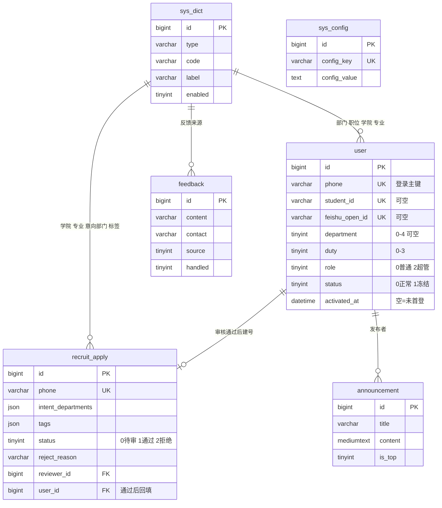

# OSC 社团管理系统 · 开发任务点清单（新对话开发手册）

> **用途**：将《PRD V1.0 定稿版》拆解为**可逐个交付的开发任务点**，供新对话（WorkBuddy/DS）从 T1 开始逐点开发。
> **配套文档**：
> - `docs/OSC 社团管理系统 · 产品需求文档（PRD）V1.0 · 定稿版.md`（权威依据，代码以 PRD 为准）
> - `docs/《战略定位与价值延伸说明》.md`（定位与价值规划）
> - `.workbuddy/memory/MEMORY.md` + 最新日志（项目记忆）
> **维护方式**：每完成一个任务点后更新本表状态列（⏳ 待开发 / 🔶 进行中 / ✅ 已完成）。
> **文档策略（2026-09-20 定）**：**不再新增文档**。每个任务点的技术方案、实现结果、验证方式与状态，全部写进本文档对应条目下；PRD 未覆盖的实现层决策统一记入 §6。PRD 仍是权威依据，战略说明仍是定位说明，二者不动。

---

## 0. 开发规则（每轮对话必遵守）

1. **单功能节奏**：一个任务点 = 一次交付。完成任务点后**停止**，等待社长审阅确认后再进入下一个。
2. **交付必附验证指引**：每条交付说明"怎么启动、怎么操作、怎么验证"，不允许只交付代码不写验证方法。
3. **不主动 git 提交**：未经社长明确指令不执行 `commit`/`push`（仓库与忽略策略已定，见 §6 D1）。
4. **先方案后代码**：涉及技术选型、表结构变更、公共抽象的任务点，先出简要技术方案经社长确认再动手。
5. **有疑问先问**：PRD 未覆盖或与实现冲突时，列出问题清单与建议选项，等待决策，不擅自发挥。
6. **参考代码只读**：旧系统代码（`F:\Project\Own Project\management-system`）仅作参考读取，所有新代码只写在当前工作空间。
7. **文档从简**：不新增文档 —— 任务点方案、实现结果、验证方式、状态都写在本文档对应条目下；实现层决策记入 §6。

## 1. 项目速览（新对话上下文）

| 项 | 内容 |
|---|---|
| 项目 | 天津中德开源鸿蒙社（OSC）社团管理系统 · 全栈重构（V1.0 纳新上线版） |
| 工作空间（新工程所在地） | `F:\Project\Own Project\New-Management-System` |
| 旧系统（只读参考） | `F:\Project\Own Project\management-system`（Vue2 + Spring Boot 半成品，仅部分逻辑可参考） |
| 旧文档归档 | `F:\Project\Own Project\Docs Acheive` |
| 目标 | 开学纳新前交付一套**手机可用、稳定运行**的"报名 → 审核 → 成员管理"系统并真实上线 |
| 范围 | V1.0 = 14 个 Must 切片（12 项核心 + 数据导出 + 反馈入口）；其余见 PRD §3.2/§3.3 |
| 核心数据模型 | `recruit_apply`（报名记录，全量）+ `user`（正式成员，仅审核通过者）；手机号为登录主键；字典全外置 `sys_dict` |

## 2. 技术栈（2026-09-20 定稿）

| 层 | 定稿选型 | 备注 |
|---|---|---|
| 工程布局 | monorepo 单仓：`server/`（后端）+ `web/`（前端，T3 建） | 独立 git 仓库，远端 GitHub（SSH） |
| 后端 | Java **17** + Spring Boot **3.3.13** + MyBatis-Plus **3.5.7** + Sa-Token **1.44.0** + Redis（Lettuce） | 分页用 MP 内置，弃 PageHelper |
| 数据库 | MySQL 8（`mysql-connector-j`）+ 一套建表脚本 + 种子数据 | 本地 `127.0.0.1:3306`，库名 `osc` |
| 缓存 | Redis（图形验证码 / 登录失败锁定 / token 存储） | 本地 `127.0.0.1:6379` 无密码（3.0.504，上线换新版） |
| 文件存储 | MinIO（头像） | T1 仅留依赖与配置占位，T11 启用 |
| Excel | EasyExcel（导入/导出） | T13 启用 |
| 接口文档 | Knife4j **4.5.0**（jakarta，仅 dev） | prod 关闭 |
| 前端（管理端） | Vue 3 + Vite + Element Plus + Pinia + Vue Router + axios | T3 落地 |
| 前端（移动端页面） | 响应式适配或 Vant（报名页/查询页为移动第一体验） | T3 定稿 |
| 接口风格 | RESTful + 统一返回体 `{code,message,data}` + 全局异常；错误码 40000 参数 / 40100 未登录 / 40300 无权限 / 40400 不存在 / 50000 系统 / 50001 下游不可用 | Header 传 token（不用 Cookie，见 PRD F-002）；不带 `/api` 前缀；dev 8080 / prod 8081 |
| 配置 | 全环境变量化：`.env`（忽略）+ `.env.example`（入仓） | 明文绝不入仓 |

## 3. 任务点总表（状态跟踪）

| # | 任务点 | 覆盖 PRD | 依赖 | 状态 |
|---|---|---|---|---|
| T1 | 后端工程初始化 | NFR 可维护性 | — | ✅ 已完成 |
| T2 | 数据库设计与初始化脚本 | §6 全部 | T1 | ✅ 已完成 |
| T3 | 前端工程初始化 | §8.2 页面地图 | — | ✅ 已完成 |
| T4 | 超管初始化 + 登录认证（含首登强制改密） | F-012 / F-002 / 切片2、12 | T1、T2 | ⏳ |
| T5 | 字典管理 | F-011 / 切片11 | T4 | ⏳ |
| T6 | 公开报名页 | F-001 / 切片1 | T3、T5 | ⏳ |
| T7 | 审核管理台 | F-003 / 切片3 | T6 | ⏳ |
| T8 | 审核状态查询页 | F-005 / 切片5 | T6 | ⏳ |
| T9 | 短信通知提效工具 | F-004 / 切片4 | T7 | ⏳ |
| T10 | 成员档案管理 | F-006 / 切片6 | T4、T5 | ⏳ |
| T11 | 个人中心 | F-007 / 切片7 | T4 | ⏳ |
| T12 | 公告系统 | F-008 / 切片8 | T4 | ⏳ |
| T13 | Excel 批量导入 | F-009 / 切片9 | T4、T5 | ⏳ |
| T14 | 数据导出 | F-013 / 切片13 | T10、T7 | ⏳ |
| T15 | 基础看板 | F-010 / 切片10 | T4、T5 | ⏳ |
| T16 | 轻量反馈入口 | F-014 / 切片14 | T4 | ⏳ |
| T17 | 全链路联调与上线准备 | NFR / M2-M3 | 全部 | ⏳ |

> **优先顺序**：T1→T2→T3 地基先行；随后**纳新主链**（T4→T5→T6→T7→T8→T9）优先冲刺；其余按序补齐；T17 收尾。

---

## 4. 任务点详情

### T1 后端工程初始化 ✅

> 状态：**已完成（2026-09-20）**。

- **覆盖**：PRD §7 NFR（可维护性）、§2 技术栈
- **交付物**：工作空间内新建后端工程 `server/`（artifactId `osc-server`）；统一返回体 + 全局异常处理；Sa-Token 接入（Header 模式）；Redis 连接；配置环境变量化（`.env.example`，杜绝明文入仓）；健康检查接口 `/health`。
- **关键点**：不写业务代码；不引 Actuator（保持轻量，避免多一套端点与权限面）。
- **自测要点**：`/health` 返回统一格式；配置项全部可从环境变量覆盖。

#### T1 技术方案（已确认 2026-09-20）

**① 目录规划**（T1 只建 `server/`，`web/` 留给 T3）

```text
New-Management-System\
├─ .gitignore                    ← T1 新增（根级，前后端通用）
├─ LICENSE / docs\ / .workbuddy\
└─ server\                       ← T1 新增
   ├─ pom.xml
   ├─ .env.example               ← 入仓（变量样例）
   ├─ .env                       ← 本地私有值（被 .gitignore 忽略）
   └─ src\main\
      ├─ java\com\tsguosc\
      │  ├─ OscServerApplication.java
      │  ├─ common\result\     Result.java · ResultCode.java
      │  ├─ common\exception\  BusinessException.java · GlobalExceptionHandler.java
      │  ├─ config\            RedisConfig.java · SaTokenConfig.java · OpenApiConfig.java
      │  └─ controller\        HealthController.java
      └─ resources\  application.yml · application-dev.yml · application-prod.yml
```

**② 依赖清单**（版本已于 2026-09-20 逐个联网核验存在）

| 依赖 | 版本 | 用途 |
|---|---|---|
| `spring-boot-starter-parent` | 3.3.13 | 父 POM，统一管版本 |
| `starter-web` / `starter-validation` / `starter-data-redis` / `starter-test` | 随父 POM | MVC · 参数校验 · Lettuce · 测试 |
| `mybatis-plus-spring-boot3-starter` | 3.5.7 | ORM + MP 内置分页（弃 PageHelper） |
| `mysql-connector-j` | 随父 POM | MySQL 驱动（旧坐标 `mysql-connector-java` 已废弃） |
| `sa-token-spring-boot3-starter` | 1.44.0 | 鉴权，Header 模式 |
| `sa-token-redis-jackson` | 1.44.0 | token 存 Redis，重启不掉线 |
| `lombok` | 随父 POM | 简化实体 |
| `knife4j-openapi3-jakarta-spring-boot-starter` | 4.5.0 | 接口文档，**仅 dev** |
| `minio` | — | **T1 只留注释占位**，T11 启用 |
| `easy-captcha`（+ `nashorn-core`） | — | T4 引入；JDK 17 已移除 Nashorn，必须补依赖 |

**③ 配置分层与环境变量**
- `application.yml`：应用名、端口占位、Jackson 时区、Sa-Token 基础项、MP 逻辑删除、`spring.config.import=optional:file:./.env[.properties]`
- `application-dev.yml`：8080、本地 MySQL/Redis、SQL 日志开、Knife4j 开；`application-prod.yml`：8081、SQL 日志关、Knife4j 关
- 环境相关项一律 `${VAR:默认值}`；`.env.example` 覆盖 `APP_PORT` / `SPRING_PROFILES_ACTIVE` / `MYSQL_HOST|PORT|DB|USER|PASSWORD` / `REDIS_HOST|PORT|PASSWORD|DB` / `SA_TOKEN_NAME|TIMEOUT` / `MINIO_*`（注释占位）

**④ 接口设计：`GET /health`**（免鉴权，T1 唯一接口）

```json
{"code":200,"message":"success","data":{"app":"osc-server","profile":"dev",
 "time":"2026-09-20T10:12:33","uptime":"3m12s",
 "components":{"redis":{"status":"UP","latencyMs":2},
               "mysql":{"status":"DOWN","latencyMs":5,"detail":"Unknown database 'osc'"}}}}
```

- 取舍：**下游不可用时 HTTP 与 `code` 仍为 200**（代表应用自身存活），真实状态放 `data.components` —— 这样 T2 建库前也能干净验收 Redis；T2 建库后 mysql 自动转 UP。

**⑤ 统一返回体与错误码**
- `Result<T>{code, message, data}`；成功 200；错误码 40000 参数 / 40100 未登录 / 40300 无权限 / 40400 不存在 / 50000 系统 / 50001 下游不可用。
- `GlobalExceptionHandler` 覆盖：业务异常、参数校验异常、Sa-Token 未登录/无权限异常、兜底异常（打全栈日志，响应不外泄堆栈）。

**⑥ 验收动作**

```powershell
& "E:\MAVEN\apache-maven-3.6.3\bin\mvn.cmd" -f "F:\Project\Own Project\New-Management-System\server\pom.xml" spring-boot:run
Invoke-RestMethod -Uri "http://127.0.0.1:8080/health" -Method Get | ConvertTo-Json -Depth 5
```

负向验证：访问 `/nope` 走统一错误格式；停掉 Redis 后 `/health` 的 redis 转 DOWN，而进程不崩。

#### T1 实现结果（2026-09-20 完成）

**已交付文件**

```text
.gitignore                                根级忽略（.env / .workbuddy / target / node_modules 等）
server/pom.xml                            Spring Boot 3.3.13 + JDK 17
server/.env.example                       环境变量样例（入仓）
server/.env                               本地私有值（被忽略，未入仓）
server/src/main/java/com/tsguosc/
  OscServerApplication.java
  common/result/        Result.java · ResultCode.java
  common/exception/     BusinessException.java · GlobalExceptionHandler.java
  config/               RedisConfig.java · OpenApiConfig.java（仅 dev）
  controller/           HealthController.java · controller/vo/HealthVO.java
server/src/main/resources/
  application.yml · application-dev.yml · application-prod.yml
```

**与方案的偏差（1 处）**：未创建 `SaTokenConfig.java` —— T1 不启用登录拦截器（见 §6 D10），Sa-Token 全部由 `application.yml` 的 `sa-token.*` 驱动，无需 Java 配置类；T4 接入登录时再新建该类注册 `SaInterceptor` 与白名单。

**实测验证记录**

| 验证项 | 结果 |
|---|---|
| `mvn clean package -DskipTests` | BUILD SUCCESS，产出 `osc-server-1.0.0.jar`（49.7 MB） |
| 启动 | `Started OscServerApplication in 10.9s`，profile=dev，端口 8080 |
| `GET /health` | `code=200`；`redis=UP(0ms)`；`mysql=DOWN(3012ms, Access denied for user 'osc_app')` —— 符合预期，T2 建库建号后转 UP |
| `GET /nope` | `code=40400 请求的资源不存在`（统一格式） |
| `POST /health` | `code=40000 请求方式不被支持：POST` |
| `GET /doc.html`（dev） | HTTP 200，Knife4j 正常；`/v3/api-docs` 含 `/health` |
| 环境变量覆盖 | 进程变量 `APP_PORT=8090` → 实际监听 8090；`OSC_HEALTH_EXPOSE_DETAIL=false` → 响应中 `detail` 字段消失 |
| 版本注入 | `@project.version@` 资源过滤生效，`/health` 返回 `version=1.0.0` |

**启动时已知告警（预期内，T2 消解）**
- `No MyBatis mapper was found in '[com.tsguosc]' package` —— T1 尚无 Mapper；T2 建表后加 `@MapperScan("com.tsguosc.mapper")` 即消失。
- MySQL 探测耗时 ~3s：账号/库未就绪时 HikariCP 在连接超时（3000ms）内持续重试，属预期；T2 建库后应降到毫秒级。

**环境注意（本机实测）**
1. ⚠️ 本机进程环境被宿主注入了 `SERVER__PORT=4225` / `SERVER__HOST=127.0.0.1`，Spring Boot 宽松绑定会将其当作 `server.port`，导致启动去抢 4225（已被占用）而失败。**在本机 WorkBuddy 终端里启动**需带 `--server.port=8080` 或先清掉该变量；在 IDEA / 普通 cmd 里启动不受影响。
2. ⚠️ PowerShell 5.1 下 `-Dfile.encoding=UTF-8` 会被拆成 `.encoding=UTF-8`，必须写成 `"-Dfile.encoding=UTF-8"`（带引号）。
3. 启动命令必须在 `server/` 目录下执行，否则读不到 `.env`（`spring.config.import` 用的是相对路径）。

**验证步骤**

```powershell
# 1) 启动（先 cd 到 F:\Project\Own Project\New-Management-System\server）
& "C:\Program Files\Java\jdk-17\bin\java.exe" -jar "target\osc-server-1.0.0.jar"
#    若在 WorkBuddy 终端内启动，追加 --server.port=8080

# 2) 另开一个 PowerShell 窗口验证
Invoke-RestMethod -Uri "http://127.0.0.1:8080/health" -Method Get | ConvertTo-Json -Depth 6
Invoke-RestMethod -Uri "http://127.0.0.1:8080/nope" -Method Get | ConvertTo-Json -Depth 3

# 3) 浏览器看接口文档（仅 dev）
Start-Process "http://127.0.0.1:8080/doc.html"
```

### T2 数据库设计与初始化脚本 ✅

> 状态：**已完成（2026-09-20）**。字段级明细以 `server/sql/01_schema.sql`（含逐列中文注释）为准，本节记录设计决策与实测结果。

- **覆盖**：PRD §6（账号三标识/权限字段/两阶段模型/字典/迁移）
- **交付物**：四个 SQL 脚本（`server/sql/`）+ ERD；六张表 `user` / `recruit_apply` / `sys_dict` / `sys_config` / `announcement` / `feedback`；字典种子；旧数据迁移框架（含「待补录清单」「冲突清单」）
- **关键点**：`user.role`（0 普通 / 2 超管）；`activated_at`（首登改密标记）；`intent_departments`、`tags` 用 JSON；手机号/学号唯一约束
- **自测要点**：SQL 可在干净 MySQL 一次性执行成功；种子数据完整；迁移脚本可空跑

#### T2 技术方案（已确认 2026-09-20）

**① 交付物**

| 脚本 | 内容 |
|---|---|
| `server/sql/00_init_database.sql` | 建库 `osc`（utf8mb4）+ 建 `osc_app` 账号 + 仅授权 `osc.*` 的 DML（模板，密码不入仓） |
| `server/sql/01_schema.sql` | 六张表 DDL + 索引（**不含 DROP**，可重复执行） |
| `server/sql/02_seed_dict.sql` | 字典种子 + `sys_config` 三条默认配置（幂等） |
| `server/sql/03_migrate_old_data.sql` | 旧数据迁移框架（staging → 待补录清单 → 冲突清单 → 正式迁移 → 核对） |

**② ERD**



**③ 表结构与关键约定**

| 表 | 关键约束 / 索引 | 说明 |
|---|---|---|
| `user` | PK`id`、UNIQUE `phone`、UNIQUE `student_id`、UNIQUE `feishu_open_id`、IDX(`department`,`status`) | 字段清单见 §6 D3；`department` 可 NULL |
| `recruit_apply` | PK`id`、UNIQUE `phone`、IDX(`status`)、IDX(`created_at`)、IDX(`reviewer_id`) | 状态 0待审/1通过/2拒绝；记录拒绝原因与审核留痕 |
| `sys_dict` | UNIQUE(`type`,`code`)、IDX(`type`,`enabled`,`sort`) | 七个 type：department/duty/status/college/major/tag/feedback_source |
| `sys_config` | UNIQUE `config_key` | 种子：`system_url`、`sms_template_pass`、`sms_template_reject`（含 D7 变量集） |
| `announcement` | IDX(`is_top`,`created_at`) | 发布时间复用 `created_at`；`content` 为 MEDIUMTEXT |
| `feedback` | IDX(`created_at`)、IDX(`source`)、IDX(`handled`) | `source` 1报名成功页 / 2成员端 |

- **字符集**：utf8mb4 + `utf8mb4_general_ci` + InnoDB（兼容 MySQL 5.7 与 8.0）
- **不建物理外键**：关系由应用层校验 + 索引保证，便于批量导入与旧数据迁移
- **唯一索引不带 `is_deleted`**：手机号一旦占用永久占用；`user` 用冻结代删、`sys_dict` 用停用代删
- **JSON 字段**：`intent_departments` / `tags` 用 MySQL JSON（`JSON_CONTAINS` 支撑 T7 部长评审隔离）；MyBatis-Plus 侧 T4 起用 `JacksonTypeHandler` + `autoResultMap`

#### T2 实现结果（2026-09-20 完成）

**已执行**
1. `00`：建库 `osc`（utf8mb4_general_ci）+ 建账号 `osc_app@localhost`，仅授权 `osc.*` 的 SELECT/INSERT/UPDATE/DELETE；28 位随机密码写入被忽略的 `server/.env`
2. `01`：六张表创建成功
3. `02`：字典 16 条（部门 5 / 职位 4 / 状态 2 / 反馈来源 2 / 学院 1 / 专业 1 / 标签 1）+ `sys_config` 3 条
4. 重启服务，`/health` 的 mysql 由 DOWN 转 **UP**

**验证记录**

| 验证项 | 结果 |
|---|---|
| 库与账号 | `osc` = utf8mb4 / utf8mb4_general_ci；`osc_app@localhost` 已建 |
| 建表 | `SHOW TABLES` 六张表齐全，表注释正确 |
| 字典内容 | 16 条，中文编码正确（部门 0~4 / 职位 0~3 / 状态 0~1 / 反馈来源 1~2 / 三个 other 兜底） |
| 短信模板 | 通过模板含 `{姓名}{系统链接}{初始密码}`，拒绝模板含 `{拒绝原因}` |
| 种子幂等 | 先把 `tag.other` 停用 → 重跑 `02` → `enabled` 仍为 0、总数仍 16（未被覆盖、无重复） |
| 建表脚本安全 | 重跑 `01` 不报错、不丢数据（无 DROP） |
| 最小权限 | 用 `osc_app` 执行 DDL → `ERROR 1142 DROP command denied` ✅ |
| 应用连通 | `GET /health` → `code=200`，`redis=UP`、**`mysql=UP(352ms)`** |

**注意**
- 学院/专业/兴趣标签目前只有「其他（other）」兜底，待社长给出种子清单后补录（T5 字典管理页可直接维护）
- `03` 迁移脚本因旧库（内网 172.19.15.13）不可连，**只交付框架未演练**；迁移账号密码写入哨兵值 `MIGRATED_RESET_REQUIRED`，需管理员重置后才能登录
- `server/sql/*.sql` 除 `00` 的密码占位符外无任何密钥；`server/.env` 已被忽略

**验证步骤**

```powershell
# 建库建号 + 建表 + 种子（root 执行；PS 5.1 用 --execute=source 而非 < 重定向）
$mysql = "C:\Program Files\MySQL\MySQL Server 8.0\bin\mysql.exe"
$sql = "F:/Project/Own Project/New-Management-System/server/sql"
& $mysql --user=root --password=root --default-character-set=utf8mb4 "--execute=source $sql/01_schema.sql"
& $mysql --user=root --password=root --default-character-set=utf8mb4 "--execute=source $sql/02_seed_dict.sql"

# 查看字典（先用 UTF8 设一下控制台编码，否则中文显示乱码）
[Console]::OutputEncoding = [System.Text.Encoding]::UTF8
& $mysql --user=root --password=root --default-character-set=utf8mb4 --table "--execute=USE osc; SELECT type, code, label, enabled FROM sys_dict ORDER BY type, sort;"
```

### T3 前端工程初始化 ✅

> 状态：**已完成（2026-09-20）**。T3 阶段所有页面均为占位（文件头注释标明归属任务点），不含业务逻辑。

- **覆盖**：PRD §8（页面地图/移动端第一体验）
- **交付物**：`web/` 前端工程（Vue3 + Vite + Element Plus + Vant + Pinia + Router + axios）；axios 封装（token 注入/统一错误/40100 跳登录）；三套布局 + 路由骨架（公开端/成员端/管理端占位）；移动端适配方案落地；路由守卫骨架
- **关键点**：双端策略在本文档 §6 D27 定稿；守卫骨架 = 公开白名单 + 登录态 + 管理端资格
- **自测要点**：`npm run dev` 启动；占位路由可跳转；移动端报名页占位显示正常

#### T3 技术方案（已确认 2026-09-20）

**① 双端与移动优先策略**（PRD §7/§8 要求移动第一体验的是报名页、状态查询页、**审核列表页**，其中审核列表页属管理端，故不能按"端"拆两套工程）

| 场景 | 组件方案 |
|---|---|
| 公开端（报名页 / 查询页） | **Vant**：Field、Picker、Cascader/Area 省市级联、Checkbox 多选、Toast 均为拇指操作设计 |
| 成员端 / 管理端（桌面） | **Element Plus**（表格 / 表单 / 弹窗） |
| 管理端（<768px） | 同页切「卡片列表 + 抽屉菜单」移动态，用 EP 基础组件实现 |

**② 目录结构**

```text
web/
├─ package.json · vite.config.js · index.html · jsconfig.json
├─ eslint.config.js · .prettierrc.json · .editorconfig
└─ src/
   ├─ main.js · App.vue
   ├─ api/         request.js（axios 实例）· health.js
   ├─ router/      index.js（路由表）· guard.js（守卫）
   ├─ stores/      user.js（token / profile / 角色推导）
   ├─ layouts/     PublicLayout · MemberLayout · AdminLayout
   ├─ components/  PlaceholderCard · HealthCheckCard
   ├─ composables/ useIsMobile.js（<768px 断点）
   ├─ constants/   app.js（token key / Header 名）· roles.js（资格推导）
   ├─ styles/      index.scss（主题变量 + 全局样式）
   └─ views/       public/（Apply·Query）· auth/（Login·ChangePassword）
                   member/（Home·Announcement·Members·Profile）
                   admin/（Audit·MemberAdmin·AnnouncementAdmin·Dashboard·Dict·Import）
```

**③ 依赖版本**（2026-09-20 实装，`package-lock.json` 入仓锁定）

vue 3.5.43 · vue-router 5.3.1 · pinia 4.0.3 · axios 1.20.0 · element-plus 2.14.6 · vant 4.10.2 ·
vite 8.3.0 · @vitejs/plugin-vue 6.0.9 · sass 1.104.1 · unplugin-auto-import 21.1.0 ·
unplugin-vue-components 32.1.0 · eslint 10.11.0 · eslint-plugin-vue 10.11.0 · prettier 3.9.8

**④ axios 封装**（横切约定，后续各页复用）
- `baseURL: '/api'`，dev 由 Vite 代理剥掉 `/api` 前缀（后端接口不带前缀）
- 请求拦截注入 `osc-token` 头；响应拦截统一判 `code`：200 只返回 `data` / 40100 清登录态跳登录 / 40300 提示无权限 / 50000·50001 提示系统繁忙；HTTP 层异常兜底
- 导出 `ApiError{code}`，业务层需要时可判 code

**⑤ 路由与守卫**
- 公开白名单：`/login`、`/apply`、`/query`、`/404`；其余需登录，未登录跳登录并带 `redirect`
- 管理端页面额外校验管理端资格，超管专属页再校验 `role=2`
- 角色不枚举，一律由 `role / department / duty` 推导（`constants/roles.js`）

#### T3 实现结果（2026-09-20 完成）

**交付文件**：`web/` 共 24 个源文件（3 套布局 / 14 个占位页面 / axios 封装 / 路由与守卫 / 角色推导 / 主题样式 / 2 个公共组件），另含 ESLint+Prettier+EditorConfig 工程规范配置。

**实测验证记录**

| 验证项 | 结果 |
|---|---|
| `npm install` | 成功（10m48s），依赖版本与上面的清单一致 |
| `npm run lint` | 通过（0 error）；期间抓到并修掉 1 处模板里的全角空格 |
| `npm run build` | **BUILD SUCCESS，4.0s**，1682 模块，路由级分包正常（每个 view 独立 chunk） |
| `npm run dev` | Vite 8 启动，`http://127.0.0.1:5173` ready in 1.9s |
| **`/api/health` 经代理** | HTTP 200，231 字节，**代理 → 后端链路通** |
| 路由 `/` | 正确重定向到登录页（headless Chrome 渲染验证） |
| 路由 `/login` | 登录页渲染；dev 连通性卡片拿到真实后端数据：`osc-server · profile=dev · v1.0.0`、`redis: UP (1ms)`、`mysql: UP (0ms)` |
| 路由 `/apply`（375px） | 报名页占位正常渲染（公开页，未被守卫拦截） |
| 路由 `/query`（375px） | 状态查询页占位正常渲染 |
| 守卫 `/home` | 未登录 → 跳登录页 ✅ |
| 守卫 `/admin/audit` | 未登录 → 跳登录页 ✅ |
| 404 `/nope` | 渲染「页面不存在」兜底页 ✅ |

> 验证方式：用本机 Chrome 无头模式逐路由渲染截图 + 导 DOM，再按标记文本核对（脚本为临时文件，未入仓）。

**注意**
- 构建产物 CSS ≈ 558KB（gzip 101KB）：这是"UI 库样式引整包"的代价，换来的是不会有漏样式类问题；若后续首屏吃紧，可改回按组件引样式（见 §6 D28）
- 学院/专业/兴趣标签字典目前只有 `other`，T6 报名页做出来时选项会比较空，等种子清单
- 前端代码里**不含任何后端地址**，地址只出现在 `vite.config.js` 的 dev 代理常量；线上走 Nginx 同源反代

**验证步骤**

```powershell
Set-Location "F:\Project\Own Project\New-Management-System\web"
npm run dev            # → http://127.0.0.1:5173
# 浏览器直接验证：/login 看连通性卡片；/apply、/query 看公开页；
# 直接输 /home 或 /admin/audit 会被守卫弹回登录页；随便输个 /xxx 会看到 404 页
npm run build          # 生产构建
npm run lint           # 代码规范
```

### T4 超管初始化 + 登录认证
- **覆盖**：F-012、F-002、切片 2/12
- **交付物**：首次启动引导页（创建超管）或初始化脚本；登录接口（手机号+密码+图形验证码）；BCrypt 密码存储；失败 5 次锁定 15 分钟（Redis）；**首登强制改密流程**（`activated_at` 判定）；登出；`/user/current`。
- **关键点**：图形验证码沿用 easy-captcha 算术型；token 走 Header；前端登录页 + 改密页。
- **自测要点**：创建超管 → 登录 → 被强制改密 → 改密后进入系统；错误密码 5 次锁定；正确流程重新登录成功。

### T5 字典管理
- **覆盖**：F-011、切片 11（开发顺序前置）
- **交付物**：`sys_dict` 后端 CRUD；管理端字典管理页（超管）；字典接口供全站引用（学院/专业/部门/兴趣标签/职位/状态）。
- **关键点**：核心编码不可改（仅改文案/排序/启停）；面试学院列表 + 其他兜底。
- **自测要点**：超管可增改启停字典项；报名页/审核台引用同一数据源；改文案后各页同步生效。

### T6 公开报名页
- **覆盖**：F-001、切片 1（纳新主链起点）
- **交付物**：移动优先 H5 报名页（社团简介 + 表单 + 隐私勾选 + 成功页）；报名提交接口（写 `recruit_apply`，不建账号）；手机号唯一防重复；被拒者允许重新提交。
- **关键点**：表单字段按 PRD F-001（含意向部门多选）；弱网重试与内容保留；提交成功页注明审核时效与查询方式。
- **自测要点**：手机浏览器 3 分钟内完成报名；重复提交被拦截并引导查询页；被拒后重提可更新记录。

### T7 审核管理台
- **覆盖**：F-003、切片 3（纳新主链核心）
- **交付物**：报名列表（筛选/排序）；通过（自动建账号 + 初始随机密码展示）；拒绝（必填原因 + 对外措辞提示）；审核人/时间留痕；批量通过 + 密码清单；**部长按"意向部门含本部门"过滤**。
- **关键点**：通过建号后可用 T4 登录流转验证；重复审核防护（仅待审可操作）。
- **自测要点**：通过一条报名 → 用初始密码登录 → 首登改密成功；拒绝一条 → 查询页看到原因；部长账号只看到含本部门的报名。

### T8 审核状态查询页
- **覆盖**：F-005、切片 5
- **交付物**：公开查询页（手机号 + 图形验证码）；返回状态与拒绝原因；防批量探测。
- **自测要点**：待审/通过/拒绝三种状态展示正确；无记录提示友好；验证码必填。

### T9 短信通知提效工具
- **覆盖**：F-004、切片 4
- **交付物**：审核弹窗"复制话术+号码"；批量复制（分号分隔）；移动端 `sms:` 唤起（Android `?body=` / iOS `&body=`）；模板与系统链接可配置（`sys_config`）。
- **自测要点**：复制内容含系统链接且可发送；批量号码格式正确；模板修改后生效。

### T10 成员档案管理
- **覆盖**：F-006、切片 6
- **交付物**：成员列表（检索/详情/编辑）；部长本部门数据隔离；敏感列分级可见（成员看基础列）；手机号变更唯一性校验；姓名仅管理员可改。
- **自测要点**：不同角色登录看到不同列与不同行范围；编辑保存生效；学号冲突提示。

### T11 个人中心
- **覆盖**：F-007、切片 7
- **交付物**：资料卡（个人信息/专业信息/社团信息）；编辑资料（不含姓名/手机号）；学号自助补录；改密码（验旧密码 + 成功强制登出）；头像上传（MinIO，≤2MB）。
- **自测要点**：改密后需重新登录；补录学号冲突提示；头像上传后全局显示更新。

### T12 公告系统
- **覆盖**：F-008、切片 8
- **交付物**：公告发布/编辑/删除（管理端），列表/详情（成员端）；置顶排序；富文本 XSS 清洗（前后端）。
- **自测要点**：置顶排最前；普通成员只读；尝试注入脚本被过滤。

### T13 Excel 批量导入
- **覆盖**：F-009、切片 9
- **交付物**：模板下载；上传导入（逐行校验：手机号/学号/部门/职位）；错误行清单（行号+原因）；导入建号 + 一次性密码清单导出。
- **自测要点**：正常文件导入成功并可登录；含错文件返回行级错误；重复手机号被跳过并标记。

### T14 数据导出
- **覆盖**：F-013、切片 13
- **交付物**：成员名册导出（按筛选条件）；报名/审核数据导出（含留痕）；文件名含日期；导出列按权限控制。
- **自测要点**：导出文件可打开、内容与列表一致；敏感列不含无权限字段。

### T15 基础看板
- **覆盖**：F-010、切片 10
- **交付物**：成员现状（总人数/学院/专业/性别/地区，user 表）；招新复盘（报名/通过/拒绝、按日趋势，recruit_apply 表）；空态处理；标准地图数据（含港澳台）。
- **自测要点**：两处数据源口径不混用；无数据时空态；地图正常渲染。

### T16 轻量反馈入口
- **覆盖**：F-014、切片 14
- **交付物**：报名成功页 + 成员端反馈入口（免登录提交）；管理端反馈列表（社长团/超管）。
- **自测要点**：提交反馈成功提示；管理端可见新反馈；未登录状态可提交。

### T17 全链路联调与上线准备
- **覆盖**：PRD §7 NFR、§11 里程碑 M2-M3
- **交付物**：全流程演练脚本与记录（报名→审核→激活→登录→档案）；高峰并发模拟；部署方案落地（公网可达/HTTPS，含域名或现场方案）；数据库备份策略与演练；上线现场预案（盯日志/回滚）。
- **自测要点**：按 PRD M2 出口条件执行：全流程演练 ≥1 轮 + 高峰模拟 + 0 数据丢失。

---

## 5. 新对话启动包

### 5.1 开场提示词（复制以下内容到新对话）

```
你好 DS。继续「OSC 社团管理系统（天津中德开源鸿蒙社）」重构项目。

- 工作空间（新工程只放这里）：F:\Project\Own Project\New-Management-System
- 先读三份材料再开工：
  1. docs/OSC 社团管理系统 · 产品需求文档（PRD）V1.0 · 定稿版.md（权威依据）
  2. docs/《战略定位与价值延伸说明》.md
  3. .workbuddy/memory/MEMORY.md 与最新日志；同时读 docs/开发任务点清单.md
- 参考资料（只读）：旧系统代码 F:\Project\Own Project\management-system；旧文档归档 F:\Project\Own Project\Docs Acheive
- 按《开发任务点清单》§3 总表确认当前进度，从当下任务点继续：先出技术方案（依赖/目录/选型）等我确认，再写代码；方案与实现结果写回本清单对应条目。
- 遵守规则：单功能节奏（每个任务点完成即停止等我确认）；不主动 git 提交；交付必附验证指引；有疑问先问。
```

### 5.2 关键词清单（检索/唤醒上下文用）

> OSC 社团管理系统 / 天津中德开源鸿蒙社 / 全栈重构 / PRD V1.0 定稿版 / 开发任务点清单 / T1 后端工程初始化 / 工作空间 F:\Project\Own Project\New-Management-System / 旧系统 management-system / Docs Acheive / 单功能节奏 / 逐点确认 / 纳新上线 / V1.0 十四切片 / 字典前置（sys_dict）/ recruit_apply 两阶段模型 / 手机号登录主键 / 首登强制改密 / 意向部门 / 部长评审隔离 / 看板双口径 / F-013 数据导出 / F-014 反馈入口 / 短信提效工具 / 部长评审 / 飞书免登 Stretch

---

## 6. 实现层决策记录（2026-09-20 拍板）

> 记录 PRD 未覆盖、由实现侧拍板的决策，避免跨会话失忆。新增决策追加到表尾。

| # | 议题 | 决策 | 影响任务点 |
|---|---|---|---|
| D1 | 工程布局 / 仓库 | monorepo 单仓（`server/` + `web/`）；工作空间为**独立 git 仓库**，远端 GitHub `git@github.com:CapableCCat/New-Management-System.git`（SSH）；`.workbuddy/` 忽略提交，`docs/` 入库 | T1 |
| D2 | 工程命名 | groupId `com.tsguosc`、artifactId `osc-server`、包根 `com.tsguosc`、主类 `OscServerApplication` | T1 |
| D3 | `user` 表字段清单 | 按实现侧拟定清单建表：`id`(PK) / `phone`(唯一,登录主键) / `password` / `name` / `student_id`(唯一可空) / `college` / `major` / `department` / `duty` / `role` / `status` / `gender` / `province` / `city` / `avatar_url` / `bio` / `feishu_open_id`(唯一可空) / `activated_at` / `is_deleted` + 审计四字段 | T2 |
| D4 | 审核通过时的部门/职位 | `duty=0`（成员）、`department` 允许 NULL，入社后由社长团/部长在成员档案分配 | T2 / T7 / T10 |
| D5 | `college` / `major` 存储 | 存 code；「专业 → 其他」兜底项另存 `major_text` 文本 | T2 / T5 / T6 |
| D6 | 性别 | 不建字典，`tinyint` **NOT NULL DEFAULT 0**：0 未填 / 1 男 / 2 女（2026-09-20 修订：原「空=NULL」改为 0=未填，聚合口径更干净） | T2 / T6 / T15 |
| D7 | 短信模板变量 | 扩为 `{姓名}` `{系统链接}` `{初始密码}`；拒绝模板另加 `{拒绝原因}` | T9 |
| D8 | 批量通过的初始密码 | **不落库**，只在弹窗与一次性导出文件里出现（最小留存） | T7 |
| D9 | 手机号「主键」实现 | `id` 自增主键 + `phone` 唯一索引（PRD 的「主键」是业务标识） | T2 |
| D10 | 鉴权连接细节 | Sa-Token Header 名 `osc-token`，token 存 Redis；**全局登录拦截器到 T4 才启用** | T1 / T4 |
| D11 | 逻辑删除与审计 | `is_deleted` + `create_time/update_time/create_user/update_user` 自动填充（沿用旧系统约定） | T1 / T2 |
| D12 | 端口与接口前缀 | dev 8080 / prod 8081；后端接口不带 `/api` 前缀（前端 Vite 5173 代理 `/api` → 8080 并剥前缀） | T1 / T3 |
| D13 | 本地开发连接 | MySQL `127.0.0.1:3306`（实测可用 root/root 登录，但应用不使用 root，见 D14）；库名 `osc`；Redis `127.0.0.1:6379` 无密码 | T1 / T2 |
| D14 | 数据库账号 | 应用一律使用**专属账号 `osc_app`**（T2 建库时创建，仅授权 `osc.*`，不用 root）；本地开发同样走该账号，密码只存在于被忽略的 `server/.env` | T2 |
| D15 | 公网部署安全基线 | ① 后端由 Nginx 反代 + HTTPS 对外，不直接暴露 8080/8081；② prod 关闭 `osc.health.expose-detail`（不回显下游错误详情）；③ prod 关闭 Knife4j 与 `/v3/api-docs`；④ 所有 secrets 走服务器环境变量，`.env` 永不入仓；⑤ 线上 Redis 必须设密码 | T1 / T17 |
| D16 | 建表/种子脚本安全 | `01_schema.sql` **不含 DROP**（只 `CREATE TABLE IF NOT EXISTS`），线上误执行不丢数据；`02_seed_dict.sql` 幂等 —— 字典用 `ON DUPLICATE KEY UPDATE` 只刷 label/sort/remark **不覆盖 enabled**，`sys_config` 用 `INSERT IGNORE` 不覆盖已改模板 | T2 |
| D17 | 字符集与引擎 | 全部表 InnoDB + `utf8mb4` / `utf8mb4_general_ci`（选 general_ci 是为兼容 MySQL 5.7 与 8.0；确认线上为 8.0 可换 `0900_ai_ci`） | T2 |
| D18 | 不建物理外键 | 表间关系由应用层校验 + 索引保证（便于批量导入、旧数据迁移与按需清理） | T2 |
| D19 | 唯一索引与逻辑删除 | 唯一索引**不带 `is_deleted`**（手机号等一旦占用永久占用）；`user` 用 `status=1` 冻结代删、`sys_dict` 用 `enabled=0` 停用代删，保证 `UNIQUE(type,code)` 稳定 | T2 |
| D20 | JSON 字段 | `recruit_apply.intent_departments` / `tags` 用 MySQL **JSON** 类型（`JSON_CONTAINS` 支撑 T7 部长评审隔离）；MyBatis-Plus 侧 T4 起用 `JacksonTypeHandler` + `autoResultMap=true` | T2 / T7 |
| D21 | 报名状态编码 | `recruit_apply.status`：0 待审 / 1 通过 / 2 拒绝（与 `user.status` 的 0正常/1冻结 语义分离，避免混淆） | T2 / T7 / T8 |
| D22 | 两个扩展字段 | `recruit_apply.user_id`（通过后回填 `user.id`，供查询页与复盘溯源）、`feedback.handled`（0 未处理 / 1 已处理，支撑反馈闭环） | T2 / T8 / T16 |
| D23 | 迁移账号密码 | 旧密码（明文/MD5）不迁移，统一写哨兵值 `MIGRATED_RESET_REQUIRED`（非法 BCrypt，无法登录），需管理员重置密码后方可登录 | T2 / T4 |
| D24 | 应用账号权限 | `osc_app@localhost` 仅 `osc.*` 的 SELECT/INSERT/UPDATE/DELETE（**无 DDL**，建表/建库一律 root 执行）；host 限定 localhost，不用 `%` | T2 / T17 |
| D25 | 应用账号密码 | 28 位随机强密码，存放于被忽略的 `server/.env`（不入仓）；轮换方式：改 `server/.env` + `ALTER USER 'osc_app'@'localhost' IDENTIFIED BY '<新密码>'` | T2 / T17 |
| D26 | 前端技术栈与工程规范 | 单工程 `web/`：Vue **3.5.43** + Vite **8.3.0** + Element Plus **2.14.6** + Vant **4.10.2** + Pinia **4.0.3** + vue-router **5.3.1** + axios **1.20.0**；语言 **JavaScript（不上 TS）**；Sass；ESLint 10（flat config）+ Prettier 3 + .editorconfig（2 空格 / LF / UTF-8） | T3 |
| D27 | 双端与移动优先策略 | **不按"端"拆工程**：公开端（报名页/查询页）用 **Vant**（拇指操作友好），成员端/管理端用 **Element Plus**（表格表单）；管理端在 **<768px** 切「卡片列表 + 抽屉菜单」移动态。移动第一体验三页 = 报名页 / 审核列表页 / 状态查询页 | T3 / T6 / T7 / T8 |
| D28 | UI 库引入方式 | 组件按需引入（unplugin-vue-components + ElementPlusResolver/VantResolver）；**样式引整包 CSS**（宁可多 100KB，也不要漏样式），产物 CSS ≈558KB / gzip 101KB；首屏吃紧时再改按组件引样式 | T3 |
| D29 | 主题变量 | 主色先用 EP 默认蓝 `#409eff`，集中在 `src/styles/index.scss` 的 `--brand-primary`，同时映射 `--el-color-primary` 与 `--van-primary-color` —— 换社团主色只改一处 | T3 |
| D30 | 登录态与守卫骨架 | token 存 localStorage（key `osc_token`），请求头 `osc-token`；Pinia user store 缓存 profile；守卫 = 公开白名单（login/apply/query/404）+ 未登录跳登录（带 redirect）+ 管理端资格校验（由 `role=2` / `department=0` / `duty=2` 推导，不枚举角色） | T3 / T4 |
| D31 | 前后端对接方式 | Vite dev 5173 代理 `/api` → `127.0.0.1:8080` 并剥掉 `/api`；线上由 Nginx 同源反代，**前端代码不含任何后端地址**；不引入 VITE_* 环境文件（既避免与根 .gitignore 的 `.env*` 规则冲突，线上同源也确实不需要） | T3 / T17 |

---

> **维护记录**：
> - 2026-09-18 初版（依据 PRD v3.1 终审修订版拆解，共 17 个任务点）。
> - 2026-09-20 ① 技术栈定稿（§2 实版本化）；② 新增「实现层决策记录」（§6，D1~D13）；③ T1 技术方案写入 T1 条目。
> - 2026-09-20 ④ **T1 完成**（后端工程初始化：统一返回体 / 全局异常 / Sa-Token + Redis 接入 / `/health` / 配置环境变量化 / 根 `.gitignore`），T1 条目补「实现结果 + 验证记录」，总表状态转 ✅；⑤ §6 新增 D14（专属账号 `osc_app`）、D15（公网部署安全基线），D13 依 D14 修订。
> - 2026-09-20 ⑥ **T2 完成**（六张表 + 四个 SQL 脚本 + 字典种子；建库建号、种子幂等、最小权限均实测通过，`/health` 的 mysql 转 UP），T2 条目补「技术方案（含 ERD）+ 实现结果 + 验证记录」，总表状态转 ✅；⑦ §6 新增 D16~D25，D6 修订（gender 改为 0=未填）。
> - 2026-09-20 ⑧ **T3 完成**（`web/` 前端工程：三套布局 + 14 个占位页 + axios 封装 + 路由与守卫 + 主题变量 + 工程规范；lint 通过、构建 4.0s 成功、headless Chrome 逐路由渲染验证通过、`/api/health` 代理打通），T3 条目补「技术方案 + 实现结果 + 验证记录 + 验证步骤」，总表状态转 ✅；⑨ §6 新增 D26~D31（前端技术栈 / 双端策略 / UI 引入方式 / 主题 / 登录态与守卫 / 前后端对接）。
